**1. Phần mềm quản lý tài sản và quản lý bảo trì, bảo dưỡng trên các tuyến đường cao tốc do VEC quản lý**

### *1.1.* *Mô hình vị trí hệ thống trong kiến trúc chính quyền điện tử của Bộ Giao thông vận tải*

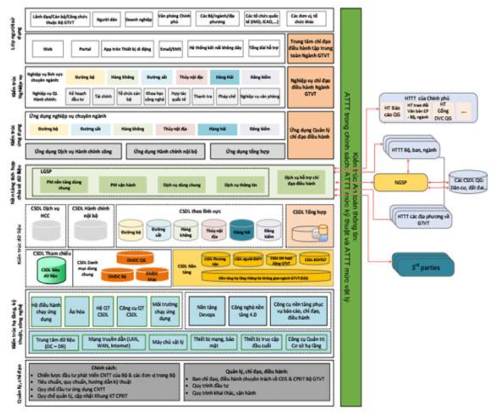

**Thuyết minh mô hình:**

Tham chiếu theo kiến trúc này, Phần mềm Quản lý tài sản thuộc tầng “ứng dụng nghiệp vụ chuyên ngành” được triển khai tại Trung tâm dữ liệu của VEC.

- Phần mềm Quản lý tài sản cung cấp các công cụ giúp cho người sử dụng tại các đơn vị, người quản trị thực hiện việc quản lý, khai thác, chia sẻ và vận hành cơ sở dữ liệu trong hệ thống.

- Ngoài ra, Phần mềm Quản lý tài sản cung cấp các dịch vụ dữ liệu, dịch vụ bản đồ có thể sẵn sàng kết nối và chia sẻ với Hệ thống khác

### *1.2. Mô hình logic*

**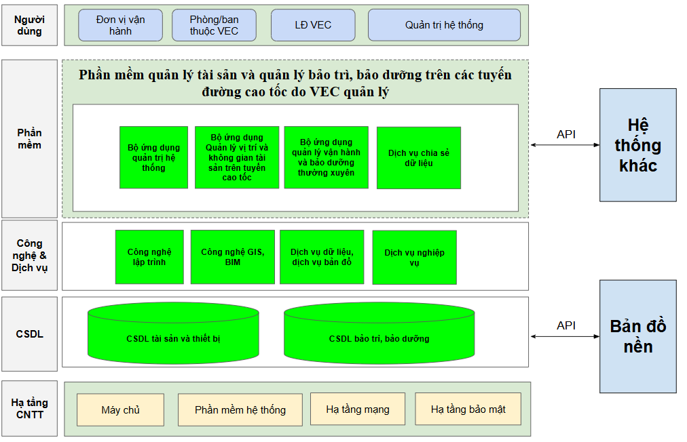**

**Thuyết minh mô hình**

**1. Người dùng:**

- Đơn vị vận hành các tuyến cao tốc: Bao gồm các tuần đường, cán bộ kỹ thuật, lãnh đạo đơn vị tham gia vận hành, khai thác phần mềm theo phân quyền.

- Phòng ban/đơn vị thuộc VECM: Bao gồm các cán bộ, lãnh đạo phòng ban/đơn vị thuộc VEC. Căn cứ vào vào trò, nhiệm vụ và được phân quyền sẽ thực hiện quản lý, theo dõi và vận hành các chức năng của phần mềm.

- Lãnh đạo VEC: Thực hiện sử dụng hệ thống thông qua các báo cáo, tổng hợp và các ứng dụng phục vụ chỉ đạo, điều hành.

- Quản trị hệ thống: Là cá nhân/tổ chức được giao quản trị phần mềm, CSDL và các thiết bị CNTT kèm theo. Quản trị hệ thống thực hiện phân quyền, theo dõi nhật ký sử dụng và thực hiện các công tác đảm bảo hệ thống hoạt động ổn định.

**2. Phần mềm:** bao gồm các bộ ứng dụng phục vụ quản lý tài sản và bảo tri, bảo dưỡng trên các tuyến như

***- Bộ ứng dụng trên web bao gồm***

+ Phân hệ quản trị hệ thống

+ Màn hình chính (Dashboard)

+ Phân hệ Quản lý tài sản trên đường cao tốc.

+ Phân hệ Quản lý bảo trì, bảo dưỡng

+ Phân hệ Giám sát hoạt động vận hành và bảo trì, bảo dưỡng

***- Bộ ứng dụng trên di động bao gồm:***

+ Quản lý đăng nhập/đăng xuất

+ Màn hình chính (Dashboard)

+ Phân hệ Quản lý tài sản trên đường cao tốc.

+ Phân hệ Quản lý bảo trì, bảo dưỡng

+ Phân hệ Giám sát hoạt động vận hành và bảo trì, bảo dưỡng

**3. Công nghệ & dịch vụ**

Lớp Công nghệ và Dịch vụ đóng vai trò là nền tảng hỗ trợ quan trọng cho hệ thống quản lý tài sản và bảo trì, bảo dưỡng các tuyến đường cao tốc do VEC quản lý. Lớp này bao gồm tập hợp các công nghệ hiện đại và dịch vụ phổ quát được ứng dụng nhằm nâng cao hiệu quả vận hành, đảm bảo khả năng mở rộng, tích hợp và an toàn thông tin cho toàn hệ thống.

Cụ thể, hệ thống có phải có khả năng tích hợp các công nghệ phổ biến như:

- Công nghệ GIS để quản lý không gian, trực quan hóa tài sản trên nền bản đồ;

- Công nghệ BIM được áp dụng trong quản lý cấu trúc và vòng đời các công trình hạ tầng.

Bên cạnh đó, hệ thống được hỗ trợ bởi các dịch vụ như:

- Dịch vụ dữ liệu: thu thập, chuẩn hóa, tích hợp dữ liệu tài sản từ nhiều nguồn khác nhau;

- Dịch vụ bảo trì, vận hành hệ thống: đảm bảo phần mềm luôn ổn định và an toàn;

- Dịch vụ tích hợp API: cho phép kết nối hệ thống với các nền tảng và cơ sở dữ liệu khác;

- Dịch vụ nghiệp vụ: tư vấn và hỗ trợ đơn vị vận hành theo các quy trình chuẩn về bảo trì và quản lý tài sản.

Việc bổ sung lớp Công nghệ và Dịch vụ giúp hệ thống đạt được sự linh hoạt, hiện đại và khả năng thích ứng với các yêu cầu mới trong quá trình vận hành, đồng thời tạo nền tảng để từng bước chuyển đổi số toàn diện trong quản lý hạ tầng giao thông. Quá trình sử dụng và tích hợp các công nghệ sẽ đưa triển khai theo các giai đoạn dựa yêu cầu thực tiễn trong công tác quản lý của chủ đầu tư.

**4. Cơ sở dữ liệu**

- CSDL tài sản và thiết bị: Bao gồm các dữ liệu không gian, thuộc tính, tài liệu các tài sản, thiết bị

- CSDL bảo trì, bảo dưỡng: Bao gồm các dữ liệu phát sinh trong quá trình bảo trì, vận hành, bảo dưỡng thường xuyên các tài sản, thiết bị

**5. Bản đồ nền**

Là các dịch vụ bản đồ nền do Nhà thầu tự cung cấp hoặc sử dụng các dịch vụ bản đồ nền có sẵn trong nước và quốc tế (phải đảm bảo giấy phép sử dụng). Các dịch vụ nền được tích hợp vào Hệ thống phục vụ khai thác và trình diễn dữ liệu.

**6. Hạ tầng CNTT**

Bao gồm các phần mềm, thiết bị được cài đặt tại Trung tâm dữ liệu VEC.

- Hạ tầng máy chủ

- Phần mềm nền tảng

- Hạ tầng mạng, hạ tầng bảo mật.

**5. Các hệ thống khác:** Bao gồm các hệ thống chuyên ngành của VEC, các hệ thống của Cục ĐBVN và các hệ thống liên quan khác. Các hệ thống kết nối, chia sẻ với nhau thông qua các API.

### *1.3. Mô hình triển khai*

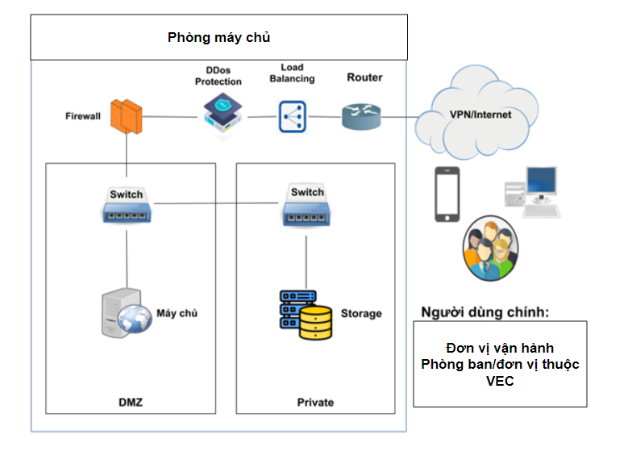

**Thuyết minh mô hình:**

- Địa điểm triển khai: Phòng máy chủ của VEC

- Phương thức truy cập: Theo sơ đồ triển khai thì các đơn vị sẽ truy cập vào hệ thống để tra cứu, cập nhật, khai thác thông tin qua Internet theo quyền được phân cấp bằng giao diện Web hoặc di động.

- Hạ tầng triển khai hệ thống: kế thừa hạ tầng CNTT tại Trung tâm dữ liệu của VEC, bao gồm:

+ 01 máy chủ, Máy chủ ứng dụng

+ 01 máy chủ CSDL

+ Không gian lưu trữ ngoài: backup lưu trữ soure và dữ liệu trên hệ thống

+ Một số thiết bị phụ trợ: switch, firewall, router, đường truyền Internet tốc độ cao, …

- **Yêu cầu cấu hình hạ tầng CNTT và đề xuất về phương án sử dụng**

| **TT** | **Thiết bị** | **ĐVT** | **SL** | **Yêu cầu cấu hình tối thiểu** | **Phương án sử dụng** |
| --- | --- | --- | --- | --- | --- |
|
|  |
| **I** | **Phần cứng** | | | |  |
| 1 | Máy chủ ứng dụng/Dịch vụ | Máy chủ | 2 | Máy chủ ảo hoặc máy chủ thật với cấu hình tối thiểu: | Chủ đầu tư cung cấp |
| - Vi xử lý (CPU): 64 core |
| - Bộ nhớ trong (RAM): 128 GB |
| - Ổ cứng (SSD/HDD): dung lượng khả dụng tối thiểu 01 TB |
| 2 | Máy chủ CSDL | Máy chủ | 1 | Máy chủ ảo hoặc máy chủ thật với cấu hình tối thiểu: | Chủ đầu tư cung cấp |
|  |  |  |  | - Vi xử lý (CPU): 64 core |  |
|  |  |  |  | - Bộ nhớ trong (RAM): 128 GB |  |
|  |  |  |  | - Ổ cứng (SSD/HDD): dung lượng khả dụng tối thiểu 01 TB |  |
| **II** | **Phần mềm hệ thống** | | | |  |
| 1 | Windows server | Phần mềm | 02 | Phiên bản tối thiếu Windows server standard 2016 trở lên được cài trên các máy chủ | Chủ đầu tư cung cấp |
| 2 | MS SQL server | Phần mềm | 1 | Phiên bản tối thiếu MS SQL Server standard 2016 trở lên được cài trên máy chủ CSDL | Chủ đầu tư cung cấp |
| **III** | **Hạ tầng truyền thông** | | | |  |
| 1 | IP tĩnh |  | 1 | Có địa chỉ IP Public | Chủ đầu tư cung cấp |
| 2 | Tên miền |  | 1 | - Tên miền internet | Chủ đầu tư cung cấp |
| - chứng thư SSL cho tên miền |
| 3 | Port |  |  | - Cổng 80 cho truy cập http | Chủ đầu tư cung cấp |
| - Cổng 1433 cho https |

- **Trang thiết bị đầu cuối tham gia vận hành hệ thống**

Để đảm bảo hiệu năng khi tham gia vận hành hệ thống, cấu hình tối thiểu của các thiết bị đầu cuối sử dụng cần đáp ứng các yêu cầu tối thiểu như sau:

| **TT** | **Thiết bị** | **Cấu hình khuyến cáo** |
| --- | --- | --- |
| 1 | Máy tính cá nhân (Desktop, Laptop) | |
|  | Vi xử lý | Bộ vi xử lý 2 nhân, tốc độ 2.0Ghz, hoặc cao hơn |
| Bộ nhớ trong (RAM) | 4GB |
| Màn hình | 12” trở lên, độ phân giải tối thiểu 1280 x 720 pixel |
| Phần mềm | Truyệt web có hỗ trợ HTML5 như Firefox, Chrome, Microsoft Edge,... |
| 2 | Máy tính bảng, điện thoại thông minh (Tablet, Smartphone) | |
|  | Hệ điều hành | Android 10.0 trở lên; iOS 13.0 trở lên |
| Màn hình | 5.0” trở lên, độ phân giải tối thiểu 1280 x 720 pixel |
| Vi xử lý | 4 nhân, tốc độ 1.0Ghz trở lên |
| Bộ nhớ trong (RAM) | 2GB trở lên |
| Bộ nhớ ROM | 8GB trở lên |
| Kết nối mạng | 3G, 4G, Wifi |
| 3 | Kết nối mạng Internet | Đường truyền ADSL hoặc cáp quang băng thông tối thiểu 10Mbps |

### *1.4. Mô tả yêu cầu kỹ thuật cần đáp ứng của phần mềm*

**1.4.1. Tên phần mềm**

Phần mềm quản lý tài sản và quản lý bảo trì, bảo dưỡng trên các tuyến đường cao tốc do VEC quản lý.

**1.4.2. Các thông số chủ yếu**

1.4.2.1. Các quy trình nghiệp vụ cần được tin học hóa

*a. Quy trình quản lý tài sản chung*

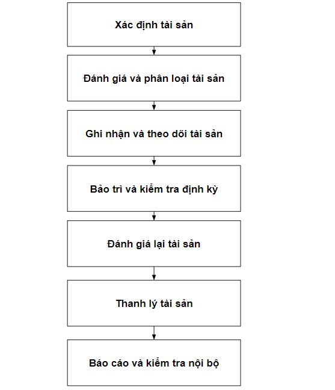

** Xác định tài sản cố định:**

Xác định các loại tài sản cố định cần quản lý (như máy móc, thiết bị, phương tiện, v.v.).

Ghi nhận thông tin chi tiết về tài sản (mã tài sản, mô tả, ngày mua, giá trị ban đầu, vị trí, v.v.).

** Đánh giá và phân loại tài sản:**

Phân loại tài sản theo các nhóm chức năng, giá trị, hoặc tầm quan trọng.

Đánh giá tuổi thọ, giá trị còn lại, và thời gian sử dụng dự kiến.

** Ghi nhận và theo dõi tài sản:**

Ghi nhận tài sản cố định vào hệ thống quản lý.

Cập nhật thông tin về các thay đổi như bảo trì, nâng cấp, di chuyển hoặc thanh lý tài sản.

** Bảo trì và kiểm tra định kỳ:**

Lên lịch và thực hiện bảo trì định kỳ cho tài sản.

Kiểm tra tình trạng tài sản để phát hiện sớm các vấn đề có thể xảy ra.

** Đánh giá lại tài sản:**

Thực hiện đánh giá lại giá trị tài sản theo chu kỳ (thường là hàng năm).

Điều chỉnh giá trị sổ sách của tài sản dựa trên kết quả đánh giá.

** Thanh lý tài sản:**

Xác định tài sản không còn sử dụng được hoặc không còn giá trị kinh tế.

Thực hiện các thủ tục thanh lý, hủy bỏ hoặc bán tài sản theo quy định.

** Báo cáo và kiểm tra nội bộ:**

Lập các báo cáo tài sản cố định để phục vụ công tác kiểm toán và quản lý.

Thực hiện kiểm tra nội bộ để đảm bảo việc quản lý tài sản được thực hiện đúng theo quy trình.

** Cải tiến liên tục:**

Dựa trên kết quả kiểm tra và phản hồi, thực hiện các biện pháp cải tiến để nâng cao hiệu quả quản lý tài sản cố định.

***b. Các quy trình cần thực hiện đối với đơn vị quản lý khai thác đường cao tốc***

**- Quy trình quản lý bảo vệ tài sản**

+ Quy trình kiểm kê tài sản

****

+ Quy trình tuần đường

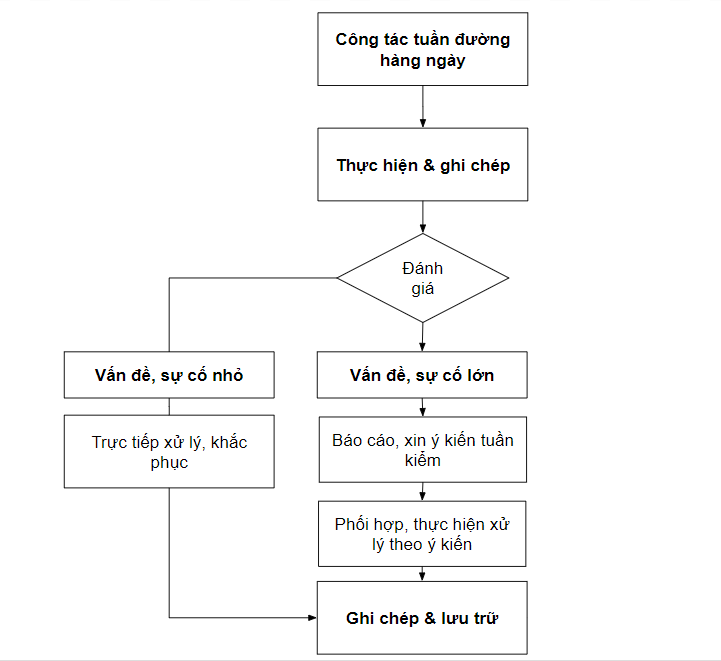

+ Quy trình tuần kiểm

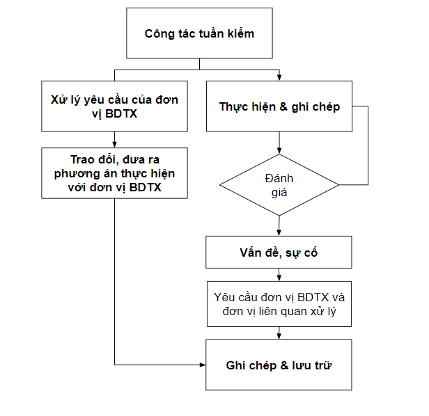

+ Công tác quản lý hành lang an toàn giao thông

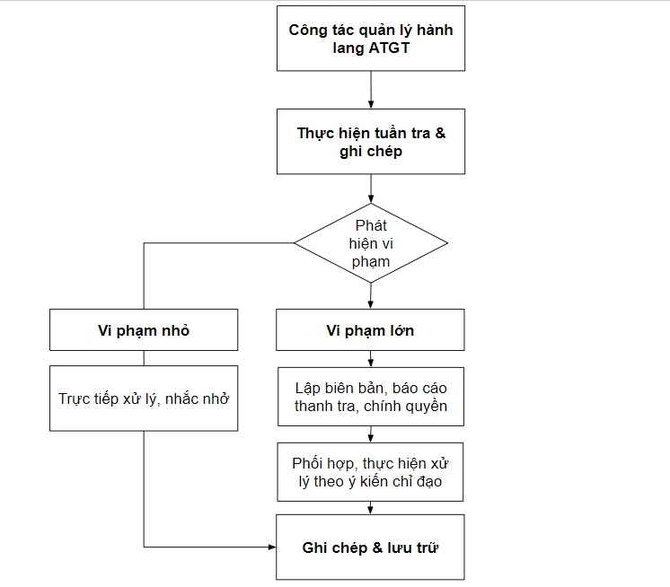

+ Quy trình vận hành hầm, cầu đường bộ

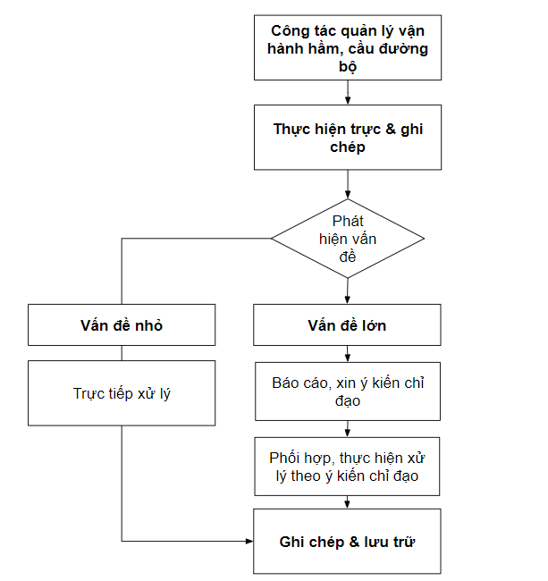

**- Quy trình vận hành, kiểm tra tài sản**

**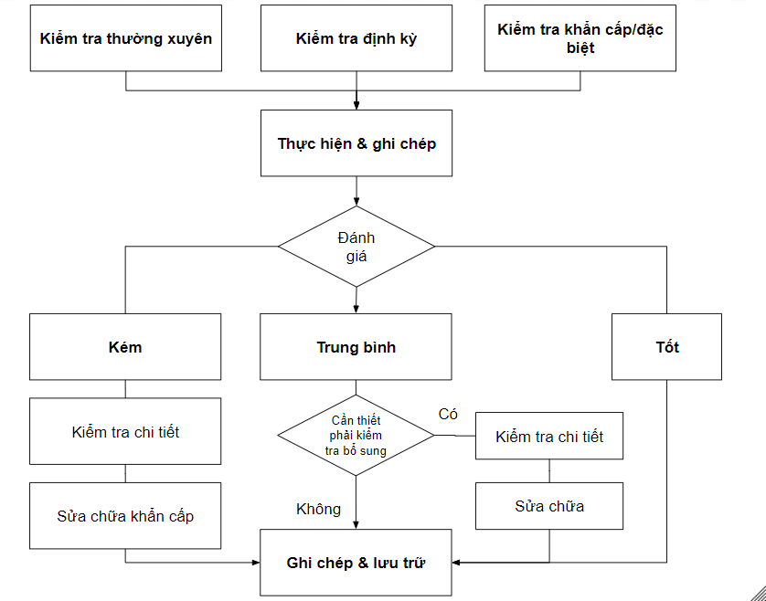**

**- Quy trình quản lý giao thông**

**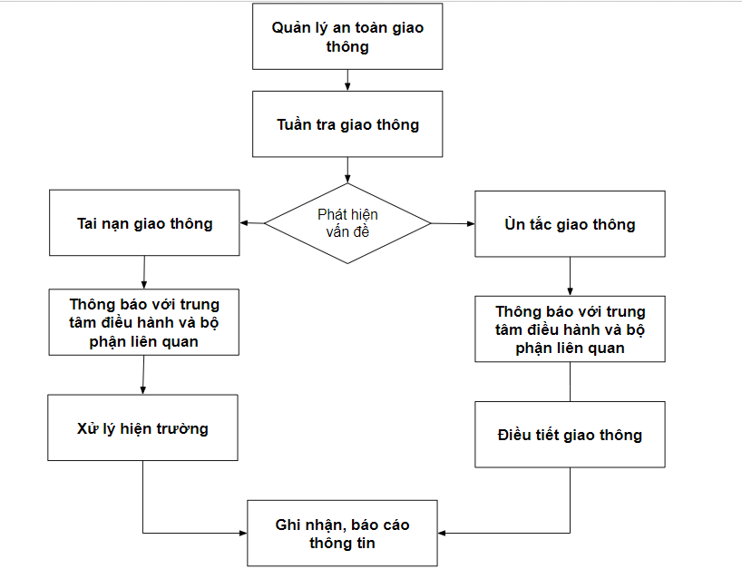**

**- Quy trình quản lý bảo trì đường cao tốc**

+ Quy trình lập kế hoạch bảo trì, sửa chữa

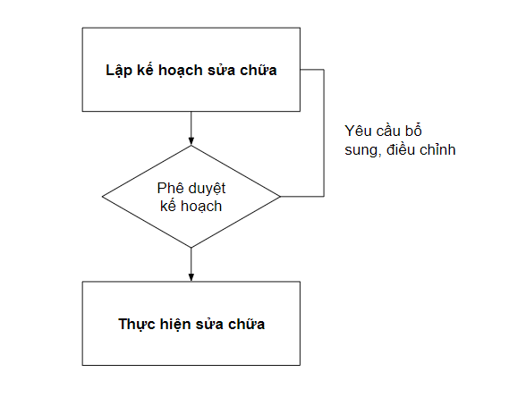

+ Quy trình quản lý bảo dưỡng

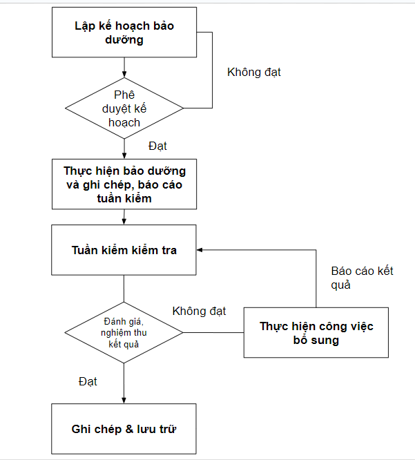

+ Quy trình quản lý kiểm tra

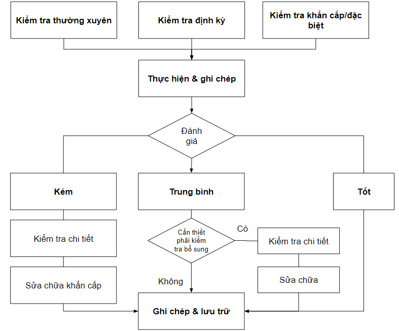

+ Quy trình quan trắc

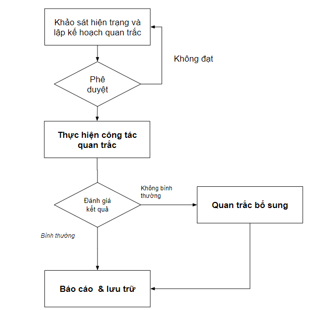

+ Quy trình quản lý kiểm định

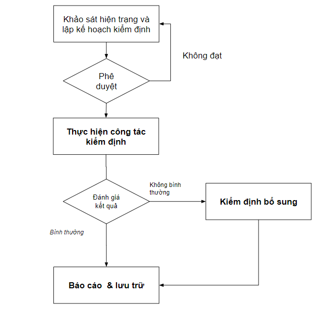

Đánh giá: Quy trình quản lý, bảo trì các tuyến đường cao tốc do VEC quản lý và khai thác rất nhiều và đa dạng. Tuy nhiên để phục vụ việc phân tích, xây dựng các chức năng phần mềm, trong khuôn khổ dự án sẽ tập trung các các quy trình như

**1. Quy trình quản lý tài sản**

**2. Quy trình quản lý bảo vệ tài sản**

+ Quy trình kiểm kê tài sản

+ Quy trình tuần đường

+ Quy trình tuần kiểm

+ Công tác quản lý hành lang an toàn giao thông

+ Quy trình vận hành hầm, cầu đường bộ

**3. Quy trình vận hành, kiểm tra tài sản**

**4. Quy trình quản lý giao thông**

**5. Quy trình quản lý bảo trì đường cao tốc**

+ Quy trình lập kế hoạch bảo trì, sửa chữa

+ Quy trình quản lý bảo dưỡng

+ Quy trình quản lý kiểm tra

1.4.2.2. Mô hình thành phần ứng dụng

Các phân hệ được cung cấp và thiết kế trên nền tảng web, di động. Các phân hệ bao gồm:

**Phân hệ Quản trị hệ thống**:

Phân hệ này đảm nhận việc quản lý toàn bộ hệ thống, bao gồm quản lý người dùng, nhóm người dùng, phân quyền và cấu hình các tính năng. Người quản trị có thể thêm mới, sửa đổi hoặc xóa tài khoản người dùng, cấp quyền truy cập dựa trên vai trò và nhiệm vụ cụ thể của từng người dùng. Ngoài ra, hệ thống còn hỗ trợ quản lý cấu hình bảo mật, thiết lập các chính sách an toàn như thay đổi mật khẩu định kỳ, xác thực hai yếu tố, và quản lý log hoạt động của người dùng để theo dõi lịch sử thao tác. Điều này đảm bảo tính bảo mật, ổn định và khả năng vận hành hiệu quả của hệ thống.

Phân hệ cung cấp các dịch vụ dữ liệu cho các hệ thống khác sử dụng.

**Màn hình chính (Dashboard)**:

Đây là trung tâm hiển thị thông tin tổng quan về hoạt động của hệ thống, cung cấp các biểu đồ, bảng thống kê, và báo cáo về các hoạt động bảo trì, kiểm tra và giám sát tài sản. Dashboard giúp người dùng nắm bắt nhanh chóng tình trạng của các tài sản, các yêu cầu đang chờ xử lý, và các cảnh báo khẩn cấp về sự cố phát sinh. Phân hệ này cũng cung cấp các tùy chọn để người dùng có thể theo dõi thông tin theo thời gian thực hoặc xem báo cáo lịch sử. Giao diện được thiết kế trực quan giúp tối ưu hóa việc ra quyết định và điều phối hoạt động.

**Phân hệ Quản lý vị trí và không gian tài sản trên tuyến cao tốc *(còn gọi là Quản lý tài sản trên đường cao tốc)***:

Phân hệ này quản lý dữ liệu vị trí và không gian của các tài sản trên bản đồ số 2D, 3D của tuyến cao tốc. Người dùng có thể xác định vị trí, cập nhật thông tin vị trí tài sản (như biển báo, cầu, hệ thống thoát nước), và theo dõi trạng thái của chúng. Hệ thống cung cấp bản đồ tương tác, cho phép phóng to/thu nhỏ và chọn từng tài sản để kiểm tra thông tin chi tiết. Điều này giúp việc quản lý tài sản trở nên dễ dàng và chính xác, đảm bảo rằng các dữ liệu về vị trí được cập nhật liên tục, giảm thiểu rủi ro sai sót trong quá trình quản lý không gian.

**Phân hệ Quản lý bảo trì, bảo dưỡng**:

Phân hệ này hỗ trợ quản lý toàn bộ quy trình bảo trì và bảo dưỡng tài sản, từ việc lập lịch bảo trì định kỳ đến xử lý các yêu cầu sửa chữa khẩn cấp. Người quản lý có thể lên lịch bảo dưỡng cho từng tài sản, phân công công việc cho đội ngũ kỹ thuật và theo dõi tiến độ thực hiện. Hệ thống cũng cho phép cập nhật báo cáo bảo trì ngay tại hiện trường, giúp việc giám sát và điều chỉnh kế hoạch bảo dưỡng trở nên nhanh chóng và hiệu quả. Phân hệ này cũng tích hợp với hệ thống cảnh báo, gửi thông báo khi phát hiện sự cố hoặc khi đến hạn bảo trì tài sản.

**Phân hệ Giám sát hoạt động vận hành và bảo trì, bảo dưỡng**:

Phân hệ này cung cấp khả năng giám sát chi tiết hoạt động vận hành và bảo trì tài sản theo thời gian thực. Các thông số về hiệu suất vận hành, tiến độ bảo trì được hiển thị dưới dạng biểu đồ và báo cáo trực quan, giúp người quản lý dễ dàng theo dõi và đánh giá hiệu quả. Ngoài ra, phân hệ còn tích hợp công cụ cảnh báo, thông báo về các sự cố vận hành hoặc bảo trì chưa hoàn thành đúng hạn. Phân hệ này giúp tối ưu hóa quy trình vận hành và bảo trì, giảm thiểu thời gian gián đoạn do sự cố.

1.4.2.3. Tác nhân tham gia hệ thống

|  |  |  |  |
| --- | --- | --- | --- |
| **TT** | **Tên tác nhân** | **Mô tả tác nhân** | **Phân loại tác nhân** |
| 1 | Cán bộ | Là cán bộ thuộc các đơn vận hành thuộc các công ty, cán bộ phòng ban thuôc các Ban của VEC | Phức tạp |
| 2 | Lãnh đạo | Là cán bộ lãnh đạo thuộc các công ty, các Ban thuộc VEC | Phức tạp |
| 3 | Quản trị hệ thống | Là cán bộ quản trị toàn hệ thống thông tin về hệ thống | Phức tạp |
| 4 | Hệ thống bên ngoài | Cung cấp các dịch vụ dữ liệu cho các hệ thống khác sử dụng | Đơn giản |

1.4.2.4. Danh sách yêu cầu người dùng

| **TT** | **Mô tả yêu cầu** | **Phân loại** |
| --- | --- | --- |
|  | **PHẦN 1 - NHÓM CHỨC NĂNG TRÊN WEB** |  |
| **A** | **Phân hệ quản trị hệ thống** |  |
| **I** | **Modules Quản trị hệ thống** |  |
| 1 | Quản lý người dùng | Dữ liệu đầu vào |
| 2 | Quản lý cầu hình chung hệ thống | Dữ liệu đầu vào |
|  | Xác thực người sử dụng |  |
| 3 | Đăng nhập hệ thống | Dữ liệu đầu vào |
| 4 | Thiết lập chính sách mật khẩu | Dữ liệu đầu vào |
| 5 | Khóa tài khoản sau số lần đăng nhập sai | Dữ liệu đầu vào |
|  | *Kiểm soát truy cập* |  |
| 6 | Quản lý thời gian chờ (Timeout) | Dữ liệu đầu vào |
| 7 | Phân quyền truy cập | Dữ liệu đầu vào |
| 8 | Quản lý nhật ký hoạt động hệ thống (Audit Log) | Dữ liệu đầu vào |
| II | Modules quản trị danh mục | Dữ liệu đầu vào |
| 9 | Danh mục Phân quyền chức năng | Dữ liệu đầu vào |
| 10 | Quản lý danh mục địa phận tỉnh | Dữ liệu đầu vào |
| 11 | Quản lý danh mục địa phận xã | Dữ liệu đầu vào |
| 12 | Quản lý danh mục phòng ban, trung tâm VEC | Dữ liệu đầu vào |
| 13 | Quản lý danh mục các tuyến cao tốc do VEC quản lý | Dữ liệu đầu vào |
| 14 | Quản lý danh mục các đơn vị quản lý, khai thác, giám sát trên các tuyến | Dữ liệu đầu vào |
| 15 | Quản lý danh mục tài sản trên tuyến | Dữ liệu đầu vào |
| 16 | Quản lý danh mục thiết bị (thiết bị văn phòng, thiết bị CNTT và các thiết bị khác) | Dữ liệu đầu vào |
| 17 | Quản lý danh mục kho vật lý | Dữ liệu đầu vào |
| 18 | Quản lý danh mục hồ sơ tài sản đường cao tốc | Dữ liệu đầu vào |
|  | *Quản lý danh mục đánh giá chấm điểm giám sát* |  |
| 19 | Quản lý danh mục đánh giá bảo trì | Dữ liệu đầu vào |
| 20 | Quản lý danh mục đánh giá sửa chữa | Dữ liệu đầu vào |
| 21 | Quản lý danh mục tiêu chí đánh giá vận hành | Dữ liệu đầu vào |
| 22 | Quản lý danh mục mục sơ đồ mặt bằng | Dữ liệu đầu vào |
| 23 | Quản lý danh mục của các lớp tài sản | Dữ liệu đầu vào |
| III | Quản lý tích hợp, chia sẻ | Dữ liệu đầu vào |
| 24 | Quản lý dịch vụ | Dữ liệu đầu vào |
| 25 | Theo dõi và giám sát tình trạng dịch vụ | Dữ liệu đầu ra |
| 26 | Quản lý cấu hình dịch vụ | Dữ liệu đầu vào |
|  | *Chia sẻ dữ liệu dữ liệu tài sản* |  |
| 27 | Dịch vụ dữ liệu tổng hợp tài sản | Dữ liệu đầu ra |
| 28 | Dịch vụ dữ liệu chi tiết tài sản | Dữ liệu đầu ra |
|  | *Chia sẻ dịch vụ bảo trì tài sản* | Dữ liệu đầu vào |
| 29 | Dịch vụ dữ liệu bảo trì định kỳ | Dữ liệu đầu ra |
| 30 | Dịch vụ dữ liệu các yêu cầu theo thời gian, loại yêu cầu | Dữ liệu đầu ra |
| **B** | **Màn hình chính (Dashboard)** | Dữ liệu đầu vào |
| 31 | Tổng hợp số lượng tài sản | Dữ liệu đầu ra |
| 32 | Cảnh báo tài sản sắp đến hạn thanh lý | Dữ liệu đầu ra |
| 33 | Cảnh báo tài sản sắp đến hạn bảo trì | Dữ liệu đầu ra |
| 34 | Tổng hợp tài sản đã thanh lý, thanh hủy | Dữ liệu đầu ra |
| 35 | Thông tin hồ sơ tài sản | Dữ liệu đầu ra |
| 36 | Hoạt động kiểm kê tài sản | Dữ liệu đầu ra |
| 37 | Tổng hợp hoạt động kiểm tra tài sản | Dữ liệu đầu ra |
| 38 | Cảnh báo kết quả kiểm tra bất thường | Dữ liệu đầu ra |
| 39 | Tiến độ thực hiện kế hoạch bảo trì | Dữ liệu đầu ra |
| 40 | Tài sản có lịch bảo trì định kỳ | Dữ liệu đầu ra |
| 41 | Tình trạng xử lý công việc sửa chữa | Dữ liệu đầu ra |
| 42 | Tiếp nhận và xử lý phản ánh từ hiện trường | Dữ liệu đầu ra |
| 43 | Phân tích xu hướng sự cố lặp lại | Dữ liệu đầu ra |
| 44 | Đánh giá hiệu suất công tác bảo trì | Dữ liệu đầu ra |
| **C** | **Phân hệ Quản lý tài sản trên đường cao tốc** |  |
| **I** | **Quản lý tài sản trên bản đồ** |  |
| *I.1* | *Quản lý bản đồ nền* |  |
| 45 | Cấu hình bản đồ nền | Dữ liệu đầu vào |
| 46 | Thay đổi bản đồ đồ nền | Dữ liệu đầu vào |
| *I.2* | *Quản lý lý dữ liệu 3D* |  |
| 47 | Cài đặt hiển thị 3D cho loại dữ liệu dạng điểm | Dữ liệu đầu vào |
| 48 | Cập nhật dữ liệu 3D trên bản đồ | Dữ liệu đầu vào |
| I.3 | Quản lý lớp thông tin tài sản trên bản đồ | Dữ liệu đầu vào |
| 49 | Thêm lớp dữ liệu bản đồ mới | Dữ liệu đầu vào |
| 50 | Quản lý các lớp thông tin | Dữ liệu đầu vào |
| 51 | Cập nhật dữ liệu tài sản trên bản đồ | Dữ liệu đầu vào |
| 52 | Khai thác tài sản trên bản đồ | Dữ liệu đầu vào |
| 53 | Định vị tài sản theo tuyến | Dữ liệu đầu ra |
| **II** | **Quản lý thiết bị trên sơ đồ mặt bằng** |  |
| 54 | Thêm thông tin thiết bị trên sơ đồ mặt bằng | Dữ liệu đầu vào |
| 55 | Cập nhật thiết bị trên sơ đồ bằng bằng | Dữ liệu đầu vào |
| 56 | Khai thác tài sản, thiết bị trên sơ đồ mặt bằng | Dữ liệu đầu ra |
| **III** | **Quản lý tài sản trên bình đồ duỗi thẳng** |  |
| 57 | Hiển thị tài sản trên bình đồ duỗi thẳng | Dữ liệu đầu ra |
| 58 | Tìm kiếm tài sản trên bình đồ | Dữ liệu đầu ra |
| 59 | Xem chi tiết tài sản trên bình đồ | Dữ liệu đầu ra |
| 60 | Xuất dữ liệu bình đồ duỗi thẳng | Dữ liệu đầu ra |
| **IV** | **Quản lý mô hình BIM** |  |
| 61 | Tích hợp mô hình BIM | Dữ liệu đầu vào |
| 62 | Sửa mô hình BIM | Dữ liệu đầu vào |
| 63 | Xóa mô hình BIM | Dữ liệu đầu ra |
| 64 | Quản lý phiên bản mô hình | Dữ liệu đầu vào |
| 65 | So sánh phiên bản mô hình | Dữ liệu đầu ra |
| 66 | Quản lý lớp hiển thị dữ liệu | Dữ liệu đầu vào |
| 67 | Công cụ đo đạc và tương tác | Dữ liệu đầu ra |
| 68 | Tương tác với tài sản, thiết bị | Dữ liệu đầu vào |
| 69 | Liên kết thông tin hồ sơ tài liệu của tài sản thiết bị | Dữ liệu đầu ra |
| 70 | Tìm kiếm tài sản trên mô hình | Dữ liệu đầu vào |
| 71 | Lọc hiển thị theo điều kiện thuộc tính | Dữ liệu đầu ra |
| 72 | Gắn cảnh báo/ghi chú vào đối tượng | Dữ liệu đầu vào |
| 73 | Trích xuất dữ liệu thống kê từ mô hình | Dữ liệu đầu ra |
| **V** | **Nghiệp vụ quản lý tài sản** |  |
| ***V.1.*** | ***Quản lý thông tin tài sản*** |  |
| 74 | Quản lý Biển báo | Dữ liệu đầu vào |
| 75 | Quản lý Cầu | Dữ liệu đầu vào |
| 76 | Quản lý Cống dân sinh | Dữ liệu đầu vào |
| 77 | Quản lý Cống thoát nước | Dữ liệu đầu vào |
| 78 | Quản lý Cột KM | Dữ liệu đầu vào |
| 79 | Quản lý Cột GPMB, MLG | Dữ liệu đầu vào |
| 80 | Quản lý Dải phân cách | Dữ liệu đầu vào |
| 81 | Quản lý Đất hạ tầng | Dữ liệu đầu vào |
| 82 | Quản lý Đường gom | Dữ liệu đầu vào |
| 83 | Quản lý Giá long môn | Dữ liệu đầu vào |
| 84 | Quản lý Hàng rào bảo vệ | Dữ liệu đầu vào |
| 85 | Quản lý Hàng rào chống chói | Dữ liệu đầu vào |
| 86 | Quản lý Hầm | Dữ liệu đầu vào |
| 87 | Quản lý Hố ga | Dữ liệu đầu vào |
| 88 | Quản lý Hệ thống chiếu sáng | Dữ liệu đầu vào |
| 89 | Quản lý Hệ thống điện | Dữ liệu đầu vào |
| 90 | Quản lý Hệ thống ITS | Dữ liệu đầu vào |
| 91 | Quản lý Kho bãi | Dữ liệu đầu vào |
| 92 | Quản lý Mái dốc | Dữ liệu đầu vào |
| 93 | Quản lý Mặt đường | Dữ liệu đầu vào |
| 94 | Quản lý Nút giao đường bộ | Dữ liệu đầu vào |
| 95 | Quản lý Phương tiện đi lại | Dữ liệu đầu vào |
| 96 | Quản lý Rãnh dọc | Dữ liệu đầu vào |
| 97 | Quản lý Rào chắn ồn | Dữ liệu đầu vào |
| 98 | Quản lý Tôn hộ lan | Dữ liệu đầu vào |
| 99 | Quản lý Thảm cỏ cây xanh | Dữ liệu đầu vào |
| 100 | Quản lý Thiết bị cân xe | Dữ liệu đầu vào |
| 101 | Quản lý Thiết bị O&M | Dữ liệu đầu vào |
| 102 | Quản lý Thiết bị thí nghiệm | Dữ liệu đầu vào |
| 103 | Quản lý Trạm dừng nghỉ | Dữ liệu đầu vào |
| 104 | Quản lý Trạm thu phí | Dữ liệu đầu vào |
| 105 | Quản lý Trung tâm điều hành | Dữ liệu đầu vào |
| 106 | Quản lý Vạch kẻ đường | Dữ liệu đầu vào |
| 107 | Quản lý thiết bị văn phòng, thiết bị CNTT | Dữ liệu đầu vào |
| 108 | Quản lý cấu hình cảnh báo tài sản | Dữ liệu đầu vào |
| ***IV.2.*** | ***Quản lý tài sản thanh lý*** |  |
| 109 | Khởi tạo yêu cầu thanh lý tài sản | Dữ liệu đầu vào |
| 110 | Phê duyệt yêu cầu thanh lý tài sản | Dữ liệu đầu vào |
| 111 | Cập nhật thông tin tài sản thanh lý | Dữ liệu đầu vào |
| 112 | Xuất báo cáo thanh lý tài sản | Dữ liệu đầu vào |
| 113 | Lưu trữ hồ sơ thanh lý tài sản | Dữ liệu đầu vào |
| 114 | Theo dõi trạng thái thanh lý tài sản | Dữ liệu đầu ra |
| ***V.3.*** | ***Quản lý tài sản thanh hủy*** |  |
| 115 | Khởi tạo yêu cầu Thanh hủy tài sản | Dữ liệu đầu vào |
| 116 | Phê duyệt yêu cầu Thanh hủy tài sản | Dữ liệu đầu vào |
| 117 | Cập nhật thông tin tài sản Thanh hủy | Dữ liệu đầu vào |
| 118 | Xuất báo cáo Thanh hủy tài sản | Dữ liệu đầu vào |
| 119 | Lưu trữ hồ sơ Thanh hủy tài sản | Dữ liệu đầu vào |
| 120 | Theo dõi trạng thái Thanh hủy tài sản | Dữ liệu đầu ra |
| ***V.4.*** | ***Quản lý kiểm kê tài sản*** |  |
| 121 | Lập kế hoạch kiểm kê tài sản | Dữ liệu đầu vào |
| 122 | Tạo phiếu kiểm kê tài sản | Dữ liệu đầu vào |
| 123 | Thực hiện kiểm kê tài sản thực địa | Dữ liệu đầu vào |
| 124 | So sánh kết quả kiểm kê | Dữ liệu đầu vào |
| 125 | Cập nhật dữ liệu sau kiểm kê | Dữ liệu đầu vào |
| 126 | Báo cáo kết quả kiểm kê | Dữ liệu đầu ra |
| 127 | Quản lý lịch sử kiểm kê | Dữ liệu đầu vào |
| 128 | Đề xuất xử lý tài sản sau kiểm kê | Dữ liệu đầu vào |
| ***V.5.*** | ***Quản lý kho tài sản trên các tuyến*** |  |
| 129 | Khai báo kho tài sản trên tuyến | Dữ liệu đầu vào |
| 130 | Danh mục tài sản thu hồi lưu kho | Dữ liệu đầu vào |
| 131 | Cập nhật thông tin tài sản thu hồi theo từng tài sản | Dữ liệu đầu vào |
| 132 | Cập nhật thông tin tài sản thu hồi đồng loạt | Dữ liệu đầu vào |
| 133 | Hiển thị danh mục tài sản thu hồi lưu kho | Dữ liệu đầu ra |
| 134 | Quản lý điều chuyển kho | Dữ liệu đầu vào |
| 135 | Cập nhật thông tin tài sản chuyển kho theo từng tài sản | Dữ liệu đầu vào |
| 136 | Cập nhật thông tin tài sản chuyển kho đồng loạt | Dữ liệu đầu vào |
| 137 | Hiển thị danh mục tài sản đã chuyển kho | Dữ liệu đầu ra |
| 138 | Tìm kiếm tài sản đã chuyển kho, truy xuất tình trạng | Dữ liệu đầu ra |
| 139 | Báo cáo thống kê tài sản lưu kho, điều chuyển kho | Dữ liệu đầu ra |
| ***V.6.*** | ***Quản lý hợp đồng khai thác*** |  |
| 140 | Khai báo thông tin hợp đồng | Dữ liệu đầu vào |
| 141 | Cập nhật thông tin hợp đồng | Dữ liệu đầu vào |
| 142 | Tìm kiếm thông tin hợp đồng | Dữ liệu đầu vào |
| ***V.7.*** | ***Quản lý hồ sơ quản lý khai thác*** | Dữ liệu đầu vào |
| 143 | Thêm mới hồ sơ tài liệu | Dữ liệu đầu vào |
| 144 | Cập nhật thông tin hồ sơ | Dữ liệu đầu vào |
| 145 | Tìm kiếm thông tin hồ sơ | Dữ liệu đầu ra |
| V.8 | Báo cáo và thống kê tài sản | Dữ liệu đầu ra |
| 146 | Báo cáo tổng hợp tài sản | Dữ liệu đầu ra |
| **D** | **Phân hệ Quản lý bảo trì, bảo dưỡng** |  |
| **I** | **Lập kế hoạch bảo trì** |  |
| 147 | Lập kế hoạch bảo trì thường xuyên | Dữ liệu đầu vào |
| 148 | Lập kế hoạch sửa chữa định kỳ | Dữ liệu đầu vào |
| 149 | Lập kế hoạch sửa chữa lớn | Dữ liệu đầu vào |
| 150 | Lập kế hoạch sửa chữa đột xuất | Dữ liệu đầu vào |
| 151 | Theo dõi thực hiện kế hoạch bảo trì | Dữ liệu đầu ra |
| **II.** | **Quản lý kiểm tra tài sản** |  |
| 152 | Lập kế hoạch kiểm tra và phân công công việc | Dữ liệu đầu vào |
| 153 | Cập nhật thông tin kiểm tra | Dữ liệu đầu vào |
| 154 | Tìm kiếm kết quả kiểm tra | Dữ liệu đầu vào |
| 155 | Xem chi tiết kết quả kiểm tra | Dữ liệu đầu ra |
| 156 | Tạo công việc xử lý sau kiểm tra | Dữ liệu đầu vào |
| 157 | Cảnh báo tự động kết quả kiểm tra bất thường | Dữ liệu đầu vào |
| **III.** | **Quản lý bảo trì, bảo dưỡng tài sản** |  |
| 158 | Lập kế hoạch bảo trì, bảo dưỡng | Dữ liệu đầu vào |
| 159 | Cập nhật kết quả bảo trì | Dữ liệu đầu vào |
| 160 | Tìm kiếm kết quả bảo trì | Dữ liệu đầu vào |
| 161 | Xem chi tiết kết quả bảo trì | Dữ liệu đầu ra |
| 162 | Tạo công việc xử lý sau bảo trì | Dữ liệu đầu vào |
| 163 | Cảnh báo tự động kết quả bảo trì |  |
| **IV.** | **Quản lý sửa chữa tài sản** | Dữ liệu đầu vào |
| 164 | Lập kế hoạch sửa chữa tài sản | Dữ liệu đầu vào |
| 165 | Cập nhật kết quả sửa chữa | Dữ liệu đầu vào |
| 166 | Tìm kiếm kết quả sửa chữa | Dữ liệu đầu ra |
| 167 | Xem chi tiết kết quả sửa chữa | Dữ liệu đầu vào |
| 168 | Cảnh báo tự động kết quả sửa chữa | Dữ liệu đầu vào |
| **V.** | **Báo cáo tổng hợp công tác bảo trì, bảo dưỡng tài sản** |  |
| 169 | Báo cáo, tổng hợp dữ liệu bảo trì định kỳ | Dữ liệu đầu ra |
| 170 | Báo cáo, tổng hợp tình trạng tài sản sau bảo trì | Dữ liệu đầu ra |
| 171 | Báo cáo, tổng hợp dữ liệu hiệu suất bảo trì | Dữ liệu đầu ra |
| 172 | Báo cáo, tổng hợp về sự cố và sửa chữa đột xuất | Dữ liệu đầu ra |
| 173 | Tra cứu và xuất lịch sử bảo trì tài sản | Dữ liệu đầu ra |
| **VI** | **Quản lý tiếp nhận và xử lý yêu cầu trong quản lý khai thác** | **Dữ liệu đầu vào** |
| ***VI.1*** | ***Quản lý tiếp nhận và xử lý yêu cầu*** | Dữ liệu đầu vào |
| 174 | Khai báo yêu cầu từ khách hàng hoặc cán bộ quản lý vận hành | Dữ liệu đầu vào |
| 175 | Phân loại và phân bổ yêu cầu cho đơn vị quản lý vận hành | Dữ liệu đầu vào |
| 176 | Tạo và giao xử lý công việc cho cán bộ thực hiện | Dữ liệu đầu vào |
| 177 | Cập nhật kết quả xử lý vào yêu cầu | Dữ liệu đầu vào |
| 178 | Đóng yêu cầu sau khi xử lý hoàn thành | Dữ liệu đầu vào |
| 179 | Thông báo trên phần mềm khi có sự cố gửi đến người dùng | Dữ liệu đầu ra |
| 180 | Theo dõi trạng thái và tiến độ xử lý yêu cầu | Dữ liệu đầu ra |
| ***VI.2*** | ***Tra cứu và báo cáo*** |  |
| 181 | Tra cứu số liệu về các yêu cầu | Dữ liệu đầu ra |
| 182 | Tra cứu số liệu về công việc | Dữ liệu đầu ra |
| **F** | **Phân hệ Giám sát hoạt động vận hành và bảo trì, bảo dưỡng** |  |
| **I.** | **Kiểm tra và đánh giá giám sát** |  |
| 183 | Lập và phân công kế hoạch giám sát | Dữ liệu đầu vào |
| 184 | Kiểm tra và đánh giá giám sát | Dữ liệu đầu vào |
| 185 | Cập nhật kết quả đánh giá | Dữ liệu đầu vào |
| 186 | Xem chi tiết kết quả đánh giá | Dữ liệu đầu ra |
| 187 | Trao đổi, chỉ đạo thông tin | Dữ liệu đầu vào |
| 188 | Tạo công việc để xử lý hạng mục sau sửa chữa | Dữ liệu đầu vào |
| 189 | Gửi kết quả đánh giá | Dữ liệu đầu vào |
| 190 | Báo cáo tổng hợp kết quả đánh giá, giám sát | Dữ liệu đầu ra |
| **II** | **Đánh giá chấm điểm theo tiêu chuẩn TCVN/AASHTO** |  |
| 191 | Chọn tiêu chuẩn đánh giá | Dữ liệu đầu vào |
| 192 | Nhập dữ liệu kiểm tra hiện trường | Dữ liệu đầu vào |
| 193 | Tính chỉ số IRI (TCVN 8863) | Dữ liệu đầu vào |
| 194 | Thiết kế kết cấu áo đường mềm (TCVN 9437) | Dữ liệu đầu vào |
| 195 | Chấm điểm PCI (Pavement Condition Index) | Dữ liệu đầu vào |
| 196 | Chấm điểm BCI (Bridge Condition Index) | Dữ liệu đầu vào |
| 197 | Phân loại và cảnh báo tự động | Dữ liệu đầu vào |
| 198 | Hiển thị kết quả trên bản đồ | Dữ liệu đầu ra |
| 199 | Gợi ý biện pháp xử lý kỹ thuật | Dữ liệu đầu vào |
| 200 | Theo dõi thay đổi theo thời gian | Dữ liệu đầu ra |
| 201 | Xuất báo cáo kết quả đánh giá | Dữ liệu đầu ra |
| 202 | Tùy chỉnh trọng số đánh giá | Dữ liệu đầu vào |
|  | **PHẦN II - NHÓM CHỨC NĂNG TRÊN DI ĐỘNG** |  |
| **A** | **Quản lý đăng nhập hệ thống** |  |
| 203 | Đăng nhập hệ thống | Dữ liệu đầu vào |
| **B** | **Màn hình chính (Dashboard)** |  |
| 204 | Tổng hợp số lượng tài sản | Dữ liệu đầu ra |
| 205 | Cảnh báo tài sản sắp đến hạn thanh lý | Dữ liệu đầu ra |
| 206 | Cảnh báo tài sản sắp đến hạn bảo trì | Dữ liệu đầu ra |
| 207 | Tổng hợp tài sản đã thanh lý, thanh hủy | Dữ liệu đầu ra |
| 208 | Thông tin hồ sơ tài sản | Dữ liệu đầu ra |
| 209 | Hoạt động kiểm kê tài sản | Dữ liệu đầu ra |
| 210 | Tổng hợp hoạt động kiểm tra tài sản | Dữ liệu đầu ra |
| 211 | Cảnh báo kết quả kiểm tra bất thường | Dữ liệu đầu ra |
| 212 | Tiến độ thực hiện kế hoạch bảo trì | Dữ liệu đầu ra |
| 213 | Tài sản có lịch bảo trì định kỳ | Dữ liệu đầu ra |
| 214 | Tình trạng xử lý công việc sửa chữa | Dữ liệu đầu ra |
| 215 | Tiếp nhận và xử lý phản ánh từ hiện trường | Dữ liệu đầu ra |
| 216 | Phân tích xu hướng sự cố lặp lại | Dữ liệu đầu ra |
| 217 | Đánh giá hiệu suất công tác bảo trì | Dữ liệu đầu ra |
| **C** | **Quản lý tài sản trên đường cao tốc** |  |
| **I** | **Quản lý tài sản trên bản đồ** |  |
| 218 | Cập nhật dữ liệu tài sản ngoài thực địa | Dữ liệu đầu vào |
| 219 | Khai thác tài sản trên bản đồ | Dữ liệu đầu ra |
| **II.** | **Quản lý kiểm kê tài sản** |  |
| 220 | Thực hiện kiểm kê tài sản thực địa | Dữ liệu đầu vào |
| 221 | Tra cứu kết quả kiểm kê | Dữ liệu đầu ra |
| **III.** | **Quản lý kho tài sản trên các tuyến** |  |
| 222 | Hiển thị danh mục tài sản thu hồi lưu kho | Dữ liệu đầu ra |
| 223 | Hiển thị danh mục tài sản đã chuyển kho | Dữ liệu đầu ra |
| 224 | Tìm kiếm tài sản đã chuyển kho, truy xuất tình trạng | Dữ liệu đầu ra |
| **D** | **Quản lý bảo trì, bảo dưỡng** |  |
| **I** | **Quản lý kiểm tra tài sản** |  |
| 225 | Thực hiện công tác kiểm tra thường xuyên ngoài thực địa | Dữ liệu đầu vào |
| 226 | Tìm kiếm kết quả kiểm tra | Dữ liệu đầu ra |
| 227 | Xem chi tiết kết quả kiểm tra | Dữ liệu đầu ra |
| **II.** | **Quản lý bảo trì, bảo dưỡng tài sản** |  |
| 228 | Cập nhật kết quả bảo trì ngoài thực địa | Dữ liệu đầu vào |
| 229 | Tìm kiếm kết quả bảo trì | Dữ liệu đầu vào |
| 230 | Xem chi tiết kết quả bảo trì | Dữ liệu đầu vào |
| **III.** | **Quản lý sửa chữa tài sản** |  |
| 231 | Cập nhật kết quả sửa chữa ngoài thực địa | Dữ liệu đầu vào |
| 232 | Tìm kiếm kết quả sửa chữa | Dữ liệu đầu ra |
| 233 | Xem chi tiết kết quả sửa chữa | Dữ liệu đầu ra |
| **IV** | **Quản lý tiếp nhận và xử lý yêu cầu trong quản lý khai thác** |  |
| 234 | Khai báo yêu cầu từ khách hàng hoặc cán bộ quản lý vận hành | Dữ liệu đầu vào |
| 235 | Cập nhật kết quả xử lý vào yêu cầu | Dữ liệu đầu vào |
| 236 | Đóng yêu cầu sau khi xử lý hoàn thành | Dữ liệu đầu vào |
| 237 | Thông báo trên phần mềm khi có sự cố gửi đến người dùng | Dữ liệu đầu vào |
| 238 | Theo dõi trạng thái và tiến độ xử lý yêu cầu | Dữ liệu đầu ra |
| **F** | **Giám sát hoạt động vận hành và bảo trì, bảo dưỡng** |  |
| 239 | Kiểm tra và đánh giá giám sát ngoài thực địa | Dữ liệu đầu vào |
| 240 | Cập nhật kết quả đánh giá | Dữ liệu đầu vào |
| 241 | Xem chi tiết kết quả đánh giá | Dữ liệu đầu ra |
| 242 | Trao đổi, chỉ đạo thông tin | Dữ liệu đầu ra |
| 243 | Gửi kết quả đánh giá | Dữ liệu đầu vào |

1.4.2.5. Bảng chuyển đổi yêu cầu các chức năng sang trường hợp sử dụng

1.4.2.5.1. Nhóm chức năng trên web

| **TT** | **Tên Use case** | **Tên tác nhân** | **Giao dịch (Transaction)** | **Phân loại theo BMT** | **Phân loại theo độ phức tạp** |
| --- | --- | --- | --- | --- | --- |
| **A** | **Phân hệ quản trị hệ thống** |  |  |  |  |
| **I** | **Modules Quản trị hệ thống** |  |  |  |  |
| 1 | Quản lý người dùng | QTHT | Quản trị hệ thống thực hiện tìm kiếm thông tin người dùng dựa trên các tiêu chí như tên, email, hoặc mã số người dùng. Hệ thống sẽ hiển thị danh sách người dùng phù hợp với kết quả tìm kiếm. | B | Trung bình |
| Quản trị hệ thống thêm thông tin người dùng mới, bao gồm các trường dữ liệu như tên, email, số điện thoại và quyền hạn. Hệ thống sẽ lưu trữ thông tin và xác nhận rằng người dùng mới đã được thêm thành công. |
| Quản trị hệ thống sửa thông tin của một người dùng hiện tại, bao gồm các thông tin như tên, email, số điện thoại hoặc quyền hạn. Hệ thống sẽ cập nhật thông tin và thông báo xác nhận việc chỉnh sửa. |
| Quản trị hệ thống xóa một người dùng khỏi hệ thống dựa trên mã số hoặc tiêu chí định danh khác. Hệ thống sẽ xóa dữ liệu liên quan và thông báo xác nhận rằng người dùng đã bị xóa. |
| Quản trị hệ thống khóa hoặc đổi mật khẩu của một người dùng để đảm bảo an ninh hoặc khắc phục sự cố. Hệ thống sẽ áp dụng thay đổi và thông báo xác nhận trạng thái mới của người dùng. |
| 2 | Quản lý cầu hình chung hệ thống | QTHT | Quản trị hệ thống thiết lập hạn chế số lần đăng nhập sai cho tài khoản trong một khoảng thời gian nhất định để tăng cường bảo mật. Hệ thống sẽ theo dõi số lần đăng nhập sai và tự động khóa tài khoản nếu vượt quá giới hạn, đồng thời thông báo lý do khóa. | B | Đơn giản |
| Quản trị hệ thống quản lý danh sách địa chỉ mạng được phép truy cập hệ thống quản trị, bao gồm việc thêm, sửa, hoặc xóa các địa chỉ mạng. Hệ thống sẽ kiểm tra địa chỉ mạng của Quản trị hệ thống khi đăng nhập và chỉ cho phép truy cập nếu địa chỉ nằm trong danh sách được cấp quyền. |
| Quản trị hệ thống cấu hình dung lượng tối đa tải video, hình ảnh, tài liệu của ứng dụng trên web, di động. Hệ thống sẽ hiển thị form cấu hình cho người dùng cầu hình. |
|  | **Xác thực người sử dụng** |  |  |  |  |
| 3 | Đăng nhập hệ thống | Cán bộ | Cán bộ nhập thông tin đăng nhập, bao gồm tài khoản và mật khẩu, để truy cập vào hệ thống.Hệ thống xác thực thông tin đăng nhập và cho phép truy cập nếu thông tin hợp lệ. | B | Đơn giản |
| 4 | Thiết lập chính sách mật khẩu | QTHT | Quản trị hệ thống thiết lập các quy định về mật khẩu như độ dài tối thiểu, loại ký tự bắt buộc (chữ hoa, chữ thường, ký tự đặc biệt), thời gian hiệu lực của mật khẩu, và khoảng thời gian cần thay đổi mật khẩu.Hệ thống sẽ tự động áp dụng các quy định này khi người dùng tạo hoặc thay đổi mật khẩu. | B | Đơn giản |
| 5 | Khóa tài khoản sau số lần đăng nhập sai | QTHT | Quản trị hệ thống thiết lập trạng thái khóa tài khoản. Nếu người dùng nhập sai thông tin đăng nhập quá số lần quy định,hệ thống sẽ tạm thời khóa tài khoản và hiển thị thông báo cảnh báo, đồng thời yêu cầu người dùng liên hệ với quản trị viên để được hỗ trợ. | B | Đơn giản |
|  | **Kiểm soát truy cập** |  |  |  |  |
| 6 | Quản lý thời gian chờ (Timeout) | QTHT | Quản trị hệ thống thiết lập thời gian chờ. Sau khoảng thời gian không hoạt động, hệ thống sẽ tự động đăng xuất người dùng để đảm bảo an toàn và tránh các truy cập trái phép. | B | Đơn giản |
| 7 | Phân quyền truy cập | QTHT | Quản trị hệ thống thiết lập phân quyền truy cập theo chức năng hoặc nhóm người dùng cụ thể, giới hạn quyền truy cập dựa trên chức vụ hoặc vai trò của từng người dùng. Hệ thống sẽ kiểm soát và áp dụng các quyền này trong suốt quá trình sử dụng. | B | Đơn giản |
| 8 | Quản lý nhật ký hoạt động hệ thống (Audit Log) | QTHT | Quản trị hệ thống tìm kiếm nhật ký hệ thống theo phân loại, thời gian. Hệ thống hiển thị kết quả tìm kiếm | B | Trung bình |
| Quản trị hệ thống lọc nhật ký hệ thống theo người dùng. Hệ thống hiển thị kết quả tìm kiếm |
| Quản trị hệ thống thực hiện xuất excel kết quả tìm kiếm. Hệ thống hiện tại file excel để người dùng tải về |
| Quản trị hệ thống xem lịch sử thay đổi dữ liệu. Hệ thống hiển thị chi tiết thông tin lịch sử dữ liệu theo thời gian |
| **II** | **Modules quản trị danh mục** |  |  |  |  |
| 9 | Danh mục Phân quyền chức năng | QTHT | Quản trị hệ thống nhập thông tin và lưu. Hệ thống phản hồi: "Thêm mới danh mục thành công." | B | Đơn giản |
| Quản trị hệ thống cập nhật thông tin và lưu. Hệ thống phản hồi: "Cập nhật danh mục thành công." |
| Quản trị hệ thống chọn danh mục, xóa và xác nhận. Hệ thống phản hồi: "Xóa danh mục thành công." |
| 10 | Quản lý danh mục địa phận tỉnh | QTHT | Quản trị hệ thống nhập thông tin và lưu. Hệ thống phản hồi: "Thêm mới danh mục thành công." | B | Đơn giản |
|  |  |  | Quản trị hệ thống cập nhật thông tin và lưu. Hệ thống phản hồi: "Cập nhật danh mục thành công." |
|  |  |  | Quản trị hệ thống chọn danh mục, xóa và xác nhận. Hệ thống phản hồi: "Xóa danh mục thành công." |
| 11 | Quản lý danh mục địa phận xã | QTHT | Quản trị hệ thống nhập thông tin và lưu. Hệ thống phản hồi: "Thêm mới danh mục thành công." | B | Đơn giản |
|  |  |  | Quản trị hệ thống cập nhật thông tin và lưu. Hệ thống phản hồi: "Cập nhật danh mục thành công." |
|  |  |  | Quản trị hệ thống chọn danh mục, xóa và xác nhận. Hệ thống phản hồi: "Xóa danh mục thành công." |
| 12 | Quản lý danh mục phòng ban, trung tâm VEC | QTHT | Quản trị hệ thống nhập thông tin và lưu. Hệ thống phản hồi: "Thêm mới danh mục thành công." | B | Đơn giản |
|  |  |  | Quản trị hệ thống cập nhật thông tin và lưu. Hệ thống phản hồi: "Cập nhật danh mục thành công." |
|  |  |  | Quản trị hệ thống chọn danh mục, xóa và xác nhận. Hệ thống phản hồi: "Xóa danh mục thành công." |
| 13 | Quản lý danh mục các tuyến cao tốc do VEC quản lý | QTHT | Quản trị hệ thống nhập thông tin và lưu. Hệ thống phản hồi: "Thêm mới danh mục thành công." | B | Đơn giản |
|  |  |  | Quản trị hệ thống cập nhật thông tin và lưu. Hệ thống phản hồi: "Cập nhật danh mục thành công." |
|  |  |  | Quản trị hệ thống chọn danh mục, xóa và xác nhận. Hệ thống phản hồi: "Xóa danh mục thành công." |
| 14 | Quản lý danh mục các đơn vị quản lý, khai thác, giám sát trên các tuyến | QTHT | Quản trị hệ thống nhập thông tin và lưu. Hệ thống phản hồi: "Thêm mới danh mục thành công." | B | Đơn giản |
|  |  |  | Quản trị hệ thống cập nhật thông tin và lưu. Hệ thống phản hồi: "Cập nhật danh mục thành công." |
|  |  |  | Quản trị hệ thống chọn danh mục, xóa và xác nhận. Hệ thống phản hồi: "Xóa danh mục thành công." |
| 15 | Quản lý danh mục tài sản trên tuyến | QTHT | Quản trị hệ thống nhập thông tin và lưu. Hệ thống phản hồi: "Thêm mới danh mục thành công." | B | Trung bình |
|  |  |  | Quản trị hệ thống cập nhật thông tin và lưu. Hệ thống phản hồi: "Cập nhật danh mục thành công." |
|  |  |  | Quản trị hệ thống chọn danh mục, xóa và xác nhận. Hệ thống phản hồi: "Xóa danh mục thành công." |
|  |  |  | Quản trị hệ thống cấu hình hệ tọa độ, kiểu dữ liệu. Hệ thống hiển thị form thông tin cấu hình |
|  |  |  | Quản trị hệ thống thêm, sửa, xóa các trường thông tin. Hệ thống hiển thị chức năng thêm, sửa, xóa trường dữ liệu |
|  |  |  | Quản trị hệ thống cấu hình nhãn hiển thị trường, kiểu trường dữ liệu. Hệ thống hiển thị chức năng cấu hình |
| 16 | Quản lý danh mục thiết bị (thiết bị văn phòng, thiết bị CNTT và các thiết bị khác) | QTHT | Quản trị hệ thống nhập thông tin và lưu. Hệ thống phản hồi: "Thêm mới danh mục thành công." | B | Đơn giản |
|  |  |  | Quản trị hệ thống cập nhật thông tin và lưu. Hệ thống phản hồi: "Cập nhật danh mục thành công." |
|  |  |  | Quản trị hệ thống chọn danh mục, xóa và xác nhận. Hệ thống phản hồi: "Xóa danh mục thành công." |
| 17 | Quản lý danh mục kho vật lý | QTHT | Quản trị hệ thống nhập thông tin và lưu. Hệ thống phản hồi: "Thêm mới danh mục thành công." | B | Đơn giản |
|  |  |  | Quản trị hệ thống cập nhật thông tin và lưu. Hệ thống phản hồi: "Cập nhật danh mục thành công." |
|  |  |  | Quản trị hệ thống chọn danh mục, xóa và xác nhận. Hệ thống phản hồi: "Xóa danh mục thành công." |
| 18 | Quản lý danh mục hồ sơ tài sản đường cao tốc | QTHT | Quản trị hệ thống nhập thông tin và lưu. Hệ thống phản hồi: "Thêm mới danh mục thành công." | B | Đơn giản |
|  |  |  | Quản trị hệ thống cập nhật thông tin và lưu. Hệ thống phản hồi: "Cập nhật danh mục thành công." |
|  |  |  | Quản trị hệ thống chọn danh mục, xóa và xác nhận. Hệ thống phản hồi: "Xóa danh mục thành công." |
|  | **Quản lý danh mục đánh giá chấm điểm giám sát** |  |  |  |  |
| 19 | Quản lý danh mục đánh giá bảo trì | QTHT | Quản trị hệ thống nhập thông tin và lưu. Hệ thống phản hồi: "Thêm mới danh mục thành công." | B | Đơn giản |
|  |  |  | Quản trị hệ thống cập nhật thông tin và lưu. Hệ thống phản hồi: "Cập nhật danh mục thành công." |
|  |  |  | Quản trị hệ thống chọn danh mục, xóa và xác nhận. Hệ thống phản hồi: "Xóa danh mục thành công." |
| 20 | Quản lý danh mục đánh giá sửa chữa | QTHT | Quản trị hệ thống nhập thông tin và lưu. Hệ thống phản hồi: "Thêm mới danh mục thành công." | B | Đơn giản |
|  |  |  | Quản trị hệ thống cập nhật thông tin và lưu. Hệ thống phản hồi: "Cập nhật danh mục thành công." |
|  |  |  | Quản trị hệ thống chọn danh mục, xóa và xác nhận. Hệ thống phản hồi: "Xóa danh mục thành công." |
| 21 | Quản lý danh mục tiêu chí đánh giá vận hành | QTHT | Quản trị hệ thống nhập thông tin và lưu. Hệ thống phản hồi: "Thêm mới danh mục thành công." | B | Đơn giản |
|  |  |  | Quản trị hệ thống cập nhật thông tin và lưu. Hệ thống phản hồi: "Cập nhật danh mục thành công." |
|  |  |  | Quản trị hệ thống chọn danh mục, xóa và xác nhận. Hệ thống phản hồi: "Xóa danh mục thành công." |
| 22 | Quản lý danh mục mục sơ đồ mặt bằng | QTHT | Quản trị hệ thống nhập thông tin và lưu. Hệ thống phản hồi: "Thêm mới danh mục thành công." | B | Đơn giản |
|  |  |  | Quản trị hệ thống cập nhật thông tin và lưu. Hệ thống phản hồi: "Cập nhật danh mục thành công." |
|  |  |  | Quản trị hệ thống chọn danh mục, xóa và xác nhận. Hệ thống phản hồi: "Xóa danh mục thành công." |
| 23 | Quản lý danh mục của các lớp tài sản | QTHT | Quản trị hệ thống nhập thông tin và lưu. Hệ thống phản hồi: "Thêm mới danh mục thành công." | B | Đơn giản |
|  |  |  | Quản trị hệ thống cập nhật thông tin và lưu. Hệ thống phản hồi: "Cập nhật danh mục thành công." |
|  |  |  | Quản trị hệ thống chọn danh mục, xóa và xác nhận. Hệ thống phản hồi: "Xóa danh mục thành công." |
| **III** | **Quản lý tích hợp, chia sẻ** |  |  |  |  |
| 24 | Quản lý dịch vụ | QTHT | Quản trị hệ thống tìm kiếm thông tin dịch vụ, hệ thống trả về danh sách dịch vụ phù hợp. | B | Trung bình |
| Quản trị hệ thống thêm mới dịch vụ, hệ thống thông báo thêm thành công. |
| Quản trị hệ thống cập nhật dịch vụ, hệ thống thông báo cập nhật thành công. |
| Quản trị hệ thống xóa dịch vụ, hệ thống thông báo xóa thành công. |
| 25 | Theo dõi và giám sát tình trạng dịch vụ | QTHT | Quản trị hệ thống tìm kiếm thông tin dịch vụ, hệ thống trả về kết quả tìm kiếm phù hợp. | B | Đơn giản |
| Quản trị hệ thống theo dõi tình trạng hoạt động của dịch vụ, hệ thống hiển thị thông tin chi tiết. |
| 26 | Quản lý cấu hình dịch vụ | QTHT | Quản trị hệ thống tạo và quản lý token, hệ thống ghi nhận và hiển thị danh sách token. | B | Trung bình |
| Quản trị hệ thống cấu hình tên miền và địa chỉ IP của các hệ thống sử dụng, hệ thống cập nhật thông tin cấu hình. |
| Quản trị hệ thống cấu hình thời gian sử dụng, hệ thống lưu lại thời gian được thiết lập. |
| Quản trị hệ thống cấu hình trạng thái hoạt động của dịch vụ, hệ thống cập nhật trạng thái tương ứng. |
|  | ***Chia sẻ dữ liệu dữ liệu tài sản*** |  |  |  |  |
| 27 | Dịch vụ dữ liệu tổng hợp tài sản | Hệ thống bên ngoài | Cung cấp dịch vụ tổng hợp tài sản theo loại tài sản, theo tuyến đường, theo đơn vị quản lý. Hệ thống hiển thị thông tin đường dẫn, tham số dịch vụ | B | Đơn giản |
| 28 | Dịch vụ dữ liệu chi tiết tài sản | Hệ thống bên ngoài | Cung cấp dịch vụ chi tiết tài sản theo loại tài sản, theo tuyến đường, theo đơn vị quản lý, danh sách trường thông tin. Hệ thống hiển thị thông tin đường dẫn, tham số dịch vụ | B | Đơn giản |
|  | **Chia sẻ dịch vụ bảo trì tài sản** |  |  |  |  |
| 29 | Dịch vụ dữ liệu bảo trì định kỳ | Hệ thống bên ngoài | Cung cấp dịch vụ dữ liệu bảo trì định kỳ theo tuyến đường, đơn vị quản lý, thời gian, phân loại, tình trạng xử lý…. Hệ thống hiển thị thông tin đường dẫn, tham số dịch vụ | B | Đơn giản |
| 30 | Dịch vụ dữ liệu các yêu cầu theo thời gian, loại yêu cầu | Hệ thống bên ngoài | Cung cấp Dịch vụ dữ liệu các yêu cầu theo thời gian, loại yêu cầu. Hệ thống hiển thị thông tin đường dẫn, tham số dịch vụ | B | Đơn giản |
| **B** | **Màn hình chính (Dashboard)** |  |  |  |  |
| 31 | Tổng hợp số lượng tài sản |  | Lãnh đạo xem số lượng tổng hợp tài sản theo từng tuyến đường, đơn vị quản lý, loại tài sản. Hệ thống hiển thị số liệu tổng hợp theo điều kiện tìm kiếm và chức năng xem danh sách chi tiết | B | Đơn giản |
| 32 | Cảnh báo tài sản sắp đến hạn thanh lý |  | Lãnh đạo theo dõi các tài sảnsắp đến hạn thanh lý theo từng tuyến đường, đơn vị quản lý, loại tài sản, thời gian. Hệ thống hiển thị số liệu tổng hợp theo điều kiện tìm kiếm và chức năng xem danh sách chi tiết | B | Đơn giản |
| 33 | Cảnh báo tài sản sắp đến hạn bảo trì |  | Lãnh đạo theo dõi các tài sản sắp tài sản sắp đến hạn bảo trì theo từng tuyến đường, đơn vị quản lý, loại tài sản, thời gian. Hệ thống hiển thị số liệu tổng hợp theo điều kiện tìm kiếm và chức năng xem danh sách chi tiết | B | Đơn giản |
| 34 | Tổng hợp tài sản đã thanh lý, thanh hủy |  | Lãnh đạo theo dõi các tài sản đã thanh lý, thanh hủy theo từng tuyến đường, đơn vị quản lý, loại tài sản, thời gian. Hệ thống hiển thị số liệu tổng hợp theo điều kiện tìm kiếm và chức năng xem danh sách chi tiết | B | Đơn giản |
| 35 | Thông tin hồ sơ tài sản |  | Lãnh đạo theo dõi các hồ sơ tài sản theo từng tuyến đường, đơn vị quản lý, loại hồ sơ, thời gian. Hệ thống hiển thị số liệu tổng hợp theo điều kiện tìm kiếm và chức năng xem danh sách chi tiết | B | Đơn giản |
| 36 | Hoạt động kiểm kê tài sản |  | Lãnh đạo theo dõi tình trạng kiểm kê tài sản theo từng tuyến đường, đơn vị quản lý, loại tài sản, thời gian. Hệ thống hiển thị số liệu tổng hợp theo điều kiện tìm kiếm và chức năng xem danh sách chi tiết | B | Đơn giản |
| 37 | Tổng hợp hoạt động kiểm tra tài sản |  | Lãnh đạo theo dõi tình trạng kiểm tra tài sản theo từng tuyến đường, đơn vị quản lý, loại tài sản, loại kiểm tra, thời gian. Hệ thống hiển thị số liệu tổng hợp theo điều kiện tìm kiếm và chức năng xem danh sách chi tiết | B | Đơn giản |
| 38 | Cảnh báo kết quả kiểm tra bất thường |  | Lãnh đạo theo dõi các kết quả kiểm tra bất thường theo từng tuyến đường, đơn vị quản lý, loại tài sản, loại kiểm tra, thời gian. Hệ thống hiển thị số liệu tổng hợp theo điều kiện tìm kiếm và chức năng xem danh sách chi tiết | B | Đơn giản |
| 39 | Tiến độ thực hiện kế hoạch bảo trì |  | Lãnh đạo theo dõi tiến độ thực hiện kế hoạch bảo trì sử dụng theo từng tuyến đường, đơn vị quản lý, loại tài sản, thời gian. Hệ thống hiển thị số liệu tổng hợp theo điều kiện tìm kiếm và chức năng xem danh sách chi tiết | B | Đơn giản |
| 40 | Tài sản có lịch bảo trì định kỳ |  | Lãnh đạo theo dõi tài sản có lịch bảo trì định kỳ theo từng tuyến đường, đơn vị quản lý, loại tài sản, thời gian. Hệ thống hiển thị số liệu tổng hợp theo điều kiện tìm kiếm và chức năng xem danh sách chi tiết | B | Đơn giản |
| 41 | Tình trạng xử lý công việc sửa chữa |  | Lãnh đạo theo dõi tình trạng xử lý công việc sửa chữa theo từng tuyến đường, đơn vị quản lý, thời gian. Hệ thống hiển thị số liệu tổng hợp theo điều kiện tìm kiếm và chức năng xem danh sách chi tiết | B | Đơn giản |
| 42 | Tiếp nhận và xử lý phản ánh từ hiện trường |  | Lãnh đạo theo dõi kết quả tiếp nhận và xử lý phản ánh từ hiện trường theo từng tuyến đường, đơn vị quản lý, loại tài sản, thời gian. Hệ thống hiển thị số liệu tổng hợp theo điều kiện tìm kiếm và chức năng xem danh sách chi tiết | B | Đơn giản |
| 43 | Phân tích xu hướng sự cố lặp lại |  | Lãnh đạo theo dõi các xu hướng sự cố lặp lại theo loại sự cố, tần suất, vị trí, từng tuyến đường, đơn vị quản lý, loại tài sản, thời gian. Hệ thống hiển thị số liệu tổng hợp theo điều kiện tìm kiếm và hiển thị bản đồ các khu vực sự cố lặp lại | B | Đơn giản |
| 44 | Đánh giá hiệu suất công tác bảo trì |  | Lãnh đạo theo đánh giá chấm điểm bảo trì theo từng tuyến đường, đơn vị quản lý, thời gian. Hệ thống hiển thị số liệu tổng hợp theo điều kiện tìm kiếm và hiển thị biểu đồ so sánh điểm giữa các đơn vị | B | Đơn giản |
| **C** | **Phân hệ Quản lý tài sản trên đường cao tốc** |  |  |  |  |
| **I** | **Quản lý tài sản trên bản đồ** |  |  |  |  |
| *I.1* | *Quản lý bản đồ nền* |  |  |  |  |
| 45 | Cấu hình bản đồ nền | QTHT | Cán bộ thêm mới dịch vụ bản đồ nền vào hệ thống. Hệ thống xác nhận và cập nhật thông tin vào cơ sở dữ liệu. | B | Đơn giản |
| Cán bộ cập nhật thông số về đường dẫn, vùng dữ liệu và nguồn bản đồ. Hệ thống ghi nhận và lưu thông tin mới. |
| Cán bộ lưu cấu hình bản đồ nền. Hệ thống xác nhận và lưu cấu hình vào cơ sở dữ liệu. |
| 46 | Thay đổi bản đồ đồ nền | QTHT | Cán bộ chọn bản đồ nền hiện tại để hiển thị. Hệ thống xác nhận và hiển thị bản đồ nền đã chọn. | B | Đơn giản |
| Cán bộ lựa chọn bản đồ nền mới từ danh sách có sẵn. Hệ thống ghi nhận sự thay đổi và chuẩn bị cập nhật. |
| Cán bộ xác nhận thay đổi bản đồ nền. Hệ thống tự động cập nhật và hiển thị bản đồ nền mới. |
| *I.2* | *Quản lý lý dữ liệu 3D* |  |  |  |  |
| *47* | Cài đặt hiển thị 3D cho loại dữ liệu dạng điểm | Cán bộ | Cán bộ tải file mô hình 3D cho loại dữ liệu dạng điểm. Hệ thống hiển thị chức năng tải dữ liệu | B | Trung bình |
| Cán bộ chọn 1 mô hình 3D có sẵn trong hệ thống. Hệ thống hiển thị danh sách mô hình 3D để người dùng lựa chọn |
| Cán bộ cấu hình tỉ lệ của mô hình 3D. Hệ thống hiển thị form thông tin cấu hình. |
| Cán bộ cấu hình góc xoay cho mô hình 3D. Hệ thống hiển thị chức năng cấu hình góc xoay |
| Cán bộ cấu hình độ cao cho mô hình 3D. Hệ thống hiển thị form thông tin cấu hình độ cao |
| 48 | Cập nhật dữ liệu 3D trên bản đồ | Cán bộ | Cán bộ thêm vị trí dữ liệu 3D trên bản đồ. Hệ thống hiển thị công cụ tạo điểm 3D | B | Trung bình |
| Cán bộ thêm mô hình 3D cho dữ liệu bằng cách upload file mô hình. Hệ thống hiển thị form upload file mô hình |
| Cán bộ thêm mô hình 3D cho dữ liệu bằng cách chọn mô hình có sẵn trong hệ thống. Hệ thống hiển thị các mô hình có sẵn cho người dùng lựa chọn |
| Cán bộ xóa vị trí 3D vừa tạo. Hệ thống hiển thị thông báo cho người lựa chọn xóa hoặc không |
| *I.3* | *Quản lý lớp thông tin tài sản trên bản đồ* |  |  |  |  |
| 49 | Thêm lớp dữ liệu bản đồ mới | QTHT | Cán bộ chọn bản đồ tài sản hiện tại để sử dụng. Hệ thống hiển thị bản đồ tài sản đã được chọn. | B | Đơn giản |
| Cán bộ tìm kiếm lớp dữ liệu tài sản cần hiển thị. Hệ thống cung cấp danh sách kết quả phù hợp với từ khóa tìm kiếm. |
| Cán bộ thêm lớp dữ liệu tài sản vào bản đồ 2D, 3D. Hệ thống cập nhật và hiển thị lớp dữ liệu tài sản trên bản đồ. |
| 50 | Quản lý các lớp thông tin | QTHT | Cán bộ chọn bản đồ tài sản hiện tại để sử dụng. Hệ thống hiển thị bản đồ tài sản đã được chọn. | B | Đơn giản |
| Cán bộ xem danh sách các lớp dữ liệu đang hiển thị trên bản đồ 2D, 3D. Hệ thống liệt kê đầy đủ các lớp dữ liệu hiện tại. |
| Cán bộ cấu hình bật hoặc tắt các lớp dữ liệu không cần thiết. Hệ thống cập nhật bản đồ theo cấu hình đã thiết lập. |
| 51 | Cập nhật dữ liệu tài sản trên bản đồ | Cán bộ | Cán bộ cập nhật dữ liệu thông qua thông tin lý trình và tọa độ. Hệ thống tự động điều chỉnh và lưu dữ liệu trên bản đồ 2D, 3D. | B | Trung bình |
| Cán bộ cập nhật dữ liệu bằng cách sửa đổi thông tin thuộc tính của tài sản. Hệ thống ghi nhận và cập nhật thông tin mới vào cơ sở dữ liệu. |
| Cán bộ cập nhật dữ liệu bằng cách gán thông tin hàng loạt cho các tài sản. Hệ thống xử lý và áp dụng thông tin cập nhật cho các tài sản liên quan. |
| Cán bộ cập nhật dữ liệu không gian bằng cách sử dụng công cụ dựng hình điểm, đường, hoặc vùng trên bản đồ. Hệ thống lưu lại các thay đổi và hiển thị dữ liệu không gian mới trên bản đồ 2D, 3D. |
| 52 | Khai thác tài sản trên bản đồ | Cán bộ | Cán bộ xem lớp tài sản hiện có trên bản đồ 2D, 3D. Hệ thống hiển thị các lớp tài sản theo yêu cầu. | B | Trung bình |
| Cán bộ tìm kiếm tài sản trên bản đồ 2D, 3D theo thuộc tính. Hệ thống hiển thị các tài sản phù hợp với thông tin tìm kiếm. |
| Cán bộ tìm kiếm tài sản trên bản đồ 2D, 3D theo không gian. Hệ thống hiển thị các tài sản trong phạm vi tìm kiếm không gian. |
| Cán bộ định vị tài sản trên bản đồ 2D, 3D. Hệ thống xác định vị trí chính xác của tài sản và hiển thị trên bản đồ. |
| Cán bộ đo khoảng cách giữa các tài sản trên bản đồ 2D, 3D. Hệ thống tính toán và hiển thị khoảng cách giữa các tài sản đã chọn. |
| Cán bộ xuất ảnh bản đồ. Hệ thống tạo và lưu ảnh bản đồ theo yêu cầu của cán bộ. |
| 53 | Định vị tài sản theo tuyến | Cán bộ | - Cán bộ chọn tuyến và nhập điểm đầu – điểm cuối hoặc chiều dài. Hệ thống tự động tính tọa độ giữa theo tuyến và hiển thị vị trí tài sản trên bản đồ | B | Đơn giản |
| **II** | **Quản lý thiết bị trên sơ đồ mặt bằng** |  |  |  |  |
| 54 | Thêm thông tin thiết bị trên sơ đồ mặt bằng | Cán bộ | Cán bộ tìm kiếm thiết bị cần bổ sung vào hệ thống. Hệ thống hiển thị danh sách các thiết bị cần bổ sung. | B | Trung bình |
| Cán bộ chọn thiết bị cần thêm vào sơ đồ. Hệ thống hiển thị chi tiết thiết bị đã chọn để bổ sung. |
| Cán bộ chọn vị trí trên sơ đồ mặt bằng để đặt thiết bị. Hệ thống hiển thị sơ đồ mặt bằng để xác định vị trí thiết bị. |
| Cán bộ thêm mới tài sản trên sơ đồ mặt bằng. Hệ thống ghi nhận vị trí và thông tin tài sản mới trên sơ đồ. |
| 55 | Cập nhật thiết bị trên sơ đồ bằng bằng | Cán bộ | Cán bộ cập nhật thông tin vị trí của thiết bị trên sơ đồ. Hệ thống ghi nhận và lưu thông tin vị trí mới của thiết bị. | B | Đơn giản |
| Cán bộ thay đổi thông tin thiết bị trên sơ đồ. Hệ thống cập nhật và lưu thông tin thiết bị mới. |
| Cán bộ xóa thiết bị khỏi sơ đồ mặt bằng. Hệ thống loại bỏ thiết bị khỏi sơ đồ và cập nhật lại cơ sở dữ liệu. |
| 56 | Khai thác tài sản, thiết bị trên sơ đồ mặt bằng | Cán bộ | Cán bộ hiển thị các tài sản, thiết bị trên sơ đồ mặt bằng. Hệ thống cung cấp các đối tượng tài sản, thiết bị trên sơ đồ với các vị trí chính xác. | B | Trung bình |
| Cán bộ zoom in, zoom out kết quả hiển thị trên sơ đồ mặt bằng. Hệ thống cho phép thay đổi tỷ lệ hiển thị để dễ dàng xem và tương tác với sơ đồ. |
| Cán bộ xem thông tin tên tài sản khi di chuột qua các đối tượng. Hệ thống hiển thị tên tài sản khi di chuột qua từng đối tượng trên sơ đồ. |
| Cán bộ xem thông tin chi tiết khi click vào đối tượng. Hệ thống hiển thị thông tin chi tiết của tài sản, thiết bị khi Cán bộ click vào đối tượng trên sơ đồ. |
| **III** | **Quản lý tài sản trên bình đồ duỗi thẳng** |  |  |  |  |
| 57 | Hiển thị tài sản trên bình đồ duỗi thẳng | Cán bộ | Cán bộ hiển thị các tài sản dọc theo tuyến đường trên bình đồ duỗi thẳng. Hệ thống giúp Cán bộ dễ dàng quan sát và theo dõi vị trí tài sản dọc theo tuyến cao tốc. | B | Đơn giản |
| 58 | Tìm kiếm tài sản trên bình đồ | Cán bộ | Cán bộ tìm kiếm tài sản theo loại, mã tài sản hoặc lý trình trên bình đồ duỗi thẳng. Hệ thống hỗ trợ tìm kiếm nhanh chóng để xác định vị trí tài sản một cách dễ dàng. | B | Đơn giản |
| 59 | Xem chi tiết tài sản trên bình đồ | Cán bộ | Cán bộ xem thông tin chi tiết của từng tài sản khi nhấn vào các biểu tượng tương ứng trên bình đồ duỗi thẳng. Hệ thống hiển thị thông tin chi tiết của tài sản khi Cán bộ tương tác với các biểu tượng trên bình đồ. | B | Đơn giản |
| 60 | Xuất dữ liệu bình đồ duỗi thẳng | Cán bộ | Cán bộ xuất dữ liệu bình đồ duỗi thẳng dưới dạng file ảnh. Hệ thống cho phép Cán bộ lưu và xuất dữ liệu bình đồ dưới dạng file ảnh để sử dụng ngoài hệ thống. | B | Đơn giản |
| **IV** | **Quản lý mô hình BIM** |  |  |  |  |
| 61 | Tích hợp mô hình BIM | Cán bộ | - Cán bộ thực hiện tích hợp các file mô hình BIM (IFC). Hệ thống hiển thị form nhập liệu cho người dùng tích hợp. | B | Trung bình |
| - Cán bộ thực hiện tải mô hình BIM từ máy tính. Hệ thống hiển thị chức năng tải dữ liệu |
| - Cán bộ kiểm tra và xác nhận tính toàn vẹn dữ liệu khi nhập mô hình mới. Hệ thống hiển thị thông báo đã xác nhận thành công. |
| - Cán bộ xem lại kết quả tích hợp. Hệ thống hiển thị file mô hình BIM vừa tích hợp |
| 62 | Sửa mô hình BIM | Cán bộ | -Cán bộ sửa tên và mô tả mô hình BIM trong hệ thống.Hệ thống hiển thị giao diện sửa thông tin | B | Đơn giản |
| Cán bộ lưu kết quả. Hệ thống hiển thị thông báo cập nhật thành công |
| 63 | Xóa mô hình BIM | Cán bộ | - Cán bộ chọn xóa mô hình BIM. Hệ thống yêu cầu xác nhận thao tác 2 bước và ghi lại thông tin người thực hiện, thời gian, lý do xóa. | B | Đơn giản |
| 64 | Quản lý phiên bản mô hình | Cán bộ | Cán bộ chọn quản lý phiên bản. Hệ hống hiển thị các phiên bản mô hình đã lưu khi có thay đổi. | B | Trung bình |
| Cán bộ xem thông tin phiên bản. Hệ thống hiển thị chi tiết tên, người thực hiện, thời gian. |
| Cán bộ xóa phiên bản lịch sử đã lưu, Hệ thống hiển thị thông báo xóa thành công |
| Cán bộ khôi phục phiên bản mô hình BIM lịch sử. Hệ thống hiển thị thông báo phiên bản đã khôi phục thành công |
| 65 | So sánh phiên bản mô hình | Cán bộ | Cán bộ chọn 2 phiên bản để so sánh trực quan.Hệ thống hiển thị các khác biệt về hình học, dữ liệu. | B | Đơn giản |
| Cán bộ đánh dấu và lưu kết quả so sánh. Hệ thống hiển thị kết quả lưu thành công |
| 66 | Quản lý lớp hiển thị dữ liệu | Cán bộ | - Cán bộ bật/tắt các lớp dữ liệu trên mô hình BIM .Hệ thống lưu cấu hình lớp hiển thị theo cá nhân và hiển thị dữ liệu theo lớp dữ liệu | B | Đơn giản |
| 67 | Công cụ đo đạc và tương tác | Cán bộ | - Cán bộ chọn các công cụ đo khoảng cách, diện tích, thể tích trong không gian 3D.Hệ thống hiển thị công cụ cho người dùng thực hiện thao tác | B | Đơn giản |
| 68 | Tương tác với tài sản, thiết bị | Cán bộ | - Cán bộ chọn và tương tác với thiết bị trên mô hình BIM . Hệ thống hiển thị thông tin thuộc tính của thiết bị và liên kết tới thông tin thuộc tính lưu trữ trong CSDL tài sản | B | Đơn giản |
| 69 | Liên kết thông tin hồ sơ tài liệu của tài sản thiết bị | Cán bộ | Cán bộ chọn xem thông tin tài liệu, hồ sơ về tài sản/thiết bị trên mô hình BIM. Hệ thống hiển thị liên kết tới tài liệu, hồ sơ trong cơ sở dữ liệu | B | Đơn giản |
| 70 | Tìm kiếm tài sản trên mô hình | Cán bộ | - Người dùng nhập từ khóa tìm kiếm (mã tài sản, tên thiết bị, loại tài sản...), hệ thống lọc và highlight các đối tượng tương ứng trên mô hình BIM. | B | Đơn giản |
| 71 | Lọc hiển thị theo điều kiện thuộc tính | Cán bộ | - Cán bộ cấu hình các bộ lọc (ví dụ: tài sản đang bảo trì, tài sản chưa kiểm định...), hệ thống lọc và chỉ hiển thị đối tượng phù hợp trên mô hình. | B | Đơn giản |
| 72 | Gắn cảnh báo/ghi chú vào đối tượng | Cán bộ | - Cán bộ chọn một đối tượng BIM, thêm ghi chú hoặc cảnh báo (màu sắc, biểu tượng...). Hệ thống lưu và hiển thị cảnh báo đó trong các phiên xem mô hình tiếp theo. | B | Đơn giản |
| 73 | Trích xuất dữ liệu thống kê từ mô hình | Cán bộ | - Cán bộ quét dữ liệu BIM theo lớp hoặc loại tài sản và xuất ra bảng thống kê theo mẫu excel. Hệ thống hiển thị chức lưu file excel | B | Đơn giản |
| **V** | **Nghiệp vụ quản lý tài sản** |  |  |  |  |
| ***V.1.*** | ***Quản lý thông tin tài sản*** |  |  |  |  |
| 74 | Quản lý Biển báo | Cán bộ | Cán bộ tìm kiếm thông tin biển báo toàn văn hoặc theo vị trí, loại biển báo hoặc mã số. Hệ thống hỗ trợ tìm kiếm biển báo nhanh chóng và chính xác theo các tiêu chí đã chọn. | B | Trung bình |
| Cán bộ thêm mới hoặc chỉnh sửa thông tin về biển báo, tình trạng hoạt động, và vị trí. Hệ thống cho phép cập nhật thông tin biển báo dễ dàng và hiệu quả. |
| Cán bộ xem thông tin chi tiết đối tượng. Hệ thống hiển thị form thông tin đầy đủ dữ liệu các trường thông tin, hình ảnh của đối tượng |
| Cán bộ xuất danh sách biển báo ra file Excel để lưu trữ hoặc chia sẻ. Hệ thống hỗ trợ xuất dữ liệu biển báo dưới dạng file Excel cho mục đích báo cáo hoặc chia sẻ. |
| Cán bộ nhập dữ liệu biển báo từ file Excel để cập nhật vào hệ thống. Hệ thống hỗ trợ nhập dữ liệu từ file Excel để dễ dàng bổ sung thông tin biển báo vào cơ sở dữ liệu. |
| 75 | Quản lý Cầu | Cán bộ | Cán bộ tìm kiếm thông tin cầu theo toàn văn hoặc vị trí, loại cầu hoặc mã số. Hệ thống hỗ trợ tìm kiếm cầu nhanh chóng và chính xác theo các tiêu chí đã chọn. | B | Trung bình |
| Cán bộ thêm mới hoặc chỉnh sửa thông tin về cầu, tình trạng hoạt động, và vị trí. Hệ thống cho phép cập nhật thông tin cầu dễ dàng và hiệu quả. |
| Cán bộ xem thông tin chi tiết đối tượng. Hệ thống hiển thị form thông tin đầy đủ dữ liệu các trường thông tin, hình ảnh của đối tượng |
| Cán bộ xuất danh sách cầu ra file Excel để lưu trữ hoặc chia sẻ. Hệ thống hỗ trợ xuất dữ liệu cầu dưới dạng file Excel cho mục đích báo cáo hoặc chia sẻ. |
| Cán bộ nhập dữ liệu cầu từ file Excel để cập nhật vào hệ thống. Hệ thống hỗ trợ nhập dữ liệu từ file Excel để dễ dàng bổ sung thông tin cầu vào cơ sở dữ liệu. |
| 76 | Quản lý Cống dân sinh | Cán bộ | Cán bộ tìm kiếm thông tin cống dân sinh theo toàn văn hoặc vị trí, loại cống dân sinh hoặc mã số. Hệ thống hỗ trợ tìm kiếm cống dân sinh nhanh chóng và chính xác theo các tiêu chí đã chọn. | B | Trung bình |
| Cán bộ thêm mới hoặc chỉnh sửa thông tin về cống dân sinh, tình trạng hoạt động, và vị trí. Hệ thống cho phép cập nhật thông tin cống dân sinh dễ dàng và hiệu quả. |
| Cán bộ xem thông tin chi tiết đối tượng. Hệ thống hiển thị form thông tin đầy đủ dữ liệu các trường thông tin, hình ảnh của đối tượng |
| Cán bộ xuất danh sách cống dân sinh ra file Excel để lưu trữ hoặc chia sẻ. Hệ thống hỗ trợ xuất dữ liệu cống dân sinh dưới dạng file Excel cho mục đích báo cáo hoặc chia sẻ. |
| Cán bộ nhập dữ liệu cống dân sinh từ file Excel để cập nhật vào hệ thống. Hệ thống hỗ trợ nhập dữ liệu từ file Excel để dễ dàng bổ sung thông tin cống dân sinh vào cơ sở dữ liệu. |
| 77 | Quản lý Cống thoát nước | Cán bộ | Cán bộ tìm kiếm thông tin cống thoát nước theo toàn văn hoặc theo vị trí, loại cống thoát nước hoặc mã số. Hệ thống hỗ trợ tìm kiếm cống thoát nước nhanh chóng và chính xác theo các tiêu chí đã chọn. | B | Trung bình |
| Cán bộ thêm mới hoặc chỉnh sửa thông tin về cống thoát nước, tình trạng hoạt động, và vị trí. Hệ thống cho phép cập nhật thông tin cống thoát nước dễ dàng và hiệu quả. |
| Cán bộ xem thông tin chi tiết đối tượng. Hệ thống hiển thị form thông tin đầy đủ dữ liệu các trường thông tin, hình ảnh của đối tượng |
| Cán bộ xuất danh sách cống thoát nước ra file Excel để lưu trữ hoặc chia sẻ. Hệ thống hỗ trợ xuất dữ liệu cống thoát nước dưới dạng file Excel cho mục đích báo cáo hoặc chia sẻ. |
| Cán bộ nhập dữ liệu cống thoát nước từ file Excel để cập nhật vào hệ thống. Hệ thống hỗ trợ nhập dữ liệu từ file Excel để dễ dàng bổ sung thông tin cống thoát nước vào cơ sở dữ liệu. |
| 78 | Quản lý Cột KM | Cán bộ | Cán bộ tìm kiếm thông tin cột KM theo toàn văn hoặc theo vị trí, loại cột KM hoặc mã số. Hệ thống hỗ trợ tìm kiếm cột KM nhanh chóng và chính xác theo các tiêu chí đã chọn. | B | Trung bình |
| Cán bộ thêm mới hoặc chỉnh sửa thông tin về cột KM, tình trạng hoạt động, và vị trí. Hệ thống cho phép cập nhật thông tin cột KM dễ dàng và hiệu quả. |
| Cán bộ xem thông tin chi tiết đối tượng. Hệ thống hiển thị form thông tin đầy đủ dữ liệu các trường thông tin, hình ảnh của đối tượng |
| Cán bộ xuất danh sách cột KM ra file Excel để lưu trữ hoặc chia sẻ. Hệ thống hỗ trợ xuất dữ liệu cột KM dưới dạng file Excel cho mục đích báo cáo hoặc chia sẻ. |
| Cán bộ nhập dữ liệu cột KM từ file Excel để cập nhật vào hệ thống. Hệ thống hỗ trợ nhập dữ liệu từ file Excel để dễ dàng bổ sung thông tin cột KM vào cơ sở dữ liệu. |
| 79 | Quản lý Cột GPMB, MLG | Cán bộ | Cán bộ tìm kiếm thông tin cột GPMB theo toàn văn hoặc theo vị trí, loại cột GPMB hoặc mã số. Hệ thống hỗ trợ tìm kiếm cột GPMB nhanh chóng và chính xác theo các tiêu chí đã chọn. | B | Trung bình |
| Cán bộ thêm mới hoặc chỉnh sửa thông tin về cột GPMB, tình trạng hoạt động, và vị trí. Hệ thống cho phép cập nhật thông tin cột GPMB dễ dàng và hiệu quả. |
| Cán bộ xem thông tin chi tiết đối tượng. Hệ thống hiển thị form thông tin đầy đủ dữ liệu các trường thông tin, hình ảnh của đối tượng |
| Cán bộ xuất danh sách cột GPMB ra file Excel để lưu trữ hoặc chia sẻ. Hệ thống hỗ trợ xuất dữ liệu cột GPMB dưới dạng file Excel cho mục đích báo cáo hoặc chia sẻ. |
| Cán bộ nhập dữ liệu cột GPMB từ file Excel để cập nhật vào hệ thống. Hệ thống hỗ trợ nhập dữ liệu từ file Excel để dễ dàng bổ sung thông tin cột GPMB vào cơ sở dữ liệu. |
| 80 | Quản lý Dải phân cách | Cán bộ | Cán bộ tìm kiếm thông tin dải phân cách theo toàn văn hoặc theo vị trí, loại dải phân cách hoặc mã số. Hệ thống hỗ trợ tìm kiếm dải phân cách nhanh chóng và chính xác theo các tiêu chí đã chọn. | B | Trung bình |
| Cán bộ thêm mới hoặc chỉnh sửa thông tin về dải phân cách, tình trạng hoạt động, và vị trí. Hệ thống cho phép cập nhật thông tin dải phân cách dễ dàng và hiệu quả. |
| Cán bộ xem thông tin chi tiết đối tượng. Hệ thống hiển thị form thông tin đầy đủ dữ liệu các trường thông tin, hình ảnh của đối tượng |
| Cán bộ xuất danh sách dải phân cách ra file Excel để lưu trữ hoặc chia sẻ. Hệ thống hỗ trợ xuất dữ liệu dải phân cách dưới dạng file Excel cho mục đích báo cáo hoặc chia sẻ. |
| Cán bộ nhập dữ liệu dải phân cách từ file Excel để cập nhật vào hệ thống. Hệ thống hỗ trợ nhập dữ liệu từ file Excel để dễ dàng bổ sung thông tin dải phân cách vào cơ sở dữ liệu. |
| 81 | Quản lý Đất hạ tầng | Cán bộ | Cán bộ tìm kiếm thông tin đât hạ tầng theo toàn văn hoặc theo vị trí, loại đât hạ tầng hoặc mã số. Hệ thống hỗ trợ tìm kiếm đât hạ tầng nhanh chóng và chính xác theo các tiêu chí đã chọn. | B | Trung bình |
| Cán bộ thêm mới hoặc chỉnh sửa thông tin về đât hạ tầng, tình trạng hoạt động, và vị trí. Hệ thống cho phép cập nhật thông tin đât hạ tầng dễ dàng và hiệu quả. |
| Cán bộ xem thông tin chi tiết đối tượng. Hệ thống hiển thị form thông tin đầy đủ dữ liệu các trường thông tin, hình ảnh của đối tượng |
| Cán bộ xuất danh sách đât hạ tầng ra file Excel để lưu trữ hoặc chia sẻ. Hệ thống hỗ trợ xuất dữ liệu đât hạ tầng dưới dạng file Excel cho mục đích báo cáo hoặc chia sẻ. |
| Cán bộ nhập dữ liệu đât hạ tầng từ file Excel để cập nhật vào hệ thống. Hệ thống hỗ trợ nhập dữ liệu từ file Excel để dễ dàng bổ sung thông tin đât hạ tầng vào cơ sở dữ liệu. |
| 82 | Quản lý Đường gom | Cán bộ | Cán bộ tìm kiếm thông tin đuòng gom theo toàn văn hoặc theo vị trí, loại đuòng gom hoặc mã số. Hệ thống hỗ trợ tìm kiếm đuòng gom nhanh chóng và chính xác theo các tiêu chí đã chọn. | B | Trung bình |
| Cán bộ thêm mới hoặc chỉnh sửa thông tin về đuòng gom, tình trạng hoạt động, và vị trí. Hệ thống cho phép cập nhật thông tin đuòng gom dễ dàng và hiệu quả. |
| Cán bộ xem thông tin chi tiết đối tượng. Hệ thống hiển thị form thông tin đầy đủ dữ liệu các trường thông tin, hình ảnh của đối tượng |
| Cán bộ xuất danh sách đuòng gom ra file Excel để lưu trữ hoặc chia sẻ. Hệ thống hỗ trợ xuất dữ liệu đuòng gom dưới dạng file Excel cho mục đích báo cáo hoặc chia sẻ. |
| Cán bộ nhập dữ liệu đuòng gom từ file Excel để cập nhật vào hệ thống. Hệ thống hỗ trợ nhập dữ liệu từ file Excel để dễ dàng bổ sung thông tin đuòng gom vào cơ sở dữ liệu. |
| 83 | Quản lý Giá long môn | Cán bộ | Cán bộ tìm kiếm thông tin giá long môn theo theo toàn văn hoặc theo vị trí, loại giá long môn hoặc mã số. Hệ thống hỗ trợ tìm kiếm giá long môn nhanh chóng và chính xác theo các tiêu chí đã chọn. | B | Trung bình |
| Cán bộ thêm mới hoặc chỉnh sửa thông tin về giá long môn, tình trạng hoạt động, và vị trí. Hệ thống cho phép cập nhật thông tin giá long môn dễ dàng và hiệu quả. |
| Cán bộ xem thông tin chi tiết đối tượng. Hệ thống hiển thị form thông tin đầy đủ dữ liệu các trường thông tin, hình ảnh của đối tượng |
| Cán bộ xuất danh sách giá long môn ra file Excel để lưu trữ hoặc chia sẻ. Hệ thống hỗ trợ xuất dữ liệu giá long môn dưới dạng file Excel cho mục đích báo cáo hoặc chia sẻ. |
| Cán bộ nhập dữ liệu giá long môn từ file Excel để cập nhật vào hệ thống. Hệ thống hỗ trợ nhập dữ liệu từ file Excel để dễ dàng bổ sung thông tin giá long môn vào cơ sở dữ liệu. |
| 84 | Quản lý Hàng rào bảo vệ | Cán bộ | Cán bộ tìm kiếm thông tin hàng lang bảo vệ theo toàn văn hoặc theo vị trí, loại hàng lang bảo vệ hoặc mã số. Hệ thống hỗ trợ tìm kiếm hàng lang bảo vệ nhanh chóng và chính xác theo các tiêu chí đã chọn. | B | Trung bình |
| Cán bộ thêm mới hoặc chỉnh sửa thông tin về hàng lang bảo vệ, tình trạng hoạt động, và vị trí. Hệ thống cho phép cập nhật thông tin hàng lang bảo vệ dễ dàng và hiệu quả. |
| Cán bộ xem thông tin chi tiết đối tượng. Hệ thống hiển thị form thông tin đầy đủ dữ liệu các trường thông tin, hình ảnh của đối tượng |
| Cán bộ xuất danh sách hàng lang bảo vệ ra file Excel để lưu trữ hoặc chia sẻ. Hệ thống hỗ trợ xuất dữ liệu hàng lang bảo vệ dưới dạng file Excel cho mục đích báo cáo hoặc chia sẻ. |
| Cán bộ nhập dữ liệu hàng lang bảo vệ từ file Excel để cập nhật vào hệ thống. Hệ thống hỗ trợ nhập dữ liệu từ file Excel để dễ dàng bổ sung thông tin hàng lang bảo vệ vào cơ sở dữ liệu. |
| 85 | Quản lý Hàng rào chống chói | Cán bộ | Cán bộ tìm kiếm thông tin hàng rào chống chói theo toàn văn hoặc theo vị trí, loại hàng rào chống chói hoặc mã số. Hệ thống hỗ trợ tìm kiếm hàng rào chống chói nhanh chóng và chính xác theo các tiêu chí đã chọn. | B | Trung bình |
| Cán bộ thêm mới hoặc chỉnh sửa thông tin về hàng rào chống chói, tình trạng hoạt động, và vị trí. Hệ thống cho phép cập nhật thông tin hàng rào chống chói dễ dàng và hiệu quả. |
| Cán bộ xem thông tin chi tiết đối tượng. Hệ thống hiển thị form thông tin đầy đủ dữ liệu các trường thông tin, hình ảnh của đối tượng |
| Cán bộ xuất danh sách hàng rào chống chói ra file Excel để lưu trữ hoặc chia sẻ. Hệ thống hỗ trợ xuất dữ liệu hàng rào chống chói dưới dạng file Excel cho mục đích báo cáo hoặc chia sẻ. |
| Cán bộ nhập dữ liệu hàng rào chống chói từ file Excel để cập nhật vào hệ thống. Hệ thống hỗ trợ nhập dữ liệu từ file Excel để dễ dàng bổ sung thông tin hàng rào chống chói vào cơ sở dữ liệu. |
| 86 | Quản lý Hầm | Cán bộ | Cán bộ tìm kiếm thông tin hầm theo toàn văn hoặc theo vị trí, loại hầm hoặc mã số. Hệ thống hỗ trợ tìm kiếm hầm nhanh chóng và chính xác theo các tiêu chí đã chọn. | B | Trung bình |
| Cán bộ thêm mới hoặc chỉnh sửa thông tin về hầm, tình trạng hoạt động, và vị trí. Hệ thống cho phép cập nhật thông tin hầm dễ dàng và hiệu quả. |
| Cán bộ xem thông tin chi tiết đối tượng. Hệ thống hiển thị form thông tin đầy đủ dữ liệu các trường thông tin, hình ảnh của đối tượng |
| Cán bộ xuất danh sách hầm ra file Excel để lưu trữ hoặc chia sẻ. Hệ thống hỗ trợ xuất dữ liệu hầm dưới dạng file Excel cho mục đích báo cáo hoặc chia sẻ. |
| Cán bộ nhập dữ liệu hầm từ file Excel để cập nhật vào hệ thống. Hệ thống hỗ trợ nhập dữ liệu từ file Excel để dễ dàng bổ sung thông tin hầm vào cơ sở dữ liệu. |
| 87 | Quản lý Hố ga | Cán bộ | Cán bộ tìm kiếm thông tin hố ga theo toàn văn hoặc theo vị trí, loại hố ga hoặc mã số. Hệ thống hỗ trợ tìm kiếm hố ga nhanh chóng và chính xác theo các tiêu chí đã chọn. | B | Trung bình |
| Cán bộ thêm mới hoặc chỉnh sửa thông tin về hố ga, tình trạng hoạt động, và vị trí. Hệ thống cho phép cập nhật thông tin hố ga dễ dàng và hiệu quả. |
| Cán bộ xem thông tin chi tiết đối tượng. Hệ thống hiển thị form thông tin đầy đủ dữ liệu các trường thông tin, hình ảnh của đối tượng |
| Cán bộ xuất danh sách hố ga ra file Excel để lưu trữ hoặc chia sẻ. Hệ thống hỗ trợ xuất dữ liệu hố ga dưới dạng file Excel cho mục đích báo cáo hoặc chia sẻ. |
| Cán bộ nhập dữ liệu hố ga từ file Excel để cập nhật vào hệ thống. Hệ thống hỗ trợ nhập dữ liệu từ file Excel để dễ dàng bổ sung thông tin hố ga vào cơ sở dữ liệu. |
| 88 | Quản lý Hệ thống chiếu sáng | Cán bộ | Cán bộ tìm kiếm thông tin hệ thống chiếu sáng theo toàn văn hoặc theo vị trí, loại hệ thống chiếu sáng hoặc mã số. Hệ thống hỗ trợ tìm kiếm hệ thống chiếu sáng nhanh chóng và chính xác theo các tiêu chí đã chọn. | B | Trung bình |
| Cán bộ thêm mới hoặc chỉnh sửa thông tin về hệ thống chiếu sáng, tình trạng hoạt động, và vị trí. Hệ thống cho phép cập nhật thông tin hệ thống chiếu sáng dễ dàng và hiệu quả. |
| Cán bộ xem thông tin chi tiết đối tượng. Hệ thống hiển thị form thông tin đầy đủ dữ liệu các trường thông tin, hình ảnh của đối tượng |
| Cán bộ xuất danh sách hệ thống chiếu sáng ra file Excel để lưu trữ hoặc chia sẻ. Hệ thống hỗ trợ xuất dữ liệu hệ thống chiếu sáng dưới dạng file Excel cho mục đích báo cáo hoặc chia sẻ. |
| Cán bộ nhập dữ liệu hệ thống chiếu sáng từ file Excel để cập nhật vào hệ thống. Hệ thống hỗ trợ nhập dữ liệu từ file Excel để dễ dàng bổ sung thông tin hệ thống chiếu sáng vào cơ sở dữ liệu. |
| 89 | Quản lý Hệ thống điện | Cán bộ | Cán bộ tìm kiếm thông tin hệ thống điện theo toàn văn hoặc theo vị trí, loại hệ thống điện hoặc mã số. Hệ thống hỗ trợ tìm kiếm hệ thống điện nhanh chóng và chính xác theo các tiêu chí đã chọn. | B | Trung bình |
| Cán bộ thêm mới hoặc chỉnh sửa thông tin về hệ thống điện, tình trạng hoạt động, và vị trí. Hệ thống cho phép cập nhật thông tin hệ thống điện dễ dàng và hiệu quả. |
| Cán bộ xem thông tin chi tiết đối tượng. Hệ thống hiển thị form thông tin đầy đủ dữ liệu các trường thông tin, hình ảnh của đối tượng |
| Cán bộ xuất danh sách hệ thống điện ra file Excel để lưu trữ hoặc chia sẻ. Hệ thống hỗ trợ xuất dữ liệu hệ thống điện dưới dạng file Excel cho mục đích báo cáo hoặc chia sẻ. |
| Cán bộ nhập dữ liệu hệ thống điện từ file Excel để cập nhật vào hệ thống. Hệ thống hỗ trợ nhập dữ liệu từ file Excel để dễ dàng bổ sung thông tin hệ thống điện vào cơ sở dữ liệu. |
| 90 | Quản lý Hệ thống ITS | Cán bộ | Cán bộ tìm kiếm thông tin hệ thống ITS theo toàn văn hoặc theo vị trí, loại hệ thống ITS hoặc mã số. Hệ thống hỗ trợ tìm kiếm hệ thống ITS nhanh chóng và chính xác theo các tiêu chí đã chọn. | B | Trung bình |
| Cán bộ thêm mới hoặc chỉnh sửa thông tin về hệ thống ITS, tình trạng hoạt động, và vị trí. Hệ thống cho phép cập nhật thông tin hệ thống ITS dễ dàng và hiệu quả. |
| Cán bộ xem thông tin chi tiết đối tượng. Hệ thống hiển thị form thông tin đầy đủ dữ liệu các trường thông tin, hình ảnh của đối tượng |
| Cán bộ xuất danh sách hệ thống ITS ra file Excel để lưu trữ hoặc chia sẻ. Hệ thống hỗ trợ xuất dữ liệu hệ thống ITS dưới dạng file Excel cho mục đích báo cáo hoặc chia sẻ. |
| Cán bộ nhập dữ liệu hệ thống ITS từ file Excel để cập nhật vào hệ thống. Hệ thống hỗ trợ nhập dữ liệu từ file Excel để dễ dàng bổ sung thông tin hệ thống ITS vào cơ sở dữ liệu. |
| 91 | Quản lý Kho bãi | Cán bộ | Cán bộ tìm kiếm thông tin kho bãi theo toàn văn hoặc theo vị trí, loại kho bãi hoặc mã số. Hệ thống hỗ trợ tìm kiếm kho bãi nhanh chóng và chính xác theo các tiêu chí đã chọn. | B | Trung bình |
| Cán bộ thêm mới hoặc chỉnh sửa thông tin về kho bãi, tình trạng hoạt động, và vị trí. Hệ thống cho phép cập nhật thông tin kho bãi dễ dàng và hiệu quả. |
| Cán bộ xem thông tin chi tiết đối tượng. Hệ thống hiển thị form thông tin đầy đủ dữ liệu các trường thông tin, hình ảnh của đối tượng |
| Cán bộ xuất danh sách kho bãi ra file Excel để lưu trữ hoặc chia sẻ. Hệ thống hỗ trợ xuất dữ liệu kho bãi dưới dạng file Excel cho mục đích báo cáo hoặc chia sẻ. |
| Cán bộ nhập dữ liệu kho bãi từ file Excel để cập nhật vào hệ thống. Hệ thống hỗ trợ nhập dữ liệu từ file Excel để dễ dàng bổ sung thông tin kho bãi vào cơ sở dữ liệu. |
| 92 | Quản lý Mái dốc | Cán bộ | Cán bộ tìm kiếm thông tin mái dốc theo toàn văn hoặc theo vị trí, loại mái dốc hoặc mã số. Hệ thống hỗ trợ tìm kiếm mái dốc nhanh chóng và chính xác theo các tiêu chí đã chọn. | B | Trung bình |
| Cán bộ thêm mới hoặc chỉnh sửa thông tin về mái dốc, tình trạng hoạt động, và vị trí. Hệ thống cho phép cập nhật thông tin mái dốc dễ dàng và hiệu quả. |
| Cán bộ hiển thị chi tiết thông tin về mái dốc, bao gồm hình ảnh, mô tả và tình trạng. Hệ thống hiển thị thông tin chi tiết của từng mái dốc khi Cán bộ cần tham khảo. |
| Cán bộ xuất danh sách mái dốc ra file Excel để lưu trữ hoặc chia sẻ. Hệ thống hỗ trợ xuất dữ liệu mái dốc dưới dạng file Excel cho mục đích báo cáo hoặc chia sẻ. |
| Cán bộ nhập dữ liệu mái dốc từ file Excel để cập nhật vào hệ thống. Hệ thống hỗ trợ nhập dữ liệu từ file Excel để dễ dàng bổ sung thông tin mái dốc vào cơ sở dữ liệu. |
| 93 | Quản lý Mặt đường | Cán bộ | Cán bộ tìm kiếm thông tin mặt đường theo toàn văn hoặc theo vị trí, loại mặt đường hoặc mã số. Hệ thống hỗ trợ tìm kiếm mặt đường nhanh chóng và chính xác theo các tiêu chí đã chọn. | B | Trung bình |
| Cán bộ thêm mới hoặc chỉnh sửa thông tin về mặt đường, tình trạng hoạt động, và vị trí. Hệ thống cho phép cập nhật thông tin mặt đường dễ dàng và hiệu quả. |
| Cán bộ xem thông tin chi tiết đối tượng. Hệ thống hiển thị form thông tin đầy đủ dữ liệu các trường thông tin, hình ảnh của đối tượng |
| Cán bộ xuất danh sách mặt đường ra file Excel để lưu trữ hoặc chia sẻ. Hệ thống hỗ trợ xuất dữ liệu mặt đường dưới dạng file Excel cho mục đích báo cáo hoặc chia sẻ. |
| Cán bộ nhập dữ liệu mặt đường từ file Excel để cập nhật vào hệ thống. Hệ thống hỗ trợ nhập dữ liệu từ file Excel để dễ dàng bổ sung thông tin mặt đường vào cơ sở dữ liệu. |
| 94 | Quản lý Nút giao đường bộ | Cán bộ | Cán bộ tìm kiếm thông tin nút giao đường bộ theo toàn văn hoặc theo vị trí, loại nút giao đường bộ hoặc mã số. Hệ thống hỗ trợ tìm kiếm nút giao đường bộ nhanh chóng và chính xác theo các tiêu chí đã chọn. | B | Trung bình |
| Cán bộ thêm mới hoặc chỉnh sửa thông tin về nút giao đường bộ, tình trạng hoạt động, và vị trí. Hệ thống cho phép cập nhật thông tin nút giao đường bộ dễ dàng và hiệu quả. |
| Cán bộ xem thông tin chi tiết đối tượng. Hệ thống hiển thị form thông tin đầy đủ dữ liệu các trường thông tin, hình ảnh của đối tượng |
| Cán bộ xuất danh sách nút giao đường bộ ra file Excel để lưu trữ hoặc chia sẻ. Hệ thống hỗ trợ xuất dữ liệu nút giao đường bộ dưới dạng file Excel cho mục đích báo cáo hoặc chia sẻ. |
| Cán bộ nhập dữ liệu nút giao đường bộ từ file Excel để cập nhật vào hệ thống. Hệ thống hỗ trợ nhập dữ liệu từ file Excel để dễ dàng bổ sung thông tin nút giao đường bộ vào cơ sở dữ liệu. |
| 95 | Quản lý Phương tiện đi lại | Cán bộ | Cán bộ tìm kiếm thông tin phương tiện đi lại theo toàn văn hoặc theo vị trí, loại phương tiện đi lại hoặc mã số. Hệ thống hỗ trợ tìm kiếm phương tiện đi lại nhanh chóng và chính xác theo các tiêu chí đã chọn. | B | Trung bình |
| Cán bộ thêm mới hoặc chỉnh sửa thông tin về phương tiện đi lại, tình trạng hoạt động, và vị trí. Hệ thống cho phép cập nhật thông tin phương tiện đi lại dễ dàng và hiệu quả. |
| Cán bộ xem thông tin chi tiết đối tượng. Hệ thống hiển thị form thông tin đầy đủ dữ liệu các trường thông tin, hình ảnh của đối tượng |
| Cán bộ xuất danh sách phương tiện đi lại ra file Excel để lưu trữ hoặc chia sẻ. Hệ thống hỗ trợ xuất dữ liệu phương tiện đi lại dưới dạng file Excel cho mục đích báo cáo hoặc chia sẻ. |
| Cán bộ nhập dữ liệu phương tiện đi lại từ file Excel để cập nhật vào hệ thống. Hệ thống hỗ trợ nhập dữ liệu từ file Excel để dễ dàng bổ sung thông tin phương tiện đi lại vào cơ sở dữ liệu. |
| 96 | Quản lý Rãnh dọc | Cán bộ | Cán bộ tìm kiếm thông tin rảnh dọc theo toàn văn hoặc theo vị trí, loại rảnh dọc hoặc mã số. Hệ thống hỗ trợ tìm kiếm rảnh dọc nhanh chóng và chính xác theo các tiêu chí đã chọn. | B | Trung bình |
| Cán bộ thêm mới hoặc chỉnh sửa thông tin về rảnh dọc, tình trạng hoạt động, và vị trí. Hệ thống cho phép cập nhật thông tin rảnh dọc dễ dàng và hiệu quả. |
| Cán bộ xem thông tin chi tiết đối tượng. Hệ thống hiển thị form thông tin đầy đủ dữ liệu các trường thông tin, hình ảnh của đối tượng |
| Cán bộ xuất danh sách rảnh dọc ra file Excel để lưu trữ hoặc chia sẻ. Hệ thống hỗ trợ xuất dữ liệu rảnh dọc dưới dạng file Excel cho mục đích báo cáo hoặc chia sẻ. |
| Cán bộ nhập dữ liệu rảnh dọc từ file Excel để cập nhật vào hệ thống. Hệ thống hỗ trợ nhập dữ liệu từ file Excel để dễ dàng bổ sung thông tin rảnh dọc vào cơ sở dữ liệu. |
| 97 | Quản lý Rào chắn ồn | Cán bộ | Cán bộ tìm kiếm thông tin rào chắn ồn theo toàn văn hoặc theo vị trí, loại rào chắn ồn hoặc mã số. Hệ thống hỗ trợ tìm kiếm rào chắn ồn nhanh chóng và chính xác theo các tiêu chí đã chọn. | B | Trung bình |
| Cán bộ thêm mới hoặc chỉnh sửa thông tin về rào chắn ồn, tình trạng hoạt động, và vị trí. Hệ thống cho phép cập nhật thông tin rào chắn ồn dễ dàng và hiệu quả. |
| Cán bộ xem thông tin chi tiết đối tượng. Hệ thống hiển thị form thông tin đầy đủ dữ liệu các trường thông tin, hình ảnh của đối tượng |
| Cán bộ xuất danh sách rào chắn ồn ra file Excel để lưu trữ hoặc chia sẻ. Hệ thống hỗ trợ xuất dữ liệu rào chắn ồn dưới dạng file Excel cho mục đích báo cáo hoặc chia sẻ. |
| Cán bộ nhập dữ liệu rào chắn ồn từ file Excel để cập nhật vào hệ thống. Hệ thống hỗ trợ nhập dữ liệu từ file Excel để dễ dàng bổ sung thông tin rào chắn ồn vào cơ sở dữ liệu. |
| 98 | Quản lý Tôn hộ lan | Cán bộ | Cán bộ tìm kiếm thông tin Tôn hộ lan theo toàn văn hoặc theo vị trí, loại Tôn hộ lan hoặc mã số. Hệ thống hỗ trợ tìm kiếm Tôn hộ lan nhanh chóng và chính xác theo các tiêu chí đã chọn. | B | Trung bình |
| Cán bộ thêm mới hoặc chỉnh sửa thông tin về Tôn hộ lan, tình trạng hoạt động, và vị trí. Hệ thống cho phép cập nhật thông tin Tôn hộ lan dễ dàng và hiệu quả. |
| Cán bộ xem thông tin chi tiết đối tượng. Hệ thống hiển thị form thông tin đầy đủ dữ liệu các trường thông tin, hình ảnh của đối tượng |
| Cán bộ xuất danh sách Tôn hộ lan ra file Excel để lưu trữ hoặc chia sẻ. Hệ thống hỗ trợ xuất dữ liệu Tôn hộ lan dưới dạng file Excel cho mục đích báo cáo hoặc chia sẻ. |
| Cán bộ nhập dữ liệu Tôn hộ lan từ file Excel để cập nhật vào hệ thống. Hệ thống hỗ trợ nhập dữ liệu từ file Excel để dễ dàng bổ sung thông tin Tôn hộ lan vào cơ sở dữ liệu. |
| 99 | Quản lý Thảm cỏ cây xanh | Cán bộ | Cán bộ tìm kiếm thông tin thảm cỏ cây xanh theo toàn văn hoặc theo vị trí, loại thảm cỏ cây xanh hoặc mã số. Hệ thống hỗ trợ tìm kiếm thảm cỏ cây xanh nhanh chóng và chính xác theo các tiêu chí đã chọn. | B | Trung bình |
| Cán bộ thêm mới hoặc chỉnh sửa thông tin về thảm cỏ cây xanh, tình trạng hoạt động, và vị trí. Hệ thống cho phép cập nhật thông tin thảm cỏ cây xanh dễ dàng và hiệu quả. |
| Cán bộ xem thông tin chi tiết đối tượng. Hệ thống hiển thị form thông tin đầy đủ dữ liệu các trường thông tin, hình ảnh của đối tượng |
| Cán bộ xuất danh sách thảm cỏ cây xanh ra file Excel để lưu trữ hoặc chia sẻ. Hệ thống hỗ trợ xuất dữ liệu thảm cỏ cây xanh dưới dạng file Excel cho mục đích báo cáo hoặc chia sẻ. |
| Cán bộ nhập dữ liệu thảm cỏ cây xanh từ file Excel để cập nhật vào hệ thống. Hệ thống hỗ trợ nhập dữ liệu từ file Excel để dễ dàng bổ sung thông tin thảm cỏ cây xanh vào cơ sở dữ liệu. |
| 100 | Quản lý Thiết bị cân xe | Cán bộ | Cán bộ tìm kiếm thông tin thiết bị cân xe theo toàn văn hoặc theo vị trí, loại thiết bị cân xe hoặc mã số. Hệ thống hỗ trợ tìm kiếm thiết bị cân xe nhanh chóng và chính xác theo các tiêu chí đã chọn. | B | Trung bình |
| Cán bộ thêm mới hoặc chỉnh sửa thông tin về thiết bị cân xe, tình trạng hoạt động, và vị trí. Hệ thống cho phép cập nhật thông tin thiết bị cân xe dễ dàng và hiệu quả. |
| Cán bộ xem thông tin chi tiết đối tượng. Hệ thống hiển thị form thông tin đầy đủ dữ liệu các trường thông tin, hình ảnh của đối tượng |
| Cán bộ xuất danh sách thiết bị cân xe ra file Excel để lưu trữ hoặc chia sẻ. Hệ thống hỗ trợ xuất dữ liệu thiết bị cân xe dưới dạng file Excel cho mục đích báo cáo hoặc chia sẻ. |
| Cán bộ nhập dữ liệu thiết bị cân xe từ file Excel để cập nhật vào hệ thống. Hệ thống hỗ trợ nhập dữ liệu từ file Excel để dễ dàng bổ sung thông tin thiết bị cân xe vào cơ sở dữ liệu. |
| 101 | Quản lý Thiết bị O&M | Cán bộ | Cán bộ tìm kiếm thông tin thiết bị O&M theo toàn văn hoặc theo vị trí, loại thiết bị O&M hoặc mã số. Hệ thống hỗ trợ tìm kiếm thiết bị O&M nhanh chóng và chính xác theo các tiêu chí đã chọn. | B | Trung bình |
| Cán bộ thêm mới hoặc chỉnh sửa thông tin về thiết bị O&M, tình trạng hoạt động, và vị trí. Hệ thống cho phép cập nhật thông tin thiết bị O&M dễ dàng và hiệu quả. |
| Cán bộ xem thông tin chi tiết đối tượng. Hệ thống hiển thị form thông tin đầy đủ dữ liệu các trường thông tin, hình ảnh của đối tượng |
| Cán bộ xuất danh sách thiết bị O&M ra file Excel để lưu trữ hoặc chia sẻ. Hệ thống hỗ trợ xuất dữ liệu thiết bị O&M dưới dạng file Excel cho mục đích báo cáo hoặc chia sẻ. |
| Cán bộ nhập dữ liệu thiết bị O&M từ file Excel để cập nhật vào hệ thống. Hệ thống hỗ trợ nhập dữ liệu từ file Excel để dễ dàng bổ sung thông tin thiết bị O&M vào cơ sở dữ liệu. |
| 102 | Quản lý Thiết bị thí nghiệm | Cán bộ | Cán bộ tìm kiếm thông tin thiết bị thí nghiệm theo toàn văn hoặc theo vị trí, loại thiết bị thí nghiệm hoặc mã số. Hệ thống hỗ trợ tìm kiếm thiết bị thí nghiệm nhanh chóng và chính xác theo các tiêu chí đã chọn. | B | Trung bình |
| Cán bộ thêm mới hoặc chỉnh sửa thông tin về thiết bị thí nghiệm, tình trạng hoạt động, và vị trí. Hệ thống cho phép cập nhật thông tin thiết bị thí nghiệm dễ dàng và hiệu quả. |
| Cán bộ xem thông tin chi tiết đối tượng. Hệ thống hiển thị form thông tin đầy đủ dữ liệu các trường thông tin, hình ảnh của đối tượng |
| Cán bộ xuất danh sách thiết bị thí nghiệm ra file Excel để lưu trữ hoặc chia sẻ. Hệ thống hỗ trợ xuất dữ liệu thiết bị thí nghiệm dưới dạng file Excel cho mục đích báo cáo hoặc chia sẻ. |
| Cán bộ nhập dữ liệu thiết bị thí nghiệm từ file Excel để cập nhật vào hệ thống. Hệ thống hỗ trợ nhập dữ liệu từ file Excel để dễ dàng bổ sung thông tin thiết bị thí nghiệm vào cơ sở dữ liệu. |
| 103 | Quản lý Trạm dừng nghỉ | Cán bộ | Cán bộ tìm kiếm thông tin trạm dừng nghỉ theo toàn văn hoặc theo vị trí, loại trạm dừng nghỉ hoặc mã số. Hệ thống hỗ trợ tìm kiếm trạm dừng nghỉ nhanh chóng và chính xác theo các tiêu chí đã chọn. | B | Trung bình |
| Cán bộ thêm mới hoặc chỉnh sửa thông tin về trạm dừng nghỉ, tình trạng hoạt động, và vị trí. Hệ thống cho phép cập nhật thông tin trạm dừng nghỉ dễ dàng và hiệu quả. |
| Cán bộ xem thông tin chi tiết đối tượng. Hệ thống hiển thị form thông tin đầy đủ dữ liệu các trường thông tin, hình ảnh của đối tượng |
| Cán bộ xuất danh sách trạm dừng nghỉ ra file Excel để lưu trữ hoặc chia sẻ. Hệ thống hỗ trợ xuất dữ liệu trạm dừng nghỉ dưới dạng file Excel cho mục đích báo cáo hoặc chia sẻ. |
| Cán bộ nhập dữ liệu trạm dừng nghỉ từ file Excel để cập nhật vào hệ thống. Hệ thống hỗ trợ nhập dữ liệu từ file Excel để dễ dàng bổ sung thông tin trạm dừng nghỉ vào cơ sở dữ liệu. |
| 104 | Quản lý Trạm thu phí | Cán bộ | Cán bộ tìm kiếm thông tin trạm thu phí theo toàn văn hoặc theo vị trí, loại trạm thu phí hoặc mã số. Hệ thống hỗ trợ tìm kiếm trạm thu phí nhanh chóng và chính xác theo các tiêu chí đã chọn. | B | Trung bình |
| Cán bộ thêm mới hoặc chỉnh sửa thông tin về trạm thu phí, tình trạng hoạt động, và vị trí. Hệ thống cho phép cập nhật thông tin trạm thu phí dễ dàng và hiệu quả. |
| Cán bộ xem thông tin chi tiết đối tượng. Hệ thống hiển thị form thông tin đầy đủ dữ liệu các trường thông tin, hình ảnh của đối tượng |
| Cán bộ xuất danh sách trạm thu phí ra file Excel để lưu trữ hoặc chia sẻ. Hệ thống hỗ trợ xuất dữ liệu trạm thu phí dưới dạng file Excel cho mục đích báo cáo hoặc chia sẻ. |
| Cán bộ nhập dữ liệu trạm thu phí từ file Excel để cập nhật vào hệ thống. Hệ thống hỗ trợ nhập dữ liệu từ file Excel để dễ dàng bổ sung thông tin trạm thu phí vào cơ sở dữ liệu. |
| 105 | Quản lý Trung tâm điều hành | Cán bộ | Cán bộ tìm kiếm thông tin trung tâm điều hành theo toàn văn hoặc theo vị trí, loại trung tâm điều hành hoặc mã số. Hệ thống hỗ trợ tìm kiếm trung tâm điều hành nhanh chóng và chính xác theo các tiêu chí đã chọn. | B | Trung bình |
| Cán bộ thêm mới hoặc chỉnh sửa thông tin về trung tâm điều hành, tình trạng hoạt động, và vị trí. Hệ thống cho phép cập nhật thông tin trung tâm điều hành dễ dàng và hiệu quả. |
| Cán bộ xem thông tin chi tiết đối tượng. Hệ thống hiển thị form thông tin đầy đủ dữ liệu các trường thông tin, hình ảnh của đối tượng |
| Cán bộ xuất danh sách trung tâm điều hành ra file Excel để lưu trữ hoặc chia sẻ. Hệ thống hỗ trợ xuất dữ liệu trung tâm điều hành dưới dạng file Excel cho mục đích báo cáo hoặc chia sẻ. |
| Cán bộ nhập dữ liệu trung tâm điều hành từ file Excel để cập nhật vào hệ thống. Hệ thống hỗ trợ nhập dữ liệu từ file Excel để dễ dàng bổ sung thông tin trung tâm điều hành vào cơ sở dữ liệu. |
| 106 | Quản lý Vạch kẻ đường | Cán bộ | Cán bộ tìm kiếm thông tin vạch kẻ đường theo toàn văn hoặc theo vị trí, loại vạch kẻ đường hoặc mã số. Hệ thống hỗ trợ tìm kiếm vạch kẻ đường nhanh chóng và chính xác theo các tiêu chí đã chọn. | B | Trung bình |
| Cán bộ thêm mới hoặc chỉnh sửa thông tin về vạch kẻ đường, tình trạng hoạt động, và vị trí. Hệ thống cho phép cập nhật thông tin vạch kẻ đường dễ dàng và hiệu quả. |
| Cán bộ xem thông tin chi tiết đối tượng. Hệ thống hiển thị form thông tin đầy đủ dữ liệu các trường thông tin, hình ảnh của đối tượng |
| Cán bộ xuất danh sách vạch kẻ đường ra file Excel để lưu trữ hoặc chia sẻ. Hệ thống hỗ trợ xuất dữ liệu vạch kẻ đường dưới dạng file Excel cho mục đích báo cáo hoặc chia sẻ. |
| Cán bộ nhập dữ liệu vạch kẻ đường từ file Excel để cập nhật vào hệ thống. Hệ thống hỗ trợ nhập dữ liệu từ file Excel để dễ dàng bổ sung thông tin vạch kẻ đường vào cơ sở dữ liệu. |
| 107 | Quản lý thiết bị văn phòng, thiết bị CNTT | Cán bộ | Cán bộ tìm kiếm thông tin thiết bị văn phòng, thiết bị CNTT theo vị trí, loại thiết bị văn phòng, thiết bị CNTT hoặc mã số. Hệ thống hỗ trợ tìm kiếm thiết bị văn phòng, thiết bị CNTT nhanh chóng và chính xác theo các tiêu chí đã chọn. | B | Trung bình |
| Cán bộ thêm mới hoặc chỉnh sửa thông tin về thiết bị văn phòng, thiết bị CNTT, tình trạng hoạt động, và vị trí. Hệ thống cho phép cập nhật thông tin thiết bị văn phòng, thiết bị CNTT dễ dàng và hiệu quả. |
| Cán bộ xem thông tin chi tiết đối tượng. Hệ thống hiển thị form thông tin đầy đủ dữ liệu các trường thông tin, hình ảnh của đối tượng |
| Cán bộ xuất danh sách thiết bị văn phòng, thiết bị CNTT ra file Excel để lưu trữ hoặc chia sẻ. Hệ thống hỗ trợ xuất dữ liệu thiết bị văn phòng, thiết bị CNTT dưới dạng file Excel cho mục đích báo cáo hoặc chia sẻ. |
| Cán bộ nhập dữ liệu thiết bị văn phòng, thiết bị CNTT từ file Excel để cập nhật vào hệ thống. Hệ thống hỗ trợ nhập dữ liệu từ file Excel để dễ dàng bổ sung thông tin thiết bị văn phòng, thiết bị CNTT vào cơ sở dữ liệu. |
| 108 | Quản lý cấu hình cảnh báo tài sản | QTHT | Quản trị hệ thống cấu hình trường giá trị và điều kiện cảnh báo cần bảo trì theo từng loại tài sản. Hệ thống lưu thông tin cấu hình | B | Trung bình |
| Quản trị hệ thống cấu hình trường giá trị và điều kiện cảnh báo cần kiểm tra theo từng loại tài sản. Hệ thống lưu thông tin cấu hình |
| Quản trị hệ thống cấu hình trường giá trị và điều kiện cảnh báo cần thanh lý theo từng loại tài sản. Hệ thống lưu thông tin cấu hình |
| Quản lý hệ thống cấu hình thông báo cho người hoặc phòng ban phụ trách, Hệ thống lưu thông tin cấu hình |
| ***IV.2.*** | ***Quản lý tài sản thanh lý*** |  |  |  |  |
| 109 | Khởi tạo yêu cầu thanh lý tài sản | Cán bộ | Cán bộ chọn chức năng "Tạo yêu cầu thanh lý". Hệ thống hiển thị giao diện để tạo yêu cầu thanh lý tài sản. | B | Trung bình |
| Cán bộ chọn tài sản cần thanh lý từ danh mục tài sản. Hệ thống liệt kê các tài sản trong danh mục để Cán bộ dễ dàng lựa chọn. |
| Cán bộ nhập lý do thanh lý (hết hạn sử dụng, hư hỏng nặng, không còn phù hợp). Hệ thống yêu cầu Cán bộ cung cấp lý do cụ thể để xác nhận yêu cầu thanh lý. |
| Cán bộ gửi yêu cầu thanh lý cho Cán bộ phê duyệt. Hệ thống chuyển yêu cầu thanh lý đến Cán bộ để phê duyệt hoặc từ chối. |
| 110 | Phê duyệt yêu cầu thanh lý tài sản | Cán bộ | Cán bộ xem danh sách các yêu cầu thanh lý đang chờ phê duyệt. Hệ thống hiển thị tất cả các yêu cầu thanh lý chưa được phê duyệt để Cán bộ có thể kiểm tra. | B | Trung bình |
| Cán bộ kiểm tra thông tin về tài sản, lý do thanh lý và tình trạng hiện tại. Hệ thống cung cấp chi tiết thông tin về tài sản, lý do và tình trạng của từng yêu cầu thanh lý. |
| Cán bộ phê duyệt hoặc từ chối yêu cầu. Hệ thống cho phép Cán bộ quyết định phê duyệt hoặc từ chối yêu cầu thanh lý dựa trên các thông tin đã kiểm tra. |
| Cán bộ ghi nhận các thông tin bổ sung (ví dụ: đơn vị thanh lý, chi phí thanh lý). Hệ thống yêu cầu ghi chú thêm các thông tin cần thiết để hoàn tất quy trình thanh lý tài sản. |
| 111 | Cập nhật thông tin tài sản thanh lý | Cán bộ | Cán bộ chọn tài sản đã được phê duyệt thanh lý. Hệ thống hiển thị danh sách các tài sản đã được phê duyệt để Cán bộ lựa chọn tài sản cần thanh lý. | B | Đơn giản |
| Cán bộ cập nhật trạng thái tài sản thành "Đang thanh lý" hoặc "Đã thanh lý". Hệ thống cho phép Cán bộ thay đổi trạng thái tài sản tùy theo tiến độ thanh lý. |
| Cán bộ ghi nhận thông tin về quy trình thanh lý (thời gian, đơn vị xử lý, giá trị còn lại của tài sản). Hệ thống yêu cầu ghi lại các thông tin quan trọng như thời gian thanh lý, đơn vị xử lý và giá trị còn lại của tài sản sau thanh lý. |
| 112 | Xuất báo cáo thanh lý tài sản | *Cán bộ* | Cán bộ chọn chức năng "Xuất báo cáo thanh lý". Hệ thống hiển thị các tùy chọn báo cáo để Cán bộ có thể chọn yêu cầu xuất báo cáo thanh lý. | B | Đơn giản |
| Cán bộ chọn thời gian, loại tài sản, hoặc tình trạng tài sản để lọc báo cáo. Hệ thống cho phép Cán bộ lọc dữ liệu báo cáo theo các tiêu chí như thời gian, loại tài sản, hoặc tình trạng tài sản. |
| Cán bộ xuất báo cáo dưới dạng Excel. Hệ thống tạo và xuất báo cáo thanh lý theo yêu cầu của Cán bộ dưới định dạng file Excel để lưu trữ hoặc chia sẻ. |
| 113 | Lưu trữ hồ sơ thanh lý tài sản | *Cán bộ* | Cán bộ chọn chức năng "Lưu trữ hồ sơ thanh lý". Hệ thống hiển thị giao diện để Cán bộ lưu trữ hồ sơ thanh lý tài sản. | B | Đơn giản |
| Cán bộ nhập thông tin bổ sung về hồ sơ (nếu cần) và lưu trữ. Cán bộ có thể nhập các thông tin bổ sung như chi phí thanh lý, đơn vị xử lý hoặc bất kỳ thông tin liên quan nào. Hệ thống tự động lưu trữ hồ sơ thanh lý tài sản trong CSDL. Sau khi thông tin được nhập, hệ thống tự động lưu trữ hồ sơ thanh lý vào cơ sở dữ liệu để phục vụ cho việc tra cứu sau này. |
| 114 | Theo dõi trạng thái thanh lý tài sản | *Cán bộ* | Cán bộ chọn danh mục "Theo dõi thanh lý". Hệ thống hiển thị danh mục các tài sản đang trong quá trình thanh lý hoặc đã hoàn thành. | B | Đơn giản |
| Cán bộ xem danh sách các tài sản này, bao gồm thông tin chi tiết về tiến trình thanh lý và trạng thái hiện tại của từng tài sản. |
| Cán bộ có thể cập nhật tiến trình nếu có thay đổi, ví dụ như thay đổi trạng thái từ "Đang thanh lý" sang "Đã thanh lý" hoặc bổ sung thông tin về thời gian và đơn vị xử lý. |
| ***V.3.*** | ***Quản lý tài sản thanh hủy*** |  |  |  |  |
| 115 | Khởi tạo yêu cầu Thanh hủy tài sản | Cán bộ | Cán bộ chọn chức năng "Tạo yêu cầu Thanh hủy". Hệ thống hiển thị giao diện để tạo yêu cầu thanh hủy tài sản. | B | Trung bình |
| Cán bộ chọn tài sản cần thanh hủy từ danh mục tài sản có sẵn trong hệ thống. |
| Cán bộ nhập lý do thanh hủy (ví dụ: hết hạn sử dụng, hư hỏng nặng, không còn phù hợp). |
| Cán bộ gửi yêu cầu thanh hủy cho Cán bộ phê duyệt. Hệ thống thông báo rằng yêu cầu đã được gửi và chờ phê duyệt từ quản lý. |
| 116 | Phê duyệt yêu cầu Thanh hủy tài sản | Cán bộ | Cán bộ xem danh sách các yêu cầu Thanh hủy đang chờ phê duyệt trong hệ thống. | B | Trung bình |
| Cán bộ kiểm tra thông tin chi tiết về tài sản, lý do Thanh hủy và tình trạng hiện tại của tài sản. |
| Cán bộ phê duyệt hoặc từ chối yêu cầu thanh hủy dựa trên thông tin đã kiểm tra. |
| Cán bộ ghi nhận các thông tin bổ sung (ví dụ: đơn vị Thanh hủy, chi phí Thanh hủy) nếu cần thiết. Hệ thống lưu lại các thông tin này để phục vụ quản lý sau này. |
| 117 | Cập nhật thông tin tài sản Thanh hủy | Cán bộ | Cán bộ chọn tài sản đã được phê duyệt Thanh hủy từ danh sách. Hệ thống hiển thị danh sách các tài sản đã được phê duyệt Thanh hủy để Cán bộ lựa chọn. | B | Đơn giản |
| Cán bộ cập nhật trạng thái tài sản thành "Đang Thanh hủy" hoặc "Đã Thanh hủy". Hệ thống tự động cập nhật trạng thái tài sản theo lựa chọn của Cán bộ . |
| Cán bộ ghi nhận thông tin về quy trình Thanh hủy, bao gồm thời gian, đơn vị xử lý và giá trị còn lại của tài sản. Hệ thống lưu trữ thông tin quy trình Thanh hủy vào cơ sở dữ liệu để theo dõi và truy xuất sau này. |
| 118 | Xuất báo cáo Thanh hủy tài sản | *Cán bộ* | Cán bộ chọn chức năng "Xuất báo cáo Thanh hủy" trên giao diện hệ thống. Hệ thống hiển thị các lựa chọn để Cán bộ có thể chọn thời gian, loại tài sản hoặc tình trạng tài sản để lọc báo cáo. | B | Đơn giản |
| Cán bộ lựa chọn các tiêu chí cần thiết như thời gian, loại tài sản hoặc tình trạng tài sản, và hệ thống thực hiện lọc báo cáo theo các tiêu chí đã chọn. |
| Cán bộ thực hiện xuất dữ liệu dạng excel. Hệ thống thực hiện xuất báo cáo dưới dạng file Excel và cung cấp cho Cán bộ tải về hoặc lưu trữ theo yêu cầu. |
| 119 | Lưu trữ hồ sơ Thanh hủy tài sản | *Cán bộ* | Cán bộ chọn chức năng "Lưu trữ hồ sơ Thanh hủy" trên giao diện hệ thống, và hệ thống hiển thị các trường thông tin cần nhập để Cán bộ bổ sung (nếu cần). | B | Đơn giản |
| Cán bộ nhập thông tin bổ sung về hồ sơ Thanh hủy tài sản (nếu có) và nhấn nút lưu trữ, và hệ thống ghi nhận và lưu trữ thông tin vào cơ sở dữ liệu. |
| 120 | Theo dõi trạng thái Thanh hủy tài sản | *Cán bộ* | Cán bộ chọn danh mục "Theo dõi Thanh hủy" trên giao diện hệ thống, và hệ thống hiển thị danh sách các tài sản đang trong quá trình Thanh hủy hoặc đã hoàn thành. | B | Đơn giản |
| Cán bộ xem thông tin về các tài sản và tiến trình của chúng trong danh sách, và hệ thống cung cấp thông tin chi tiết về tình trạng Thanh hủy của từng tài sản. |
| Cán bộ cập nhật tiến trình Thanh hủy nếu có thay đổi, và hệ thống tự động lưu lại các thay đổi vào cơ sở dữ liệu, cập nhật trạng thái của tài sản. |
| ***V.4.*** | ***Quản lý kiểm kê tài sản*** |  |  |  |  |
| 121 | Lập kế hoạch kiểm kê tài sản | Cán bộ | Cán bộ lập kế hoạch kiểm kê tài sản định kỳ hoặc theo yêu cầu và hệ thống cung cấp giao diện để nhập thông tin về phạm vi, thời gian và tài sản cần kiểm kê. | B | Đơn giản |
| Cán bộ nhập thông tin về phạm vi, thời gian và tài sản cần kiểm kê và hệ thống lưu trữ thông tin và sẵn sàng cho các bước tiếp theo. |
| Cán bộ lưu và phân công nhiệm vụ cho các nhân sự liên quan và hệ thống tự động phân bổ công việc cho các nhân sự đã được chỉ định. |
| 122 | Tạo phiếu kiểm kê tài sản | Cán bộ | Cán bộ chọn chức năng phiếu kiểm kê. Hệ thống hiển thị danh sách phiếu kiểm kê cho các tài sản trong kế hoạch | B | Đơn giản |
| Cán bộ xem thông tin phiếu. Hệ thống hiển thị phiếu kiểm kê bao gồm thông tin tài sản: tên, vị trí, tình trạng và Cán bộ có thể xem hoặc chỉnh sửa nếu cần. |
| Cán bộ in hoặc xuất phiếu kiểm kê và hệ thống cung cấp file xuất dưới dạng PDF hoặc Excel để phục vụ kiểm tra thực địa. |
| 123 | Thực hiện kiểm kê tài sản thực địa | Cán bộ | Cán bộ kiểm tra tài sản thực tế trên cao tốc và hệ thống cung cấp thông tin tài sản từ phiếu kiểm kê để so sánh. | B | Trung bình |
| Cán bộ kiểm tra đối chiếu thông tin tài sản với phiếu kiểm kê (số lượng, tình trạng) và hệ thống hiển thị dữ liệu cần thiết để kiểm tra. |
| Cán bộ kiểm tra cập nhật kết quả kiểm tra lên hệ thống hoặc ghi lại vào phiếu giấy và hệ thống lưu trữ kết quả kiểm tra trong cơ sở dữ liệu. |
| Cán bộ kiểm tra lưu thông tin kiểm kê hoặc ghi nhận vào phiếu kiểm kê và hệ thống tự động cập nhật dữ liệu và ghi nhận vào hệ thống. |
| 124 | So sánh kết quả kiểm kê | Cán bộ | Cán bộ chọn chức năng so sánh dữ liệu kiểm kê thực tế với dữ liệu có trên hệ thống. Hệ thống hiển thị điều kiện lọc cho cán bộ lựa chọn | B | Đơn giản |
| Cán bộ chọn điều kiện lọc và thực hiện so sánh. Hệ thống hiển thị kết quả so sánh tình trạng, số lượng, vị trí của tài sản, kết quả chênh lệch |
| Cán bộ xem kết quả so sánh và quyết định xử lý sai lệch (nếu có) và hệ thống lưu trữ quyết định của Cán bộ vào cơ sở dữ liệu. |
| 125 | Cập nhật dữ liệu sau kiểm kê | Cán bộ | Cán bộ cập nhật dữ liệu tài sản sau kiểm kê và hệ thống cung cấp giao diện để chỉnh sửa thông tin. | B | Trung bình |
| Cán bộ chọn tài sản có sai lệch và cập nhật số liệu về tình trạng, số lượng của tài sản. |
| Cán bộ lưu thông tin đã chỉnh sửa vào hệ thống và hệ thống lưu trữ các thay đổi trong cơ sở dữ liệu. |
| Cán bộ ghi nhận lý do chênh lệch (mất mát, hư hỏng) và hệ thống lưu trữ lý do chênh lệch cùng với thông tin tài sản đã chỉnh sửa. |
| 126 | Báo cáo kết quả kiểm kê | Cán bộ | Cán bộ chọn chức năng báo cáo kết quả kiểm kê. Hệ thống hiển thị báo cáo kết quả kiểm kê, bao gồm thông tin về tài sản, tình trạng, số lượng và các sai lệch (nếu có). | B | Đơn giản |
| Cán bộ lọc thông tin theo tuyến đường hoặc tài sản và hệ thống cung cấp các tùy chọn lọc phù hợp. |
| Cán bộ xuất báo cáo dưới dạng PDF/Excel và hệ thống cho phép gửi báo cáo cho cấp quản lý. |
| 127 | Quản lý lịch sử kiểm kê | Cán bộ | Cán bộ lưu trữ và quản lý lịch sử kiểm kê tài sản và hệ thống tự động lưu trữ thông tin về các đợt kiểm kê trong cơ sở dữ liệu. | B | Trung bình |
| Cán bộ xem lại các đợt kiểm kê trước đây và hệ thống cung cấp giao diện để tra cứu thông tin lịch sử kiểm kê. |
| Cán bộ tra cứu chi tiết từng đợt kiểm kê và kết quả và hệ thống hiển thị thông tin chi tiết về tài sản, tình trạng và kết quả kiểm kê. |
| Cán bộ sử dụng thông tin lịch sử kiểm kê để đối chiếu và kiểm tra các đợt kiểm kê cũ khi cần và hệ thống cho phép so sánh các dữ liệu kiểm kê cũ với dữ liệu hiện tại. |
| 128 | Đề xuất xử lý tài sản sau kiểm kê | Cán bộ | Cán bộ đề xuất phương án xử lý tài sản sau kiểm kê. Hệ thống hiển thị giao diện xử lý | B | Trung bình |
| Cán bộ chọn tài sản cần xử lý và phương án: sửa chữa, thay thế, hoặc thanh lý. Hệ thống hiển thị danh sách tài sản kèm các tùy chọn xử lý. |
| Cán bộ lưu và gửi đề xuất cho cấp trên để phê duyệt. Hệ thống xác nhận đề xuất đã được gửi đi và thông báo chờ phê duyệt. |
| Sau khi cấp trên phê duyệt, Cán bộ ghi nhận kết quả xử lý (bảo trì, thanh lý, hoặc sửa chữa). Hệ thống cập nhật trạng thái tài sản và thông báo kết quả xử lý thành công. |
| ***V.5.*** | ***Quản lý kho tài sản trên các tuyến*** |  |  |  |  |
| 129 | Khai báo kho tài sản trên tuyến | Cán bộ | Cán bộ tạo mới kho tài sản trên tuyến, bao gồm thông tin vị trí và dung lượng, và hệ thống lưu thông tin kho vào cơ sở dữ liệu. | B | Đơn giản |
| Cán bộ liên kết kho với tuyến đường cụ thể, và hệ thống cập nhật thông tin tuyến đường cho kho tài sản. |
| 130 | Danh mục tài sản thu hồi lưu kho | Cán bộ | Cán bộ mở chức năng tài sản thu hồi lưu kho. Hệ thống hiển thị danh mục các tài sản được thu hồi và lưu kho cho Cán bộ . | B | Đơn giản |
| Cán bộ liệt kê tài sản theo tuyến đường, loại tài sản, và tình trạng tài sản và hệ thống hiển thị danh sách tài sản theo yêu cầu. |
| 131 | Cập nhật thông tin tài sản thu hồi theo từng tài sản | Cán bộ | Cán bộ cập nhật thông tin vị trí kho cho từng tài sản thu hồi và hệ thống lưu thông tin vị trí vào cơ sở dữ liệu. | B | Đơn giản |
| Cán bộ lưu trữ trạng thái và vị trí tài sản trước và sau khi thu hồi và hệ thống cập nhật trạng thái và vị trí tài sản trong hệ thống. |
| 132 | Cập nhật thông tin tài sản thu hồi đồng loạt | Cán bộ | Cán bộ cập nhật vị trí kho cho nhiều tài sản cùng lúc và hệ thống xử lý việc cập nhật hàng loạt tài sản. | B | Đơn giản |
| Cán bộ sử dụng chức năng cập nhật hàng loạt tài sản và hệ thống thực hiện cập nhật đồng thời cho tất cả tài sản được chọn. |
| 133 | Hiển thị danh mục tài sản thu hồi lưu kho | Cán bộ | Cán bộ chọn chức năng danh mục tài sản thu hồi lưu kho. Hệ thống hiển thị danh mục tài sản thu hồi theo tuyến đường hoặc kho và Cán bộ có thể xem các tài sản theo tiêu chí lọc đã chọn. | B | Đơn giản |
| Cán bộ chọn điều kiện lọc. Hệ thống hiển thị chức năng lọc và tìm kiếm nhanh tài sản trong kho để Cán bộ có thể dễ dàng tìm thấy tài sản cần thiết. |
| 134 | Quản lý điều chuyển kho | Cán bộ | Cán bộ theo dõi và quản lý việc điều chuyển tài sản giữa các kho và hệ thống cung cấp giao diện để theo dõi và cập nhật quá trình điều chuyển. | B | Đơn giản |
| Cán bộ ghi nhận thông tin điều chuyển vào hệ thống và hệ thống lưu trữ thông tin điều chuyển vào cơ sở dữ liệu. |
| 135 | Cập nhật thông tin tài sản chuyển kho theo từng tài sản | Cán bộ | Cán bộ cập nhật thông tin điều chuyển của từng tài sản và hệ thống cập nhật các thay đổi vào cơ sở dữ liệu. | B | Đơn giản |
| Cán bộ ghi nhận kho đi và kho đến, tình trạng tài sản sau khi điều chuyển và hệ thống lưu trữ thông tin này để theo dõi. |
| 136 | Cập nhật thông tin tài sản chuyển kho đồng loạt | Cán bộ | Cán bộ cập nhật thông tin điều chuyển cho nhiều tài sản cùng lúc và hệ thống xử lý việc cập nhật đồng thời cho tất cả tài sản được chọn. | B | Đơn giản |
| Cán bộ sử dụng chức năng cập nhật hàng loạt và hệ thống thực hiện việc cập nhật cho tất cả các tài sản trong một lần thao tác. |
| 137 | Hiển thị danh mục tài sản đã chuyển kho | Cán bộ | Cán bộ hiển thị danh mục tài sản đã điều chuyển giữa các kho và hệ thống cung cấp danh sách tài sản đã được điều chuyển. | B | Đơn giản |
| Cán bộ lọc theo năm, tuyến đường, kho đi và kho đến và hệ thống áp dụng bộ lọc để hiển thị danh sách tài sản theo các tiêu chí đã chọn. |
| 138 | Tìm kiếm tài sản đã chuyển kho, truy xuất tình trạng | Cán bộ | Cán bộ tìm kiếm tài sản đã được điều chuyển kho và hệ thống cung cấp kết quả tìm kiếm theo yêu cầu của Cán bộ . | B | Đơn giản |
| Cán bộ hiển thị tình trạng tài sản trước khi điều chuyển và cung cấp tính năng truy vết, và hệ thống hiển thị thông tin tình trạng tài sản cùng các dữ liệu truy vết trước và sau khi điều chuyển. |
| 139 | Báo cáo thống kê tài sản lưu kho, điều chuyển kho | Cán bộ | Cán bộ tạo báo cáo về tình trạng tài sản lưu kho và điều chuyển và hệ thống xuất báo cáo với thông tin tài sản lưu kho và điều chuyển. | B | Đơn giản |
| Cán bộ lọc theo tuyến đường, năm, kho, tình trạng tài sản và xuất báo cáo và hệ thống lọc và xuất báo cáo theo các tiêu chí đã chọn. |
| ***V.6.*** | ***Quản lý hợp đồng khai thác*** |  |  |  |  |
| 140 | Khai báo thông tin hợp đồng | Cán bộ | Cán bộ nhập thông tin hợp đồng mới và hệ thống cung cấp giao diện để Cán bộ điền thông tin hợp đồng. | B | Đơn giản |
| Cán bộ nhập các thông tin: nhà thầu, nội dung, thời gian thực hiện, giá trị hợp đồng, tuyến đường và hệ thống lưu trữ các thông tin nhập vào. |
| Cán bộ đính kèm tài liệu liên quan và hệ thống cho phép tải lên và lưu trữ tài liệu đính kèm. |
| 141 | Cập nhật thông tin hợp đồng | Cán bộ | Cán bộ chỉnh sửa các thông tin hợp đồng đã khai báo trước đó và hệ thống cung cấp giao diện chỉnh sửa để Cán bộ thay đổi thông tin hợp đồng. | B | Đơn giản |
| Cán bộ cập nhật khi có thay đổi về nội dung, thời gian, hoặc giá trị hợp đồng và hệ thống lưu trữ các thay đổi trong cơ sở dữ liệu. |
| 142 | Tìm kiếm thông tin hợp đồng | Cán bộ | Cán bộ tìm kiếm hợp đồng theo tiêu chí: nhà thầu, thời gian, nội dung công việc, tuyến đường và hệ thống thực hiện tìm kiếm và hiển thị kết quả phù hợp. | B | Đơn giản |
| Cán bộ xem thông tin chi tiết của hợp đồng và hệ thống cung cấp thông tin chi tiết hợp đồng theo yêu cầu của Cán bộ . |
| ***V.7.*** | ***Quản lý hồ sơ quản lý khai thác*** |  |  |  |  |
| 143 | Thêm mới hồ sơ tài liệu | Cán bộ | Cán bộ nhập thông tin hồ sơ mới và hệ thống cung cấp giao diện để Cán bộ nhập thông tin hồ sơ. | B | Đơn giản |
| Cán bộ chọn tài sản gắn với hồ sơ và hệ thống hiển thị danh sách tài sản để Cán bộ lựa chọn. |
| Cán bộ đính kèm tài liệu liên quan và hệ thống cho phép tải lên và lưu trữ tài liệu đính kèm. |
| 144 | Cập nhật thông tin hồ sơ | Cán bộ | Cán bộ chỉnh sửa các thông tin hồ sơ đã khai báo trước đó và hệ thống cung cấp giao diện chỉnh sửa để Cán bộ thay đổi thông tin hồ sơ. | B | Đơn giản |
| Cán bộ cập nhật lại tài liệu, file đính kèm hồ sơ và hệ thống lưu trữ các thay đổi về tài liệu và file đính kèm. |
| 145 | Tìm kiếm thông tin hồ sơ | Cán bộ | Cán bộ tìm kiếm hồ sơ theo tiêu chí kết hợp và hệ thống thực hiện tìm kiếm và hiển thị kết quả phù hợp. | B | Đơn giản |
| Cán bộ xem thông tin chi tiết hồ sơ và hệ thống cung cấp thông tin chi tiết hồ sơ theo yêu cầu của Cán bộ . |
| Tài liệu đính kèm được hệ thống lưu trữ và liên kết với hồ sơ để Cán bộ có thể truy cập sau này. |
| ***V.8*** | ***Báo cáo và thống kê tài sản*** |  |  |  |  |
| 146 | Báo cáo tổng hợp tài sản | Cán bộ, lãnh đạo | Cán bộ chọn loại tài sản cần báo cáo và hệ thống hiển thị các loại tài sản để Cán bộ lựa chọn. | B | Trung bình |
| Cán bộ chọn điều kiện tìm kiếm tài sản theo tuyến đường, theo đơn vị quản lý và hệ thống lọc dữ liệu theo các tiêu chí đã chọn. |
| Cán bộ chọn các trường của lớp tài sản cần hiển thị và hệ thống cập nhật giao diện để Cán bộ có thể chọn các trường dữ liệu. |
| Cán bộ xem kết quả dữ liệu hiển thị và hệ thống hiển thị kết quả tìm kiếm theo các tiêu chí đã chọn. |
| Cán bộ xuất báo cáo dạng Excel và hệ thống xuất báo cáo dưới dạng file Excel theo yêu cầu của Cán bộ . |
| **D** | **Phân hệ Quản lý bảo trì, bảo dưỡng** |  |  |  |  |
| **I** | **Lập kế hoạch bảo trì** |  |  |  |  |
| 147 | Lập kế hoạch bảo trì thường xuyên | Cán bộ | Cán bộ lập danh mục các nội dung công việc bảo trì thường xuyên, kinh phí dự kiến và hệ thống lưu trữ danh mục công việc cùng với các thông tin liên quan. | B | Trung bình |
| Quản lý đơn vị / Cán bộ QLKT của VEC xem xét, cho ý kiến và phê duyệt kế hoạch và hệ thống cập nhật trạng thái phê duyệt. |
| Cán bộ cập nhật, bổ sung kế hoạch bảo trì và hệ thống lưu trữ các thay đổi vào cơ sở dữ liệu. |
| Cán bộ xem kế hoạch bảo trì đã lập và sau khi được phê duyệt và hệ thống hiển thị thông tin kế hoạch đã duyệt. |
| 148 | Lập kế hoạch sửa chữa định kỳ | Cán bộ | Cán bộ lập danh mục các nội dung công việc sửa chữa, kinh phí dự kiến và hệ thống lưu trữ danh mục công việc cùng với các thông tin liên quan. | B | Trung bình |
| Quản lý đơn vị / Cán bộ QLKT của VEC xem xét, cho ý kiến và phê duyệt kế hoạch và hệ thống cập nhật trạng thái phê duyệt. |
| Cán bộ cập nhật, bổ sung kế hoạch sửa chữa và hệ thống lưu trữ các thay đổi vào cơ sở dữ liệu. |
| Cán bộ xem kế hoạch sửa chữa đã lập và sau khi được phê duyệt và hệ thống hiển thị thông tin kế hoạch đã duyệt. |
| 149 | Lập kế hoạch sửa chữa lớn | Cán bộ | Cán bộ lập danh mục các nội dung công việc sửa chữa lớn, kinh phí dự kiến và hệ thống lưu trữ danh mục công việc cùng với các thông tin liên quan. | B | Trung bình |
| Quản lý đơn vị / Cán bộ QLKT của VEC xem xét, cho ý kiến và phê duyệt kế hoạch và hệ thống cập nhật trạng thái phê duyệt. |
| Cán bộ cập nhật, bổ sung kế hoạch sửa chữa và hệ thống lưu trữ các thay đổi vào cơ sở dữ liệu. |
| Cán bộ xem kế hoạch sửa chữa đã lập và sau khi được phê duyệt và hệ thống hiển thị thông tin kế hoạch đã duyệt. |
| 150 | Lập kế hoạch sửa chữa đột xuất | Cán bộ | Cán bộ lập danh mục các nội dung công việc sửa chữa đột xuất, kinh phí dự kiến và hệ thống lưu trữ danh mục công việc cùng với các thông tin liên quan. | B | Trung bình |
| Quản lý đơn vị / Cán bộ QLKT của VEC xem xét, cho ý kiến và phê duyệt kế hoạch và hệ thống cập nhật trạng thái phê duyệt. |
| Cán bộ cập nhật, bổ sung kế hoạch sửa chữa và hệ thống lưu trữ các thay đổi vào cơ sở dữ liệu. |
| Cán bộ xem kế hoạch sửa chữa đột xuất đã lập và sau khi được phê duyệt và hệ thống hiển thị thông tin kế hoạch đã duyệt. |
| 151 | Theo dõi thực hiện kế hoạch bảo trì | Cán bộ | Cán bộ cập nhật thông tin, tiến độ, giá trị hạng mục theo kế hoạch đã duyệt và hệ thống lưu trữ các thông tin cập nhật. | B | Trung bình |
| Cán bộ lập báo cáo tổng hợp tiến độ thực hiện kế hoạch bảo trì định kỳ theo nội dung công việc/ theo tuyến và hệ thống tạo báo cáo theo yêu cầu. |
| Cán bộ xem báo cáo tổng hợp tiến độ thực hiện kế hoạch bảo trì định kỳ theo nội dung công việc/ theo tuyến và hệ thống hiển thị báo cáo cho Cán bộ . |
| Cán bộ in, xuất báo cáo dạng file Excel hoặc PDF và hệ thống xuất báo cáo theo định dạng yêu cầu. |
| **II.** | **Quản lý kiểm tra tài sản** |  |  |  |  |
| 152 | Lập kế hoạch kiểm tra và phân công công việc | Cán bộ | Cán bộ lên kế hoạch chi tiết về thời gian và phương pháp kiểm tra và hệ thống lưu trữ kế hoạch kiểm tra. | B | Trung bình |
| Cán bộ tạo kế hoạch kiểm tra từ các số liệu tự động cảnh báo và được đánh dấu và hệ thống lưu trữ kế hoạch |
| Cán bộ phân công nhiệm vụ cho các đội kiểm tra có chuyên môn phù hợp và hệ thống cập nhật phân công. |
| Cán bộ cập nhật điều chỉnh kế hoạch và hệ thống lưu trữ các thay đổi. |
| Cán bộ xem kế hoạch đã phân công và hệ thống hiển thị kế hoạch đã phân công. |
| 153 | Cập nhật thông tin kiểm tra | Cán bộ | Cán bộ nhập kết quả kiểm tra vào hệ thống sau khi hoàn tất và hệ thống lưu trữ kết quả kiểm tra. | B | Trung bình |
| Cán bộ đánh giá tình trạng hiện tại của tài sản sau kiểm tra và hệ thống lưu trữ kết quả đánh giá. |
| Cán bộ ghi nhận các vấn đề và đề xuất biện pháp khắc phục và hệ thống lưu trữ các vấn đề và biện pháp khắc phục. |
| Cán bộ lưu trữ dữ liệu kiểm tra để theo dõi lịch sử tài sản và hệ thống hiển thị lịch sử kiểm tra. |
| 154 | Tìm kiếm kết quả kiểm tra | Cán bộ | Cán bộ tìm kiếm kết quả kiểm tra theo tuyến đường và loại tài sản và hệ thống cung cấp công cụ tìm kiếm. | B | Trung bình |
| Cán bộ tra cứu thông tin theo khoảng thời gian cụ thể và hệ thống hiển thị thông tin kiểm tra theo yêu cầu. |
| Cán bộ xem chi tiết các thông số và tình trạng kiểm tra và hệ thống hiển thị chi tiết thông số. |
| Cán bộ phân tích dữ liệu để đưa ra quyết định bảo trì, sửa chữa và hệ thống hỗ trợ phân tích dữ liệu. |
| 155 | Xem chi tiết kết quả kiểm tra | Cán bộ | Cán bộ hiển thị thông tin chi tiết về trạng thái của từng tài sản và hệ thống hiển thị trạng thái tài sản. | B | Trung bình |
| Cán bộ xem các hình ảnh trước và sau khi kiểm tra tài sản và hệ thống hiển thị hình ảnh tài sản. |
| Cán bộ đánh giá các lỗi phát hiện và mức độ ảnh hưởng và hệ thống ghi nhận kết quả đánh giá. |
| Cán bộ xác định biện pháp xử lý và đề xuất sửa chữa và hệ thống lưu trữ các biện pháp xử lý. |
| 156 | Tạo công việc xử lý sau kiểm tra | Cán bộ | Cán bộ lập danh sách các công việc cần thực hiện sau kiểm tra và hệ thống hiển thị danh sách công việc. | B | Trung bình |
| Cán bộ phân loại mức độ khẩn cấp của từng công việc và hệ thống phân loại công việc theo mức độ khẩn cấp. |
| Cán bộ tạo yêu cầu xử lý để quản lý theo dõi và hệ thống ghi nhận yêu cầu xử lý. |
| Cán bộ theo dõi việc thực hiện công việc sau kiểm tra và hệ thống theo dõi tiến độ thực hiện công việc. |
| 157 | Cảnh báo tự động kết quả kiểm tra bất thường | Cán bộ | Cán bộ cấu hình các loại cảnh báo, mức độ nghiệm trọng, bất thường cần cảnh báo. Hệ thống sẽ tự động gửi cảnh báo theo cấu hình | B | Trung bình |
| Cán bộ xem danh sách các cảnh báo bất thường từ kết quả kiểm tra. Hệ thống hiển thị danh sách các cảnh báo được sắp xếp theo thời gian |
| Cán bộ xem chi tiết nội dung kiểm tra. Hệ thống hiển thị thông tin chi tiết kết quả kiểm tra |
| Cán bộ đánh dấu và ghi chú thông tin kết quả kiểm tra để đưa vào kế hoạch thực hiện. Hệ thống hiển thị form thông cho người dùng thực hiện |
| Cán bộ tạo công việc từ kết quả cảnh báo và phân công cho bộ phận liên quan xử lý. Hệ thống hiển thị form giao việc. |
| **III.** | **Quản lý bảo trì, bảo dưỡng tài sản** |  |  |  |  |
| 158 | Lập kế hoạch bảo trì, bảo dưỡng | Cán bộ | Cán bộ tạo kế hoạch bảo trì định kỳ hoặc đột xuất và hệ thống lưu trữ kế hoạch bảo trì. | B | Trung bình |
| Cán bộ tạo kế hoạch bảo trì, bảo dưỡng từ các số liệu tự động cảnh báo và được đánh dấu và hệ thống lưu trữ kế hoạch bảo trì |
| Cán bộ phân công các đội bảo trì thực hiện công việc và hệ thống cập nhật phân công. |
| Cán bộ cập nhật điều chỉnh kế hoạch và hệ thống lưu trữ các thay đổi. |
| Cán bộ xem kế hoạch bảo trì, bảo dưỡng và hệ thống hiển thị kế hoạch đã phân công. |
| 159 | Cập nhật kết quả bảo trì | Cán bộ | Cán bộ ghi nhận các kết quả bảo trì đã thực hiện và hệ thống lưu trữ kết quả bảo trì. | B | Trung bình |
| Cán bộ cập nhật tiến độ và kết quả hoàn thành vào hệ thống và hệ thống lưu trữ tiến độ hoàn thành. |
| Cán bộ đính kèm các tài liệu và hình ảnh liên quan đến bảo trì và hệ thống lưu trữ tài liệu. |
| Cán bộ xem lịch sử cập nhật và hệ thống hiển thị lịch sử thay đổi. |
| 160 | Tìm kiếm kết quả bảo trì | Cán bộ | Cán bộ tra cứu kết quả bảo trì theo loại tài sản, tuyến đường và hệ thống cung cấp công cụ tìm kiếm. | B | Đơn giản |
| Cán bộ xem các báo cáo bảo trì theo khoảng thời gian cụ thể và hệ thống hiển thị báo cáo. |
| Cán bộ tra cứu kết quả sửa chữa theo kết quả và hệ thống cung cấp kết quả tra cứu. |
| 161 | Xem chi tiết kết quả bảo trì | Cán bộ | Cán bộ hiển thị thông tin chi tiết về quá trình bảo trì và hệ thống hiển thị chi tiết bảo trì. | B | Trung bình |
| Cán bộ xem hình ảnh trước và sau khi bảo dưỡng tài sản và hệ thống hiển thị hình ảnh tài sản. |
| Cán bộ lập báo cáo hoàn thành bảo trì để lưu trữ và theo dõi và hệ thống lưu trữ báo cáo hoàn thành. |
| Cán bộ in, xuất báo cáo dạng file excel hoặc pdf và hệ thống hỗ trợ xuất báo cáo. |
| 162 | Tạo công việc xử lý sau bảo trì | Cán bộ | Cán bộ lập danh sách các công việc cần làm sau bảo trì và hệ thống hiển thị danh sách công việc. | B | Trung bình |
| Cán bộ đánh giá các lỗi phát sinh trong quá trình bảo dưỡng và hệ thống ghi nhận đánh giá lỗi. |
| Cán bộ tạo yêu cầu xử lý để quản lý theo dõi và hệ thống ghi nhận yêu cầu xử lý. |
| Cán bộ theo dõi việc thực hiện công việc sau bảo trì và hệ thống theo dõi tiến độ thực hiện công việc. |
| 163 | Cảnh báo tự động kết quả bảo trì | Cán bộ | Cán bộ cấu hình các loại cảnh báo, mức độ nghiệm trọng, bất thường cần cảnh báo. Hệ thống sẽ tự động gửi cảnh báo theo cấu hình | B | Trung bình |
| Cán bộ xem danh sách các cảnh báo bất thường từ kết quả bảo trì. Hệ thống hiển thị danh sách các cảnh báo được sắp xếp theo thời gian |
| Cán bộ xem chi tiết nội dung bảo trì. Hệ thống hiển thị thông tin chi tiết |
| Cán bộ đánh dấu và ghi chú thông tin kết quả bảo trì để đưa vào kế hoạch thực hiện. Hệ thống hiển thị form thông cho người dùng thực hiện |
| Cán bộ tạo công việc từ kết quả cảnh báo và phân công cho bộ phận liên quan xử lý. Hệ thống hiển thị form giao việc. |
| **IV.** | **Quản lý sửa chữa tài sản** |  |  |  |  |
| 164 | Lập kế hoạch sửa chữa tài sản | Cán bộ | Cán bộ lập kế hoạch chi tiết về quy trình và thời gian sửa chữa và hệ thống lưu trữ kế hoạch sửa chữa. | B | Trung bình |
| Cán bộ tạo kế hoạch sửa chữa từ các số liệu tự động cảnh báo và được đánh dấu và hệ thống lưu trữ kế hoạch |
| Cán bộ phân công đội sửa chữa và đảm bảo nguồn lực cần thiết và hệ thống hỗ trợ phân công đội sửa chữa. |
| Cán bộ cập nhật điều chỉnh kế hoạch và hệ thống lưu trữ các thay đổi trong kế hoạch sửa chữa. |
| Cán bộ xem kế hoạch sửa chữa và hệ thống hiển thị kế hoạch sửa chữa. |
| 165 | Cập nhật kết quả sửa chữa | Cán bộ | Cán bộ ghi nhận tiến độ và kết quả sửa chữa trong hệ thống và hệ thống cập nhật tiến độ sửa chữa. | B | Đơn giản |
| Cán bộ cập nhật tài liệu và hình ảnh trước và sau sửa chữa và hệ thống lưu trữ tài liệu và hình ảnh. |
| Cán bộ xem lịch sử cập nhật và hệ thống hiển thị lịch sử cập nhật sửa chữa. |
| 166 | Tìm kiếm kết quả sửa chữa | Cán bộ | Cán bộ tra cứu kết quả sửa chữa theo thời gian và tài sản và hệ thống cung cấp kết quả tra cứu. | B | Đơn giản |
| Cán bộ tra cứu kết quả sửa chữa theo tình trạng và hệ thống cung cấp kết quả tra cứu tình trạng. |
| Cán bộ tra cứu kết quả sửa chữa theo tuyến đường và hệ thống cung cấp kết quả theo tuyến đường. |
| 167 | Xem chi tiết kết quả sửa chữa | Cán bộ | Cán bộ xem chi tiết các lỗi đã được khắc phục và hệ thống hiển thị chi tiết lỗi sửa chữa. | B | Trung bình |
| Cán bộ hiển thị các hình ảnh trước và sau khi sửa chữa và hệ thống hiển thị hình ảnh trước và sau sửa chữa. |
| Cán bộ theo dõi lịch sử sửa chữa của từng loại tài sản và hệ thống lưu trữ lịch sử sửa chữa. |
| Cán bộ in, xuất báo cáo dạng file excel hoặc pdf và hệ thống hỗ trợ xuất báo cáo. |
| 168 | Cảnh báo tự động kết quả sửa chữa | Cán bộ | Cán bộ cấu hình các loại cảnh báo, mức độ nghiệm trọng, bất thường cần cảnh báo. Hệ thống sẽ tự động gửi cảnh báo theo cấu hình | B | Trung bình |
| Cán bộ xem danh sách các cảnh báo bất thường từ kết quả sửa chữa. Hệ thống hiển thị danh sách các cảnh báo được sắp xếp theo thời gian |
| Cán bộ xem chi tiết nội dung kết quả sửa chữa. Hệ thống hiển thị thông tin chi tiết |
| Cán bộ đánh dấu và ghi chú thông tin kết quả sửa chữa để đưa vào kế hoạch thực hiện. Hệ thống hiển thị form thông cho người dùng thực hiện |
| Cán bộ tạo công việc từ kết quả cảnh báo và phân công cho bộ phận liên quan xử lý. Hệ thống hiển thị form giao việc. |
| **V.** | **Báo cáo tổng hợp công tác bảo trì, bảo dưỡng tài sản** |  |  |  |  |
| 169 | Báo cáo, tổng hợp dữ liệu bảo trì định kỳ | Cán bộ | Cán bộ tìm kiếm thông tin bảo trì theo thời gian (tháng, quý, năm) và tuyến đường và hệ thống hiển thị danh sách các tài sản được bảo trì cùng với thông tin chi tiết (tên tài sản, loại hình bảo trì, ngày hoàn thành) | B | Đơn giản |
| Cán bộ xuất dữ liệu báo cáo ra các định dạng như Excel để phục vụ báo cáo cấp trên và hệ thống hỗ trợ xuất báo cáo. |
| 170 | Báo cáo, tổng hợp tình trạng tài sản sau bảo trì | Cán bộ | Cán bộ tìm kiếm tình trạng tài sản sau bảo trì theo loại tài sản, tuyến đường hoặc thời gian bảo trì và hệ thống hiển thị các thông tin liên quan đến tình trạng tài sản sau bảo trì | B | Đơn giản |
| Cán bộ xuất báo cáo tình trạng tài sản dưới dạng Excel để lưu trữ và theo dõi lâu dài và hệ thống hỗ trợ xuất báo cáo tình trạng. |
| 171 | Báo cáo, tổng hợp dữ liệu hiệu suất bảo trì | Cán bộ | Cán bộ tìm kiếm và lọc dữ liệu về thời gian thực hiện bảo trì theo tuyến đường, tài sản và nhóm thực hiện và hệ thống hiển thị kết quả về thời gian hoàn thành công việc, so sánh với thời gian dự kiến trong kế hoạch bảo trì | B | Đơn giản |
| Cán bộ xuất dữ liệu đánh giá hiệu suất dưới dạng bảng Excel hoặc báo cáo PDF và hệ thống hỗ trợ xuất báo cáo hiệu suất. |
| 172 | Báo cáo, tổng hợp về sự cố và sửa chữa đột xuất | Cán bộ | Cán bộ tìm kiếm thông tin về các sự cố phát sinh bất ngờ và biện pháp sửa chữa theo thời gian và tuyến đường và hệ thống hiển thị thông tin chi tiết về sự cố, bao gồm thời gian phát sinh, mức độ nghiêm trọng và trạng thái xử lý. Hệ thống hiển thị thông tin tìm kiếm theo yêu cầu | B | Đơn giản |
| Cán bộ xuất báo cáo về sự cố và kết quả sửa chữa dưới định dạng Excel, PDF và hệ thống hỗ trợ xuất báo cáo sự cố. |
| 173 | Tra cứu và xuất lịch sử bảo trì tài sản | Cán bộ | Cán bộ tra cứu toàn bộ lịch sử bảo trì của từng loại tài sản theo tuyến đường và thời gian và hệ thống hiển thị chi tiết các lần bảo trì, bao gồm thông tin về thời gian thực hiện, kết quả, và hình ảnh đính kèm. Hệ thống hiển thị thông tin kết quả theo yêu cầu | B | Đơn giản |
| Cán bộ xuất lịch sử bảo trì thành bảng Excel để lưu trữ và phân tích và hệ thống hỗ trợ xuất lịch sử bảo trì. |
| **VI** | **Quản lý tiếp nhận và xử lý yêu cầu trong quản lý khai thác** |  |  |  |  |
| **VI.1** | **Quản lý tiếp nhận và xử lý yêu cầu** |  |  |  |  |
| 174 | Khai báo yêu cầu từ khách hàng hoặc cán bộ quản lý vận hành | Cán bộ | Cán bộ nhập thông tin yêu cầu về vấn đề cần xử lý từ khách hàng hoặc nhân viên quản lý (vận hành, bảo trì, sửa chữa). Các yêu cầu này có thể liên quan đến các sự cố trên tuyến, tình trạng tài sản, hoặc yêu cầu dịch vụ. Hệ thống lưu trữ và tạo mã yêu cầu để theo dõi. | B | Đơn giản |
| Cán bộ có thể đính kèm hình ảnh, mô tả chi tiết về sự cố. |
| 175 | Phân loại và phân bổ yêu cầu cho đơn vị quản lý vận hành | Cán bộ | Cán bộ nhập thông tin yêu cầu về vấn đề cần xử lý từ khách hàng hoặc nhân viên quản lý (vận hành, bảo trì, sửa chữa). Các yêu cầu này có thể liên quan đến các sự cố trên tuyến, tình trạng tài sản, hoặc yêu cầu dịch vụ và Hệ thống lưu trữ và tạo mã yêu cầu để theo dõi. | B | Trung bình |
| Cán bộ có thể đính kèm hình ảnh, mô tả chi tiết về sự cố và Hệ thống phân loại yêu cầu tự động theo nội dung và tính chất sự cố. |
| Cán bộ sẽ phân bổ yêu cầu cho đơn vị vận hành phù hợp dựa trên địa điểm và lĩnh vực chuyên môn và Hệ thống chuyển giao thông tin yêu cầu tới đội phụ trách. |
| Cán bộ ghi nhận thời gian phân bổ yêu cầu và Hệ thống theo dõi tiến độ phân bổ. |
| 176 | Tạo và giao xử lý công việc cho cán bộ thực hiện | Cán bộ | Cán bộ tạo công việc cụ thể từ yêu cầu và phân công nhiệm vụ cho từng Cán bộ và Công việc sẽ bao gồm thông tin về thời hạn hoàn thành, tài liệu tham khảo, và mô tả nhiệm vụ cần làm. | B | Đơn giản |
| Cán bộ được chỉ định nhận thông báo qua hệ thống để biết công việc của mình và Hệ thống gửi thông báo công việc đến cán bộ. |
| Cán bộ theo dõi và chỉnh sửa thông tin công việc nếu cần thiết và Hệ thống ghi nhận các thay đổi trong thông tin công việc. |
| 177 | Cập nhật kết quả xử lý vào yêu cầu | Cán bộ | Cán bộ sau khi hoàn thành công việc cập nhật kết quả vào hệ thống và Thông tin cập nhật gồm: mô tả kết quả, hình ảnh trước/sau khi xử lý, và các tài liệu liên quan và Hệ thống tự động lưu kết quả và ghi nhận tiến độ xử lý. | B | Đơn giản |
| Cán bộ có thể xem và kiểm tra kết quả trước khi phê duyệt hoàn thành yêu cầu và Hệ thống cung cấp giao diện xem và kiểm tra kết quả. |
| 178 | Đóng yêu cầu sau khi xử lý hoàn thành | Cán bộ | Sau khi yêu cầu đã được xử lý, Cán bộ sẽ phê duyệt và đóng yêu cầu trên hệ thống và Hệ thống ghi nhận trạng thái hoàn thành và lưu trữ thông tin liên quan để theo dõi sau này. | B | Đơn giản |
| Cán bộ hoặc khách hàng có thể được thông báo về kết quả xử lý qua hệ thống hoặc email và Hệ thống gửi thông báo qua email hoặc hệ thống. |
| Báo cáo tổng hợp về yêu cầu có thể được xuất ra từ hệ thống và Hệ thống cung cấp tính năng xuất báo cáo. |
| 179 | Thông báo trên phần mềm khi có sự cố gửi đến người dùng | Cán bộ | Cán bộ chọn gửi thông báo. Hệ thống tự động gửi thông báo đến các Cán bộ liên quan khi có yêu cầu hoặc sự cố mới phát sinh | B | Đơn giản |
| Cán bộ sẽ nhận được thông báo trên phần mềm hoặc qua email kèm chi tiết yêu cầu và Thông báo bao gồm thông tin về thời gian yêu cầu, loại sự cố, và thời hạn xử lý. |
| 180 | Theo dõi trạng thái và tiến độ xử lý yêu cầu | Cán bộ | Cán bộ hoặc quản lý có thể theo dõi tình trạng và tiến độ xử lý của từng yêu cầu thông qua hệ thống và Trạng thái yêu cầu có thể bao gồm: mới tạo, đang xử lý, hoàn thành, hoặc bị hoãn và Hệ thống cung cấp các công cụ để xem tiến độ từng công việc cụ thể trong yêu cầu. | B | Đơn giản |
| **VI.2** | **Tra cứu và báo cáo** |  |  |  |  |
| 181 | Tra cứu số liệu về các yêu cầu | Cán bộ | Cán bộ có thể tìm kiếm yêu cầu theo các tiêu chí như: khoảng thời gian, loại yêu cầu (sự cố, bảo trì, giám sát), đơn vị, tuyến đường. Hệ thống hiển thị danh sách yêu cầu tương ứng kèm các thông tin chi tiết và Kết quả tìm kiếm có thể được sắp xếp theo thời gian, mức độ ưu tiên, hoặc tình trạng xử lý. | B | Đơn giản |
| Cán bộ có thể lưu kết quả tìm kiếm dưới dạng báo cáo để phục vụ đánh giá và Hệ thống cung cấp báo cáo chi tiết về các yêu cầu. |
| 182 | Tra cứu số liệu về công việc | Cán bộ | Cán bộ có thể lọc và tra cứu công việc theo trạng thái như: đang xử lý, đã hoàn thành, bị hoãn và Hệ thống hiển thị thông tin chi tiết về tình trạng của từng công việc cụ thể. | B | Đơn giản |
| Các báo cáo tình trạng có thể xuất ra file để đánh giá hiệu suất và Hệ thống cung cấp báo cáo đánh giá hiệu suất công việc. |
| **F** | **Phân hệ Giám sát hoạt động vận hành và bảo trì, bảo dưỡng** |  |  |  |  |
| **I.** | **Kiểm tra và đánh giá giám sát** |  |  |  |  |
| 183 | Lập và phân công kế hoạch giám sát | Cán bộ | Cán bộ lập kế hoạch giám sát định kỳ hoặc đột xuất theo tuyến đường và hạng mục cần giám sát và Hệ thống lưu trữ thông tin kế hoạch và theo dõi việc phân công. | B | Đơn giản |
| Cán bộ phân công nhiệm vụ cụ thể cho các nhân viên hoặc đơn vị thực hiện giám sát và Hệ thống lưu trữ thông tin phân công nhiệm vụ. |
| 184 | Kiểm tra và đánh giá giám sát | Cán bộ | Cán bộ thực hiện giám sát đi thực địa và kiểm tra các hạng mục đã được chỉ định và Hệ thống ghi nhận kết quả kiểm tra và theo dõi tiến độ. | B | Đơn giản |
| Cán bộ ghi nhận các thông tin về tình trạng thực tế, sự cố, hoặc vấn đề phát sinh và Hệ thống lưu trữ và tổng hợp kết quả kiểm tra. |
| 185 | Cập nhật kết quả đánh giá | Cán bộ | Cán bộ cập nhật kết quả đánh giá vào hệ thống, bao gồm tình trạng tài sản, hạng mục cần bảo trì hoặc sửa chữa, hình ảnh, vị trí và Hệ thống ghi nhận và lưu trữ kết quả để phục vụ báo cáo. | B | Đơn giản |
| 186 | Xem chi tiết kết quả đánh giá | Cán bộ | Cán bộ có thể truy cập và xem chi tiết các kết quả đánh giá của từng lần giám sát, kết quả bao gồm các thông tin như tình trạng hạng mục, hình ảnh, và ghi chú. Hệ thống sẽ hiển thị thông tin này theo yêu cầu của Cán bộ . | B | Đơn giản |
| 187 | Trao đổi, chỉ đạo thông tin | Cán bộ | Cán bộ có thể trao đổi và chỉ đạo thông tin với nhân viên trực tiếp thông qua hệ thống. Hệ thống sẽ gửi thông báo và lưu trữ các cuộc trao đổi này. | B | Đơn giản |
| 188 | Tạo công việc để xử lý hạng mục sau sửa chữa | Cán bộ | Cán bộ có thể tạo công việc để xử lý các hạng mục cần sửa chữa hoặc bảo trì. Hệ thống sẽ tạo nhiệm vụ và phân công công việc cho các nhân viên hoặc đơn vị liên quan. | B | Đơn giản |
| 189 | Gửi kết quả đánh giá | Cán bộ | Sau khi đánh giá hoàn tất, nhân viên giám sát gửi kết quả đến cấp quản lý hoặc hệ thống để phê duyệt. Hệ thống sẽ lưu trữ kết quả và gửi thông báo đến người phê duyệt. | B | Đơn giản |
| 190 | Báo cáo tổng hợp kết quả đánh giá, giám sát | Cán bộ | Cán bộ chọn xem báo cáo. Hệ thống hiển thị báo cáo tổng hợp kết quả đánh giá, giám sát theo từng đợt kiểm tra, thời gian, tuyến đường, đơn vị. Thông tin hiển thị bao gồm các hạng mục đã được kiểm tra, tình trạng, và các vấn đề phát sinh, và sẽ được hệ thống hiển thị cho Cán bộ theo yêu cầu | B | Đơn giản |
| **II** | **Đánh giá chấm điểm theo tiêu chuẩn TCVN/AASHTO** |  |  |  |  |
| 191 | Chọn tiêu chuẩn đánh giá | Cán bộ | Người dùng mở giao diện lựa chọn tiêu chuẩn. Hệ thống hiển thị danh sách các bộ tiêu chuẩn TCVN/AASHTO. | B | Trung bình |
| Người dùng chọn một tiêu chuẩn cụ thể. Hệ thống hiển thị thông tin mô tả tiêu chuẩn đã chọn. |
| Người dùng xác nhận áp dụng tiêu chuẩn.Hệ thống tải biểu mẫu và công thức tính toán tương ứng. |
| Người dùng lưu thông tin. Hệ thống lưu lựa chọn vào phiên làm việc. |
| 192 | Nhập dữ liệu kiểm tra hiện trường | Cán bộ | Người dùng truy cập giao diện nhập dữ liệu kiểm tra hiện trường. Hệ thống cho phép lựa chọn dạng nhập: thủ công hoặc tự động từ thiết bị đo. | B | Trung bình |
| Người dùng nhập thông tin như loại hư hỏng, vị trí, kích thước. Hệ thống hiển thị form thông tin nhập |
| Người dùng đính kèm ảnh hiện trường cho từng điểm kiểm tra. Hệ thống lưu từng dòng dữ liệu vào cơ sở dữ liệu. |
| Người dùng rà soát dữ liệu đã nhập và chỉnh sửa nếu cần. Hệ thống hiển thị thông tin chi tiêt cho người dùng xem |
| Người dùng xác nhận hoàn tất để chuyển sang bước đánh giá. Hệ thống hiển thị lưu thông tin thành công |
| 193 | Tính chỉ số IRI (TCVN 8863) | Cán bộ | Người dùng tải dữ liệu từ thiết bị đo IRI (profilometer) hoặc nhập thủ công. Hệ thống phân tích chuỗi dữ liệu và tính chỉ số IRI theo km. | B | Trung bình |
| Người dùng chọn đánh giá. Hệ thống so sánh kết quả với ngưỡng trong TCVN 8863 và cảnh báo theo đoạn tuyến |
| Người dùng xem biểu đồ. Hệ thống hiển thị đồ thị IRI theo chiều dài tuyến. |
| Người dùng kiểm tra dữ liệu bằng phẳng từng đoạn. Hệ thống hiển thị dữ liệu |
| Người dùng có thể đính kèm báo cáo đo để làm hồ sơ nghiệm thu. Hệ thống lưu kết quả đánh giá và cập nhật bản đồ trạng thái. |
| 194 | Thiết kế kết cấu áo đường mềm (TCVN 9437) | Cán bộ | Người dùng truy cập giao diện thiết kế kết cấu áo đường và Nhập thông số đầu vào: CBR, mô đun đàn hồi, tải trọng xe. Hệ thống kiểm tra dữ liệu và cảnh báo nếu thiếu hoặc không hợp lệ. | B | Trung bình |
| Người dùng xem chi tiết từng lớp vật liệu và chiều dày. Hệ thống hiển thị thông tin chi tiết |
| Người dùng có thể thay đổi lớp hoặc thông số thiết kế nếu có lý do kỹ thuật. Hệ thống cập nhật mô hình và lưu bản thiết kế. |
| 195 | Chấm điểm PCI (Pavement Condition Index) | Cán bộ | Người dùng mở giao diện đánh giá mặt đường theo PCI. Hệ thống hiển thị giao diện chức năng đánh giá mặt đường theo PCI | B | Trung bình |
| Người dùng nhập dữ liệu hư hỏng từ hiện trường hoặc biểu mẫu khảo sát. Hệ thống hiển thị form thông tin nhập. Hệ thống phân loại hư hỏng theo danh mục chuẩn (nứt, bong tróc, hằn lún...). |
| Người dùng tính toán mức ảnh hưởng và điểm giảm theo từng loại và Tổng hợp điểm PCI từ các điểm đánh giá. Hệ thống gán mức xếp hạng (Tốt – Trung bình – Kém...). |
| Người dùng xem Hiển thị điểm số và phân loại trên bản đồ. Hệ thống hiển thị giao diện trên bản đồ |
| Người dùng lưu dữ liệu vào hệ thống để xuất báo cáo hoặc phân tích tiếp theo. Hệ thống thông báo lưu thành công |
| 196 | Chấm điểm BCI (Bridge Condition Index) | Cán bộ | Người dùng mở giao diện đánh giá cầu. Hệ thống hiện thị giao diện chức năng đánh giá cầu | B | Trung bình |
| Người dùng nhập dữ liệu kiểm định phần trên/dưới kết cấu cầu. Hệ thống hiển thị biểu mẫu điểm theo thang AASHTO (0–9). |
| Người dùng tính điểm trung bình và xác định tình trạng kết cấu. Hệ thống thực hiện tính điểm |
| Người dùng hiển thị chỉ số BCI và phân loại cầu. Hệ thống hiển thị thông tin và Cảnh báo nếu cầu xuống cấp vượt ngưỡng. |
| Người dùng Lưu dữ liệu kèm thời gian kiểm định. Hệ thống thông báo lưu thành công |
| 197 | Phân loại và cảnh báo tự động | Cán bộ | Người dùng chọn truy xuất điểm đánh giá kỹ thuật công trình. Hệ thống truy xuất điểm đánh giá kỹ thuật của công trình. | B | Trung bình |
| Người dùng chọn so sánh với ngưỡng giới hạn an toàn hoặc chất lượng. Hệ thống hiển thị kết quả |
| Người dùng xác định mức phân loại (Tốt – TB – Kém – Nguy hiểm). Hệ thống tự động tạo cảnh báo màu (xanh – vàng – đỏ). |
| Người dùng xem hiển thị trạng thái trên bản đồ và bảng điều khiển. Hệ thống hiển thị thông tin theo yêu cầu người dùng |
| Người dùng cấu hình cảnh báo. Hệ thống gửi cảnh báo đến người phụ trách nếu cần can thiệp khẩn cấp. |
| 198 | Hiển thị kết quả trên bản đồ | Cán bộ | Người dùng truy cập bản đồ. Hệ thống hiển thị giao diện bản đồ | B | Trung bình |
| Người dùng chọn tuyến hoặc đối tượng công trình để hiển thị dữ liệu. Hệ thống hiển thị dữ liệu theo yêu cầu |
| Người dùng chọn lớp dữ liệu đánh giá. Hệ thống tải lớp dữ liệu đánh giá (PCI, IRI, BCI...) và tô màu các đoạn tuyến/cầu theo trạng thái kỹ thuật. |
| Người dùng nhấp vào điểm để xem chi tiết kết quả. Hệ thống hiển thị form chi tiết |
| Người dùng lọc theo loại công trình hoặc mức cảnh báo. Hệ thống hiển thị kết quả |
| 199 | Gợi ý biện pháp xử lý kỹ thuật | Cán bộ | Người dùng chọn gợi ý biện pháp xử lý. Hệ thống truy cập danh mục biện pháp xử lý chuẩn kỹ thuật và so khớp loại hư hỏng và mức độ để đưa ra biện pháp tương ứng. | B | Đơn giản |
| Gợi ý như: vá ổ gà, tái tạo lớp móng, nâng cấp kết cấu mặt. |
| Người dùng xem, chọn hoặc điều chỉnh giải pháp. Hệ thống lưu lựa chọn vào kế hoạch xử lý. |
| 200 | Theo dõi thay đổi theo thời gian | Cán bộ | Người dùng chọn tuyến/cầu cần theo dõi. Hệ thống hiển thị các mốc thời gian đã đánh giá. | B | Trung bình |
| Người dùng chọn hai thời điểm để so sánh. Hệ thống tính toán sự thay đổi chỉ số (PCI, IRI...). |
| Người dùng chọn hiển thị biểu đồ hoặc bảng thay đổi theo thời gian. Hệ thống hiển thị thông tin tương ứng |
| Người dùng xuất dữ liệu dạng excel. Hệ thống file excel cho người dùng tải |
| 201 | Xuất báo cáo kết quả đánh giá | Cán bộ | Người dùng truy cập chức năng báo cáo. Hệ thống hiển thị giao diện báo cáo | B | TRung bình |
| Người dùng chọn tuyến, loại công trình hoặc đợt kiểm tra. Hệ thống hiển thị danh mục tuyến, loại công trình, đợt tương ứng |
| Người dùng chọn mẫu báo cáo (TCVN, AASHTO, tuỳ chỉnh...). Hệ thống hiển thị dữ liệu theo mẫu báo cáo |
| Người dùng thêm chú thích hoặc ghi chú. Hệ thống hiển thị form thông tin cho người dùng nhập chú thích hoặc ghi chú |
| Người dùng xuất báo cáo định dạng excel. Hệ thống hiển thị file excel để tải |
| 202 | Tùy chỉnh trọng số đánh giá | Cán bộ | QTHT truy cập cấu hình hệ số đánh giá. Hệ thống hiển thị giao diện | B | Trung bình |
| QTHT chọn tiêu chuẩn và loại công trình cần tùy chỉnh. Hệ thống hiển thị giao diện tùy chỉnh |
| QTHT chỉnh sửa trọng số các yếu tố như độ võng, độ lún, bong tróc…Hệ thống lưu thông tin và Hệ thống cảnh báo nếu tổng trọng số không đạt 100%. |
| QTHT chọn áp dụng. Hệ thống áp dụng trọng số mới cho các lần đánh giá sau. |

2. Nhóm chức năng trên di động

| **TT** | **Tên Use case** | **Tên tác nhân** | **Giao dịch (Transaction)** | **Phân loại theo BMT** | **Phân loại theo độ phức tạp** |
| --- | --- | --- | --- | --- | --- |
| **A** | **Quản lý đăng nhập hệ thống** |  |  |  |  |
| 203 | Đăng nhập hệ thống | Cán bộ | Cán bộ nhập thông tin đăng nhập (tài khoản và mật khẩu) để truy cập hệ thống. Hệ thống xác thực và cho phép truy cập nếu thông tin hợp lệ. | B | Đơn giản |
| **B** | **Màn hình chính (Dashboard)** |  |  |  |  |
| 204 | Tổng hợp số lượng tài sản | Lãnh đạo | Lãnh đạo xem số lượng tổng hợp tài sản theo từng tuyến đường, đơn vị quản lý, loại tài sản. Hệ thống hiển thị số liệu tổng hợp theo điều kiện tìm kiếm | B | Đơn giản |
| 205 | Cảnh báo tài sản sắp đến hạn thanh lý | Lãnh đạo | Lãnh đạo theo dõi các tài sảnsắp đến hạn thanh lý theo từng tuyến đường, đơn vị quản lý, loại tài sản, thời gian. Hệ thống hiển thị số liệu tổng hợp theo điều kiện tìm kiếm | B | Đơn giản |
| 206 | Cảnh báo tài sản sắp đến hạn bảo trì | Lãnh đạo | Lãnh đạo theo dõi các tài sản sắp tài sản sắp đến hạn bảo trì theo từng tuyến đường, đơn vị quản lý, loại tài sản, thời gian. Hệ thống hiển thị số liệu tổng hợp theo điều kiện tìm kiếm | B | Đơn giản |
| 207 | Tổng hợp tài sản đã thanh lý, thanh hủy | Lãnh đạo | Lãnh đạo theo dõi các tài sản đã thanh lý, thanh hủy theo từng tuyến đường, đơn vị quản lý, loại tài sản, thời gian. Hệ thống hiển thị số liệu tổng hợp theo điều kiện tìm kiếm | B | Đơn giản |
| 208 | Thông tin hồ sơ tài sản | Lãnh đạo | Lãnh đạo theo dõi các hồ sơ tài sản theo từng tuyến đường, đơn vị quản lý, loại hồ sơ, thời gian. Hệ thống hiển thị số liệu tổng hợp theo điều kiện tìm kiếm | B | Đơn giản |
| 209 | Hoạt động kiểm kê tài sản | Lãnh đạo | Lãnh đạo theo dõi tình trạng kiểm kê tài sản theo từng tuyến đường, đơn vị quản lý, loại tài sản, thời gian. Hệ thống hiển thị số liệu tổng hợp theo điều kiện tìm kiếm | B | Đơn giản |
| 210 | Tổng hợp hoạt động kiểm tra tài sản | Lãnh đạo | Lãnh đạo theo dõi tình trạng kiểm tra tài sản theo từng tuyến đường, đơn vị quản lý, loại tài sản, loại kiểm tra, thời gian. Hệ thống hiển thị số liệu tổng hợp theo điều kiện tìm kiếm | B | Đơn giản |
| 211 | Cảnh báo kết quả kiểm tra bất thường | Lãnh đạo | Lãnh đạo theo dõi các kết quả kiểm tra bất thường theo từng tuyến đường, đơn vị quản lý, loại tài sản, loại kiểm tra, thời gian. Hệ thống hiển thị số liệu tổng hợp theo điều kiện tìm kiếm | B | Đơn giản |
| 212 | Tiến độ thực hiện kế hoạch bảo trì | Lãnh đạo | Lãnh đạo theo dõi tiến độ thực hiện kế hoạch bảo trì sử dụng theo từng tuyến đường, đơn vị quản lý, loại tài sản, thời gian. Hệ thống hiển thị số liệu tổng hợp theo điều kiện tìm kiếm | B | Đơn giản |
| 213 | Tài sản có lịch bảo trì định kỳ | Lãnh đạo | Lãnh đạo theo dõi tài sản có lịch bảo trì định kỳ theo từng tuyến đường, đơn vị quản lý, loại tài sản, thời gian. Hệ thống hiển thị số liệu tổng hợp theo điều kiện tìm kiếm | B | Đơn giản |
| 214 | Tình trạng xử lý công việc sửa chữa | Lãnh đạo | Lãnh đạo theo dõi tình trạng xử lý công việc sửa chữa theo từng tuyến đường, đơn vị quản lý, thời gian. Hệ thống hiển thị số liệu tổng hợp theo điều kiện tìm kiếm | B | Đơn giản |
| 215 | Tiếp nhận và xử lý phản ánh từ hiện trường | Lãnh đạo | Lãnh đạo theo dõi kết quả tiếp nhận và xử lý phản ánh từ hiện trường theo từng tuyến đường, đơn vị quản lý, loại tài sản, thời gian. Hệ thống hiển thị số liệu tổng hợp theo điều kiện tìm kiếm | B | Đơn giản |
| 216 | Phân tích xu hướng sự cố lặp lại | Lãnh đạo | Lãnh đạo theo dõi các xu hướng sự cố lặp lại theo loại sự cố, tần suất, vị trí, từng tuyến đường, đơn vị quản lý, loại tài sản, thời gian. Hệ thống hiển thị số liệu tổng hợp theo điều kiện tìm kiếm | B | Đơn giản |
| 217 | Đánh giá hiệu suất công tác bảo trì | Lãnh đạo | Lãnh đạo theo đánh giá chấm điểm bảo trì theo từng tuyến đường, đơn vị quản lý, thời gian. Hệ thống hiển thị số liệu tổng hợp theo điều kiện tìm kiếm | B | Đơn giản |
| **C** | **Quản lý tài sản trên đường cao tốc** |  |  |  |  |
| **I** | **Quản lý tài sản trên bản đồ** |  |  |  |  |
| 218 | Cập nhật dữ liệu tài sản ngoài thực địa | Cán bộ | Cán bộ thực hiện cập nhật dữ liệu thông qua thông tin lý trình, tọa độ. Hệ thống hiển thị giao diện cập nhật thông tin | B | Trung bình |
| Cán bộ thực hiện Cập nhật dữ liệu bằng cách lấy vị trí GPS. Hệ thống hiển thị giao diện cập nhật |
| Cán bộ thực hiện Cập nhật dữ liệu bằng cách sửa thông tin thuộc tính. Hệ thống hiển thị giao diện cập nhật |
| Cán bộ thực hiện Đính kèm thông tin hình ảnh ngoài hiện trường. Hệ thống hiển thị giao diện đính kèm hình ảnh |
| 219 | Khai thác tài sản trên bản đồ | Cán bộ | Cán bộ chọn xem các bản đồ nền. Hệ thống hiển thị bản đồ nền | B | Trung bình |
| Cán bộ chọn bật tắt lớp tài sản. Hệ thống hiển thị lớp tài sản trên bản đồ |
| Cán bộ tìm kiếm tài sản trên bản đồ thuộc thuộc tính. Hệ thống hiển thị kết quả theo điều kiện tìm kiếm |
| Cán bộ tìm kiếm tài sản trên bản đồ theo không gian. Hệ thống hiển thị kết quả theo điều kiện tìm kiếm |
| Cán bộ định vị tài sản trên bản đồ. Hệ thống hiển thị thông tin tài sản |
| ***II.*** | ***Quản lý kiểm kê tài sản*** |  |  |  |  |
| 220 | Thực hiện kiểm kê tài sản thực địa | Cán bộ | Cán bộ kiểm tra tài sản thực tế trên cao tốc và hệ thống cung cấp thông tin tài sản từ phiếu kiểm kê để so sánh. | B | Trung bình |
| Cán bộ kiểm tra đối chiếu thông tin tài sản với phiếu kiểm kê (số lượng, tình trạng) và hệ thống hiển thị dữ liệu cần thiết để kiểm tra. |
| Cán bộ kiểm tra cập nhật kết quả kiểm tra lên hệ thống hoặc ghi lại vào phiếu giấy và hệ thống lưu trữ kết quả kiểm tra trong cơ sở dữ liệu. |
| Cán bộ kiểm tra lưu thông tin kiểm kê hoặc ghi nhận vào phiếu kiểm kê và hệ thống tự động cập nhật dữ liệu và ghi nhận vào hệ thống. |
| 221 | Tra cứu kết quả kiểm kê |  | - Cán bộ tra cứu kết quả kiểm kê bao gồm tài sản, tình trạng, số lượng, và các sai lệch (nếu có). Hệ thống trả về danh sách theo điều kiện tìm kiếm | B | Đơn giản |
| - Cán bộ lọc thông tin theo tuyến đường hoặc tài sản. Hệ thống hiển thị kết quả theo điều kiện tìm kiếm |
| - Cán bộ xem chi tiết kết quả kiểm kê. Hệ thống hiển thị thông tin chi tiết |
| ***III.*** | ***Quản lý kho tài sản trên các tuyến*** |  |  |  |  |
| 222 | Hiển thị danh mục tài sản thu hồi lưu kho | Cán bộ | Hệ thống hiển thị danh mục tài sản thu hồi theo tuyến đường hoặc kho và Cán bộ có thể xem các tài sản theo tiêu chí lọc đã chọn. | B | Đơn giản |
| Hệ thống cung cấp tính năng lọc và tìm kiếm nhanh tài sản trong kho để Cán bộ có thể dễ dàng tìm thấy tài sản cần thiết. |
| 223 | Hiển thị danh mục tài sản đã chuyển kho | Cán bộ | Cán bộ hiển thị danh mục tài sản đã điều chuyển giữa các kho và hệ thống cung cấp danh sách tài sản đã được điều chuyển. | B | Đơn giản |
| Cán bộ lọc theo năm, tuyến đường, kho đi và kho đến và hệ thống áp dụng bộ lọc để hiển thị danh sách tài sản theo các tiêu chí đã chọn. |
| 224 | Tìm kiếm tài sản đã chuyển kho, truy xuất tình trạng | Cán bộ | Cán bộ tìm kiếm tài sản đã được điều chuyển kho và hệ thống cung cấp kết quả tìm kiếm theo yêu cầu của Cán bộ. | B | Đơn giản |
| Cán bộ hiển thị tình trạng tài sản trước khi điều chuyển và cung cấp tính năng truy vết, và hệ thống hiển thị thông tin tình trạng tài sản cùng các dữ liệu truy vết trước và sau khi điều chuyển. |
| **D** | **Quản lý bảo trì, bảo dưỡng** |  |  |  |  |
| **I** | **Quản lý kiểm tra tài sản** |  |  |  |  |
| 225 | Thực hiện công tác kiểm tra thường xuyên ngoài thực địa | Cán bộ | Cán bộ thu thập dữ liệu kiểm tra về tình trạng tài sản định kỳ. Hệ thống hiển thị form thông tin trên di động | B | Trung bình |
| Cán bộ thu thập hình ảnh và mô tả chi tiết trạng thái tài sản. Hệ thông hiển thị kết quả thu thập |
| Cán bộ thu thập tọa độ, lý trình để xác định tài sản trên bản đồ. Hệ thông hiển thị kết quả thu thập |
| Cán bộ đánh giá tình trạng tổng quan để đề xuất bảo trì. Hệ thông hiển thị form thông tin cập nhật đánh giá |
| 226 | Tìm kiếm kết quả kiểm tra | Cán bộ | Cán bộ tìm kiếm kết quả kiểm tra theo tuyến đường và loại tài sản và hệ thống cung cấp công cụ tìm kiếm. | B | Đơn giản |
| Cán bộ tra cứu thông tin theo khoảng thời gian cụ thể và hệ thống hiển thị thông tin kiểm tra theo yêu cầu. |
| Cán bộ xem chi tiết các thông số và tình trạng kiểm tra và hệ thống hiển thị chi tiết thông số. |
| 227 | Xem chi tiết kết quả kiểm tra | Cán bộ | Cán bộ hiển thị thông tin chi tiết về trạng thái của từng tài sản và hệ thống hiển thị trạng thái tài sản. | B | Đơn giản |
| Cán bộ xem các hình ảnh trước và sau khi kiểm tra tài sản và hệ thống hiển thị hình ảnh tài sản. |
| **II.** | **Quản lý bảo trì, bảo dưỡng tài sản** |  |  |  |  |
| 228 | Cập nhật kết quả bảo trì ngoài thực địa | Cán bộ | Cán bộ ghi nhận các kết quả bảo trì đã thực hiện ngoài thực địa. Hệ thống hiển thị kết quả ghi nhận | B | Trung bình |
| Cán bộ cập nhật tiến độ và kết quả hoàn thành vào hệ thống và hệ thống lưu trữ tiến độ hoàn thành. |
| Cán bộ đính kèm các video, hình ảnh liên quan đến bảo trì và hệ thống lưu trữ kết quả |
| Cán bộ xem lịch sử cập nhật và hệ thống hiển thị lịch sử thay đổi. |
| 229 | Tìm kiếm kết quả bảo trì | Cán bộ | Cán bộ tra cứu kết quả bảo trì theo loại tài sản và tuyến đường và hệ thống cung cấp công cụ tìm kiếm. | B | Đơn giản |
| Cán bộ xem các báo cáo bảo trì theo khoảng thời gian cụ thể và hệ thống hiển thị báo cáo. |
| Cán bộ tra cứu kết quả sửa chữa theo kết quả và hệ thống cung cấp kết quả tra cứu. |
| 230 | Xem chi tiết kết quả bảo trì | Cán bộ | Cán bộ hiển thị thông tin chi tiết về quá trình bảo trì và hệ thống hiển thị chi tiết bảo trì. | B | Đơn giản |
| Cán bộ xem hình ảnh trước và sau khi bảo dưỡng tài sản và hệ thống hiển thị hình ảnh tài sản. |
| **III.** | **Quản lý sửa chữa tài sản** |  |  |  |  |
| 231 | Cập nhật kết quả sửa chữa ngoài thực địa | Cán bộ | Cán bộ ghi nhận tiến độ và kết quả sửa chữa ngoài thực địa và hệ thống hiển thị kết quả cập nhật tiến độ sửa chữa. | B | Trung bình |
| Cán bộ cập nhật tài liệu và hình ảnh trước và sau sửa chữa và hệ thống lưu trữ tài liệu và hình ảnh. |
| Cán bộ xem lịch sử cập nhật và hệ thống hiển thị lịch sử cập nhật sửa chữa. |
| Cán bộ tra cứu kết quả sửa chữa theo thời gian và tài sản và hệ thống cung cấp kết quả tra cứu. |
| 232 | Tìm kiếm kết quả sửa chữa | Cán bộ | Cán bộ tra cứu kết quả sửa chữa theo tình trạng và hệ thống cung cấp kết quả tra cứu tình trạng. | B | Trung bình |
| Cán bộ tra cứu kết quả sửa chữa theo tuyến đường và hệ thống cung cấp kết quả theo tuyến đường. |
| Cán bộ xem chi tiết các lỗi đã được khắc phục và hệ thống hiển thị chi tiết lỗi sửa chữa. |
| Cán bộ hiển thị các hình ảnh trước và sau khi sửa chữa và hệ thống hiển thị hình ảnh trước và sau sửa chữa. |
| 233 | Xem chi tiết kết quả sửa chữa | Cán bộ | Cán bộ xem chi tiết kết quả sửa chữa và hệ thống hiển thị kết quả. | B | Đơn giản |
| **IV** | **Quản lý tiếp nhận và xử lý yêu cầu trong quản lý khai thác** |  |  |  |  |
| 234 | Khai báo yêu cầu từ khách hàng hoặc cán bộ quản lý vận hành | Cán bộ | Cán bộ nhập thông tin yêu cầu về vấn đề cần xử lý từ khách hàng hoặc nhân viên quản lý (vận hành, bảo trì, sửa chữa). Các yêu cầu này có thể liên quan đến các sự cố trên tuyến, tình trạng tài sản, hoặc yêu cầu dịch vụ. Hệ thống lưu trữ và tạo mã yêu cầu để theo dõi. | B | Đơn giản |
| Cán bộ có thể đính kèm hình ảnh, mô tả chi tiết về sự cố. |
| 235 | Cập nhật kết quả xử lý vào yêu cầu | Cán bộ | Cán bộ sau khi hoàn thành công việc cập nhật kết quả vào hệ thống và Thông tin cập nhật gồm: mô tả kết quả, hình ảnh trước/sau khi xử lý, và các tài liệu liên quan và Hệ thống tự động lưu kết quả và ghi nhận tiến độ xử lý. | B | Đơn giản |
| Người quản lý có thể xem và kiểm tra kết quả trước khi phê duyệt hoàn thành yêu cầu và Hệ thống cung cấp giao diện xem và kiểm tra kết quả. |
| 236 | Đóng yêu cầu sau khi xử lý hoàn thành | Cán bộ | Sau khi yêu cầu đã được xử lý, người quản lý sẽ phê duyệt và đóng yêu cầu trên hệ thống và Hệ thống ghi nhận trạng thái hoàn thành và lưu trữ thông tin liên quan để theo dõi sau này. | B | Đơn giản |
| Cán bộ hoặc khách hàng có thể được thông báo về kết quả xử lý qua hệ thống hoặc email và Hệ thống gửi thông báo qua email hoặc hệ thống. |
| 237 | Thông báo trên phần mềm khi có sự cố gửi đến người dùng | Cán bộ | Hệ thống tự động gửi thông báo đến các Cán bộ liên quan khi có yêu cầu hoặc sự cố mới phát sinh và Hệ thống gửi thông báo ngay khi có sự cố mới. | B | Đơn giản |
| Cán bộ sẽ nhận được thông báo trên phần mềm hoặc qua email kèm chi tiết yêu cầu và Thông báo bao gồm thông tin về thời gian yêu cầu, loại sự cố, và thời hạn xử lý. |
| Hệ thống ghi nhận tất cả các thông báo đã gửi để quản lý và theo dõi và Hệ thống lưu trữ và ghi nhận thông báo đã gửi. |
| 238 | Theo dõi trạng thái và tiến độ xử lý yêu cầu | Cán bộ | Cán bộ hoặc quản lý có thể theo dõi tình trạng và tiến độ xử lý của từng yêu cầu thông qua hệ thống và Trạng thái yêu cầu có thể bao gồm: mới tạo, đang xử lý, hoàn thành, hoặc bị hoãn và Hệ thống cung cấp các công cụ để xem tiến độ từng công việc cụ thể trong yêu cầu. | B | Đơn giản |
| Hiển thị Biểu đồ và bảng thống kê giúp quản lý dễ dàng nắm bắt tiến độ xử lý và Hệ thống cung cấp báo cáo và biểu đồ thống kê cho quản lý. |
| **F** | **Giám sát hoạt động vận hành và bảo trì, bảo dưỡng** |  |  |  |  |
| 239 | Kiểm tra và đánh giá giám sát ngoài thực địa | Cán bộ | Cán bộ thực hiện giám sát đi thực địa và kiểm tra các hạng mục đã được chỉ định và Hệ thống ghi nhận kết quả kiểm tra và theo dõi tiến độ. | B | Đơn giản |
| Cán bộ ghi nhận các thông tin về tình trạng thực tế, sự cố, hoặc vấn đề phát sinh và Hệ thống lưu trữ và tổng hợp kết quả kiểm tra. |
| Hệ thống lưu trữ và tổng hợp kết quả kiểm tra sau khi Cán bộ thực hiện giám sát. |
| 240 | Cập nhật kết quả đánh giá | Cán bộ | Cán bộ cập nhật kết quả đánh giá vào hệ thống, bao gồm tình trạng tài sản, hạng mục cần bảo trì hoặc sửa chữa, hình ảnh, vị trí và Hệ thống ghi nhận và lưu trữ kết quả để phục vụ báo cáo. | B | Đơn giản |
| 241 | Xem chi tiết kết quả đánh giá | Cán bộ | Cán bộ có thể truy cập và xem chi tiết các kết quả đánh giá của từng lần giám sát, kết quả bao gồm các thông tin như tình trạng hạng mục, hình ảnh, và ghi chú. Hệ thống sẽ hiển thị thông tin này theo yêu cầu của Cán bộ. | B | Đơn giản |
| 242 | Trao đổi, chỉ đạo thông tin | Cán bộ | Người quản lý có thể trao đổi và chỉ đạo thông tin với nhân viên trực tiếp thông qua hệ thống. Hệ thống sẽ gửi thông báo và lưu trữ các cuộc trao đổi này. | B | Đơn giản |
| Các thông tin phản hồi, yêu cầu bổ sung sẽ được hệ thống lưu trữ để theo dõi và cung cấp cho người quản lý khi cần. |
| 243 | Gửi kết quả đánh giá | Cán bộ | Sau khi đánh giá hoàn tất, nhân viên giám sát gửi kết quả đến cấp quản lý hoặc hệ thống để phê duyệt. Hệ thống sẽ lưu trữ kết quả và gửi thông báo đến người phê duyệt. | B | Đơn giản |
| Hệ thống lưu trữ kết quả và gửi thông báo đến người phê duyệt khi công việc cần được xem xét. |

**1.4.2.6. Sơ đồ usecase**

Nhóm Uscase trên web

**A. Phân hệ quản trị hệ thống**

***1. Modules phân hệ quản trị hệ thống***

***2. Modules quản trị danh mục***

***3. Quản lý tích hợp, chia sẻ***

**B- Màn hình chính (Dashboard)**

**C. Phân hệ Quản lý tài sản trên đường cao tốc**

***1. Quản lý tài sản trên bản đồ***

***2. Quản lý thiết bị trên sơ đồ mặt bằng***

***3. Quản lý tài sản trên bình đồ duỗi thẳng***

***4. Nghiệp vụ quản lý tài sản***

Quản lý thông tin tài sản

Quản lý tài sản thanh lý

Quản lý tài sản thanh hủy

Quản lý kiểm kê tài sản

Quản lý kho tài sản trên các tuyến

Quản lý hợp đồng khai thác

Quản lý hồ sơ quản lý khai thác

Báo cáo và thống kê tài sản

**D- Phân hệ Quản lý bảo trì, bảo dưỡng**

Lập kế hoạch bảo trì

Quản lý kiểm tra tài sản

Quản lý bảo trì, bảo dưỡng tài sản

Quản lý sửa chữa tài sản

Báo cáo tổng hợp công tác bảo trì

Quản lý tiếp nhận và xử lý yêu cầu trong quản lý khai thác

Quản lý tiếp nhận và xử lý yêu cầu

Tra cứu và báo cáo

**E- Phân hệ Giám sát hoạt động vận hành và bảo trì, bảo dưỡng**

Nhóm usecase trên di động

1. **Quản lý đăng nhập trên hệ thống**

**B- Màn hình chính (Dashboard)**

**C- Quản lý tài sản trên đường cao tốc**

Quản lý tài sản trên bản đồ

Quản lý kiểm kê tài sản

Quản lý kho tài sản trên các tuyến

**D- Quản lý bảo trì, bảo dưỡng**

Quản lý kiểm tra tài sản

Quản lý bảo trì, bảo dưỡng tài sản

Quản lý sửa chữa tài sản

Quản lý tiếp nhận và xử lý yêu cầu trong quản lý khai thác

**E- Giám sát hoạt động vận hành và bảo trì, bảo dưỡng**

### *1.5. Yêu cầu phi chức năng*

**1.5.1. Yêu cầu về an toàn thông tin**

- Hệ thống phần mềm phải đáp ứng khả năng an toàn, bảo mật theo nhiều mức: Mức mạng, mức xác thực người sử dụng, mức CSDL.

- Hệ thống cần thiết kế cơ chế kiểm soát tên người sử dụng và mật khẩu truy cập hệ thống.

- Có cơ chế phân quyền linh hoạt, cho phép tổ chức/nhóm người dùng, phân quyền theo nhóm, phân quyền theo người sử dụng, theo chức năng. Người sử dụng tuỳ theo phân quyền có thể thao tác với các chức năng khác nhau.

- Hệ thống có khả năng lưu vết tài khoản người dùng, lưu lại tất cả hoạt động của người dùng khi thay đổi hay thao tác trên bất kỳ tính năng nào của hệ thống. Hệ thống lưu vết mọi hoạt động diễn ra trong toàn bộ hệ thống để phục vụ theo dõi, giám sát và có phương án nhanh nhất khi hệ thống gặp sự cố.

**1.5.2. Yêu cầu về thời gian xử lý, độ phức tạp xử lý của các phần mềm**

- Thời gian xử lý cần đảm bảo ở tốc độ cao, thời gian cho mỗi thao tác xử lý dữ liệu không quá lâu và đảm bảo người dùng không có cảm giác về độ trễ của chương trình. Khi chương trình có độ trễ quá lớn cho tác vụ, hệ thống cần có công cụ hiển thị lời thông báo hoặc biểu tượng hiển thị cho người dụng nhận biết được rằng hệ thống vẫn đang hoạt động.

- Độ phức tạp xử lý của các chức năng phần mềm cần đảm bảo các chức năng thỏa mãn yêu cầu nghiệp vụ của người dùng hệ thống và đảm bảo tính logic về nghiệp vụ giữa các chức năng.

**1.5.3. Yêu cầu về cài đặt, hạ tầng, đường truyền, an toàn vận hành, khai thác, sử dụng**

- Tuân thủ các tiêu chuẩn, quy chuẩn kỹ thuật quy định bảo đảm sự tương thích, thông suốt và an toàn giữa các doanhh nghiệp, đơn vị trong quá trình chia sẻ, trao đổi thông tin.

- Quy định rõ các điều kiện truy nhập, cập nhật dữ liệu và bảo đảm việc quản lý, truy nhập, cập nhật và tìm kiếm dữ liệu dễ dàng.

- Quy định rõ các điều kiện duy trì dữ liệu bao gồm cả việc thay đổi, hủy bỏ dữ liệu. Thường xuyên đánh giá các điều kiện bảo đảm an toàn cho dữ liệu.

- Có cơ chế dự phòng cho hệ thống máy chủ ứng dụng và dự phòng cho máy chủ CSDL (khả năng cài đặt máy chủ chính và máy chủ sao lưu theo mô hình hệ thống đảm bảo khả năng vận hành liên tục, không bị gián đoạn khi máy chủ chính gặp sự cố).

**1.5.4. Các ràng buộc đối với hệ thống gồm: ràng buộc môi trường, sự phụ thuộc vào hệ thống nền tảng;**

***1. Ràng buộc môi trường***

Ràng buộc này liên quan đến các yếu tố bên ngoài có thể ảnh hưởng đến thiết kế và hoạt động của hệ thống:

**- Hạ tầng công nghệ thông tin:**

Phải tương thích với mạng máy tính hiện có (LAN/WAN) của cơ quan hoặc đơn vị quản lý.

**- Điều kiện vận hành:**

+ Phải hoạt động ổn định trong các môi trường khác nhau, như văn phòng, trung tâm quản lý, hoặc từ xa qua máy tính, thiết bị di động.

+ Tính sẵn sàng cao để đảm bảo vận hành liên tục, đặc biệt cho các chức năng giám sát và bảo trì thời gian thực.

**2. Sự phụ thuộc vào hệ thống nền tảng**

Ràng buộc này liên quan đến các công nghệ, nền tảng hoặc tiêu chuẩn mà hệ thống phải tuân theo:

**- Phụ thuộc vào nền tảng GIS:**

Hệ thống cần hoạt động dựa trên nền tảng bản đồ số (ví dụ: WMS, WMTS) và hỗ trợ các tiêu chuẩn không gian như GeoJSON hoặc Shapefile.

**- Phụ thuộc vào nền tảng hạ tầng dịch vụ:**

Phần mềm được phát triển trên nền tảng .Net của Microsoft và hệ quản trị CSDL MS SQL Server vì vậy cần được triển khai trên môi trường hệ điều hành windows server. Với việc phát triển theo kiến trúc SOA và sử dụng MVC framework cơ sở dữ liệu của hệ thống có thể dễ dàng mở rộng và thay đổi mà không ảnh hưởng gì tới kiến trúc tổng thể của hệ thống.

**1.5.5. Yêu cầu về tính sẵn sàng với IPv6**

- Phần mềm đảm bảo khả năng hỗ trợ triển khai trên nền IPv6 và IPv4, có khả năng chuyển đổi khi cần thiết.

- Đáp ứng khả năng sẵn sàng chuyển đổi hệ thống sang nền tảng hạ tầng IPv6 khi có kế hoạch cụ thể.

**1.5.6. Yêu cầu về mức độ chịu đựng sai hỏng đối với các lỗi cú pháp lập trình, lỗi lô-gic trong xử lý dữ liệu, lỗi kiểm soát tính đúng đắn của dữ liệu đầu vào**

- Tất cả các ngày tháng sẽ được lưu với 4 chữ số cho phần Năm, và có thể được hiển thị theo tất cả các định dạng ngày chung như trong MS-Office.

- Hệ thống sẽ hỗ trợ nhập, lưu trữ và hiển thị dữ liệu tiền tệ VND với ít nhất 15 chữ số nguyên và 2 số thập phân.

- Hệ thống sẽ hỗ trợ kiểm tra tức thời tính hợp lệ của các giá trị nhập vào qua phương thức nhập trực tiếp hoặc qua tệp dữ liệu.

- Hệ thống sẽ cung cấp chức năng kiểm tra tính nhất quán và toàn vẹn của các trường dữ liệu có quan hệ ràng buộc với nhau trong cơ sở dữ liệu thông qua các quy tắc đã được định nghĩa như ràng buộc khóa khi xây dựng CSDL.

**1.5.7. Yêu cầu về năng lực của cán bộ tham gia xây dựng, phát triển, nâng cấp, mở rộng phần mềm**

*- Có áp dụng quy trình phát triển phần mềm*

+ Yêu cầu ít nhất 40% thành viên nhóm phát triển có kinh nghiệm tham gia dự án có áp dụng quy trình phát triển phần mềm.

*- Kinh nghiệm phát triển ứng dụng tương tự*

+ Yêu cầu ít nhất 40% thành viên nhóm phát triển có kinh nghiệm phát triển ứng dụng tương tự.

*- Kinh nghiệm về hướng đối tượng*

+Yêu cầu ít nhất 40% thành viên nhóm phát triển có kinh nghiệm về hướng đối tượng.

*- Kinh nghiệm của trưởng nhóm lập trình*

+ Yêu cầu trưởng nhóm lập trình đã có kinh nghiệm làm trưởng nhóm lập trình 3 dự án/nhiệm vụ.

*- Tính chủ động*

Yêu cầu nhóm phát triển thực hiện báo cáo công việc theo các mốc công việc/sản phẩm trong kế hoạch thực hiện nhưng không yêu cầu lập báo cáo công việc định kỳ.

**1.5.7. Yêu cầu về mỹ thuật, kỹ thuật cần đạt được của các giao diệnchương trình**

- Ngôn ngữ hiển thị bằng tiếng Việt, phông chữ theo chuẩn Unicode TCVN 6909:2001.

- Giao diện phải mang tính hiện đại, dễ sử dụng, thân thiện và thông dụng, có nhiều tiện ích hỗ trợ để người sử dụng có thể lấy các dữ liệu họ cần, chuyển sang khuôn dạng (format) mà họ ưa dùng. Sau đó dễ dàng lưu trữ, in ấn, gửi cho người khác và quản lý được cho lần dùng sau.

**1.5.8. Yêu cầu phi chức năng khác**

*a. Yêu cầu về khả năng liên kết, tích hợp mở rộng*

- Các dữ liệu trao đổi trong phần mềm cần được xây dựng theo các tiêu chuẩn đã được Bộ Thông tin và Truyền thông ban hành “Quy định áp dụng tiêu chuẩn về ứng dụng công nghệ thông tin trong cơ quan nhà nước” đối với các phần mềm ứng dụng CNTT nhằm đảm bảo các tiêu chuẩn của Việt Nam và quốc tế.

- Thống nhất các danh mục, hạn chế việc nhập lại thông tin nhiều lần trong hệ thống thông tin.

- Các module phần mềm có thể được chia thành một số nhóm dựa trên quy trình tích hợp, cung cấp, trao đổi và khai thác, xử lý thông tin, Nhập dữ liệu từ các khuôn dạng chuẩn, Xuất dữ liệu ra các khuôn dạng chuẩn.

- Phần thông tin trên phần mềm được tổ chức, lưu trữ một cách có hệ thống trong CSDL mô hình quan hệ phổ biến hiện nay. Các dữ liệu phi cấu trúc như các tệp đính kèm, bản quét có thể tổ chức lưu trữ trong các thư mục trên máy chủ được quản lý một cách có hệ thống.

- Tương thích với các trình duyệt Web thông dụng như Coccoc, FireFox, Chrome,…

*b. Các yêu cầu về ràng buộc xử lý lôgic*

Các ô nhập liệu trên giao diện người dùng phải đảm bảo các nguyên tắc sau:

- Dữ liệu được kiểm tra ngay thời điểm người dùng nhập dữ liệu vào ô nhập.

- Hiện thị thông báo ngay hoặc không cho nhập khi người dùng nhập dữ liệu không hợp lệ.

- Các ô nhập phải hiển thị dấu thông báo ô nhập là bắt buộc hoặc tùy chọn nhập dữ liệu cho người dùng.

- Các ô nhập cần có định dạng của dữ liệu nhập chuyên biệt ví dụ: Ô nhập ngày tháng, Ô nhập số,…

- Thứ tự các ô nhập tuân theo đúng logic của văn bản cần nhập, người dùng hoàn toàn có thể sử dụng bàn phím (không cần chuột) để di chuyển tới các ô nhập này.

- Các ô nhập hỗ trợ phím để di chuyển nhanh tới ô nhập mong muốn.

- Đối với các ô nhập có dữ liệu cố định như: Danh mục, Ngày tháng, Danh sách cụ thể… cần hỗ trợ hiện thị danh sách để người dùng chọn mà không cần nhập.

- Việc nhập dữ liệu trên hệ thống đảm bảo ràng buộc xử lý logic của chương trình.

c. Các yêu cầu về độ phức tạp kỹ thuật - công nghệ

*- Mức độ quan trọng của hiệu năng*

Yêu cầu cụ thể hiệu năng trong toàn bộ thời gian tác nghiệp. Không có yêu cầu thiết kế riêng biệt về sử dụng tài nguyên hệ thống để đáp ứng yêu cầu hiệu năng, yêu cầu cụ thể về thời gian phản hồi đối với các giao dịch được xử lý với các hệ thống (tích hợp) khác.

*- Hiệu quả sử dụng cho người dùng*

+ Trợ giúp điều hướng (ví dụ: các menu được tạo động và thêm bớt tùy nhu cầu người dùng, Hypermedia thích hợp,…).;

+ Di chuyển con trỏ tự động (khi một trường thông tin đã được nhập xong, ví dụ như chọn giá trị trong danh sách thì con trỏ được chuyển sang trường thông tin tiếp theo);

+ Các ràng buộc đơn giản (ví dụ: tính hợp lệ của trường dữ liệu nhập vào, như dữ liệu kiểu số, dữ liệu ngày tháng,…) được kiểm tra ngay trên màn hình chức năng mà người dùng tương tác;

+ Tối thiểu hóa số lượng giao diện để đạt được các mục tiêu nghiệp vụ (yêu cầu cụ thể số lượng giao diện tối thiểu);

*- Độ phức tạp của xử lý bên trong*

+ Yêu cầu kiểm soát dữ liệu đầu vào

+ Yêu cầu xử lý lô-gic (kiểm tra tính hợp lý của dữ liệu nhập vào)

+ Yêu cầu có sử dụng công thức toán học (Phục vụ thống kê báo cáo)

+ Yêu cầu xử lý nhiều loại thông tin đầu vào hoặc thông tin đầu ra (xử lý thông tin đầu vào là json, xml, file)

*- Khả năng tái sử dụng mã nguồn*

+ Yêu cầu ứng dụng phải được đóng gói riêng và/hoặc tài liệu hóa nhằm tạo điều kiện cho việc tái sử dụng lại. Có yêu cầu có thể tùy chỉnh ứng dụng để tái sử dụng bằng cách điều chỉnh mã nguồn.

*- Dễ vận hành*

+ Việc vận hành hệ thống thực hiện theo quy trình, có yêu cầu phải lập quy trình vận hành hệ thống.

*- Khả năng chuyển đổi*

+Có yêu cầu hệ thống vận hành được trên môi trường phần mềm hoặc phần cứng tương tự nhau.

*- Dễ dàng bảo trì*

Có yêu cầu về việc chỉnh sửa hệ thống trong tương lai mà không cần lập trình lại từ đầu.

*- Xử lý đồng thời*

+ Yêu cầu truy cập dữ liệu đồng thời tại mọi thời điểm

*- Sự phụ thuộc vào mã lệnh của bên thứ ba*

+ Không sử dụng mã lệnh sẵn có để phát triển ứng dụng.

*- Mức độ hỗ trợ đào tạo người sử dụng*

+ Có yêu cầu hỗ trợ của hệ thống về đào tạo người sử dụng.

d. Yêu cầu đáp ứng đối với cơ sở dữ liệu và các ràng buộc đối với Hệ thống gồm ràng buộc môi trường, sự phụ thuộc vào hệ thống nền tảng

Hệ thống sử dụng hệ quản tcơ sở dữ liệu không gian như MS SQL Server, hỗ trợ lưu trữ dữ liệu thuộc tính và dữ liệu không gian theo các chuẩn quốc tế. Đảm bảo tính toàn vẹn dữ liệu, khả năng mở rộng, bảo mật với cơ chế mã hóa và phân quyền chặt chẽ, đồng thời hỗ trợ sao lưu và phục hồi dữ liệu đầy đủ.

Ràng buộc môi trường bao gồm yêu cầu về hạ tầng phần cứng phù hợp (máy chủ, mạng), đảm bảo băng thông và tuân thủ các quy định về an toàn, an ninh thông tin

Ràng buộc hệ thống nền tảng yêu cầu sử dụng các hệ điều hành Windows Server đảm bảo khả năng tích hợp với các hệ thống GIS tiêu chuẩn và tương thích với các giao thức OGC (WMS, WFS). Hệ thống cần hỗ trợ mở rộng linh hoạt và bảo mật cao.